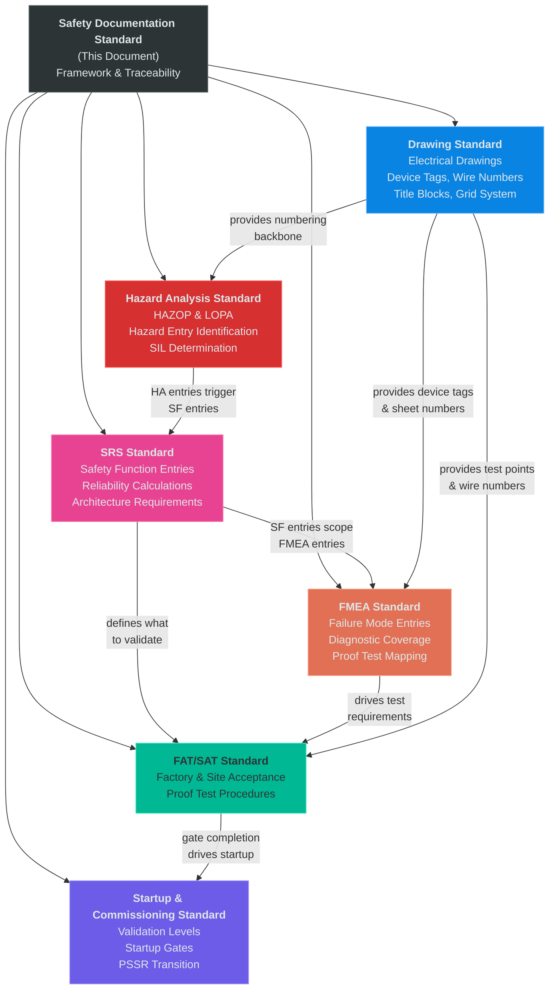
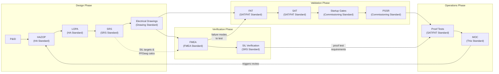
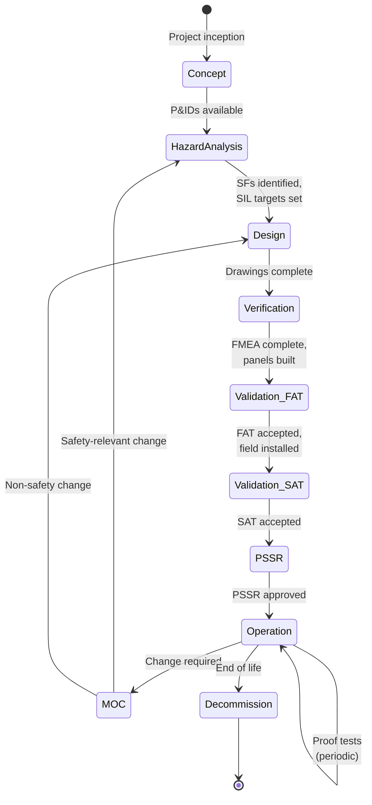
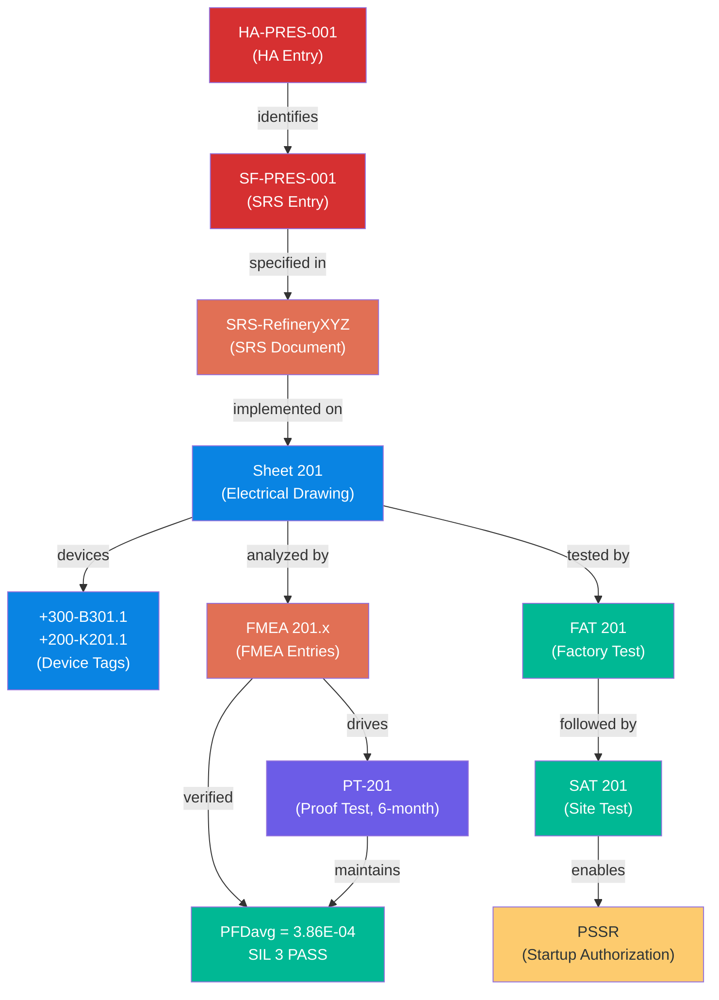
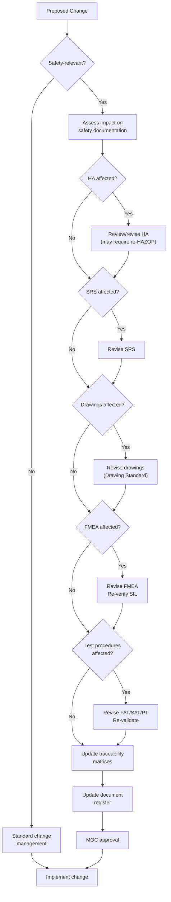

# Safety Documentation Standard
## Systems Design Documentation Framework for Industrial Control Systems

**Status:** Draft
**Scope:** Defines the complete safety documentation framework for industrial control systems — document hierarchy, lifecycle, numbering conventions, traceability requirements, and the relationships between all standards in the systems design documentation suite.

---

## Table of Contents

1. [Purpose and Scope](#1-purpose-and-scope)
2. [Standards References](#2-standards-references)
3. [Document Suite Overview](#3-document-suite-overview)
4. [Document Hierarchy and Lifecycle](#4-document-hierarchy-and-lifecycle)
5. [Numbering Conventions — Consolidated Reference](#5-numbering-conventions--consolidated-reference)
6. [Traceability Requirements](#6-traceability-requirements)
7. [Traceability Matrix Definitions](#7-traceability-matrix-definitions)
8. [Document Register](#8-document-register)
9. [Management of Change Integration](#9-management-of-change-integration)
10. [Competency Requirements](#10-competency-requirements)
11. [Audit and Compliance](#11-audit-and-compliance)
12. [Implementation Checklist](#12-implementation-checklist)
13. [Acronyms and Abbreviations](#13-acronyms-and-abbreviations)

---

## 1. Purpose and Scope

### 1.1 Purpose

This standard defines the overall framework for systems design documentation in industrial control system projects. It establishes how the individual standards in this documentation suite relate to each other, defines traceability requirements between documents, and provides consolidated reference material for numbering conventions, lifecycle management, and compliance auditing.

This is the **umbrella document**. It does not duplicate the detailed methodology in each subordinate standard — it defines how those standards work together as a system.

### 1.2 Scope

This standard governs the following documentation suite:

| Document | Coverage |
|----------|----------|
| Industrial Systems Drawing Standard | Electrical drawings, device tagging, wire numbering, title blocks |
| Hazard Analysis Standard | HAZOP methodology, LOPA, safety function identification, SIL determination |
| FMEA Standard for Safety Instrumented Systems | Failure mode analysis, SIL verification, proof test derivation |
| FAT/SAT Standard | Factory acceptance testing, site acceptance testing, proof test procedures |
| SRS Standard | Safety function definition methodology, reliability calculation methods, SF entry format |
| Startup and Commissioning Standard | Bottom-up validation levels, startup gates, commissioning modes, deferred scope, PSSR transition |
| **This document** | Framework, traceability, lifecycle, document register |

### 1.3 Additional Documents Defined by This Framework

Beyond the five methodology standards above, this framework defines several project-level documents that are produced during execution. Their format and content requirements are defined in the relevant methodology standard or here:

| Document | ID Format | Purpose | Defined In |
|----------|-----------|---------|------------|
| Safety Requirements Specification (SRS) | `SRS-[Project]` | One per project; contains one `SF-XXX-NNN` entry per safety function; specifies requirements, architecture, and reliability calculations | [SRS Standard (07_SRS_Standard)](#) |
| Traceability Matrix — Requirements | `TM-REQ-[Project]` | Maps HA → SF → SRS → Drawing Sheets | [Section 7.4](#74-requirements-traceability-matrix) |
| Traceability Matrix — Verification | `TM-VER-[Project]` | Maps SRS requirements → FMEA → FAT → SAT → Proof Test | [Section 7.5](#75-verification-traceability-matrix) |
| Traceability Matrix — Device | `TM-DEV-[Project]` | Maps device tags → drawings → FMEA items → test steps | [Section 7.6](#76-device-traceability-matrix) |
| Safety Validation Summary | `SVS-[Project]` | Consolidated evidence that all safety functions are validated | [Section 7.7](#77-safety-validation-summary) |
| Document Register | `DR-[Project]` | Master index of all safety documentation | [Section 8](#8-document-register) |
| Bypass Register | `BR-[Project]` | Active bypass/override tracking | [Section 7.8](#78-bypass-register) |

### 1.4 Design Philosophy

Hazard Analysis and the Safety Requirements Specification originate independently of the drawing package and define what must be achieved. Once the design is realized in the drawing set, the remaining lifecycle artifacts are organized around the drawing sheet structure to create a single, self-navigating system.

The Drawing Standard’s sheet-based numbering becomes the backbone for downstream documentation. Failure analysis, testing, proof testing, and software modules align to drawing sheet numbers so that a single sheet number (e.g., 201) provides a consistent navigation key across the lifecycle.

For example, Sheet 201 connects:

- The electrical drawing (Sheet 201)

- The safety function derived from Hazard Analysis (e.g., SF-PRES-001)

- The failure analysis that verifies the implementation (FMEA 201.1)

- The factory test that validates the build (FAT 201)

- The site test that commissions the system (SAT 201)

- The proof test that maintains the function (PT-201)

- The primary software module implementing the function (Sheet Module 201)

This structure eliminates the need for lookup tables while preserving the correct lifecycle order: hazards drive requirements, requirements drive design, and the drawing set becomes the central navigation index for implementation, verification, and maintenance.

---

## 2. Standards References

| Standard | Title | Application |
|----------|-------|-------------|
| IEC 61508 | Functional safety of E/E/PE safety-related systems | Parent functional safety standard |
| IEC 61511 | Safety instrumented systems for the process industry | Process sector application of IEC 61508 |
| IEC 61882 | Hazard and operability studies (HAZOP) | HAZOP application guide |
| IEC 60812 | Failure modes and effects analysis (FMEA/FMECA) | FMEA methodology |
| IEC 61082 | Preparation of documents used in electrotechnology | Drawing format |
| IEC 81346 | Structuring principles and reference designations | Device designation |
| IEC 62382 | Electrical and instrumentation loop checking | Loop check methodology |
| IEC 62443 | Industrial communication networks — Security | Cybersecurity for IACS (where applicable) |

---

## 3. Document Suite Overview

### 3.1 Document Hierarchy



### 3.2 Information Flow Between Standards



### 3.3 Document Purpose Summary

| Phase | Document | Input | Output |
|-------|----------|-------|--------|
| Hazard Identification | HAZOP worksheets | P&IDs, process data | Hazard list, consequence/cause pairs |
| Risk Assessment | LOPA worksheets | HAZOP results, risk criteria | Safety functions with SIL targets |
| Requirements | SRS | LOPA results | Functional requirements for each SF |
| Design | Electrical drawings | SRS, P&IDs | Implementation: device tags, wiring, logic |
| Verification | FMEA | Drawings, device data | Hardware integrity proof, PFDavg |
| Validation — Factory | FAT procedures & records | Drawings, FMEA | Tested panel functionality |
| Validation — Site | SAT procedures & records | Drawings, FMEA, FAT records | Commissioned system, proven end-to-end |
| Pre-Startup | PSSR | FAT/SAT records, all docs | Authorization to introduce process |
| Operations | Proof test procedures | FMEA, SAT | Ongoing integrity assurance |

---

## 4. Document Hierarchy and Lifecycle

### 4.1 Creation Sequence

Documents are created in a specific order. Each document depends on its predecessors.

```mermaid
gantt
    title Document Creation Sequence
    dateFormat  X
    axisFormat %s

    section Hazard Analysis
    HAZOP Study           :ha1, 0, 2
    LOPA Study            :ha2, after ha1, 2
    Safety Function Register :ha3, after ha2, 1

    section Requirements
    SRS (SF-XXX-NNN entries) :srs, after ha3, 2

    section Design
    Electrical Drawings    :dwg, after srs, 4
    Drawing Review         :dwgr, after dwg, 1

    section Verification
    FMEA per Sheet         :fmea, after dwg, 3
    SIL Verification Calc  :sil, after fmea, 1

    section Validation
    FAT Procedures         :fatp, after dwg, 2
    FAT Execution          :fate, after fatp, 2
    SAT Procedures         :satp, after fate, 1
    SAT Execution          :sate, after satp, 2

    section Commissioning
    PSSR                   :pssr, after sate, 1
    Proof Test Procedures  :pt, after fmea, 2
```



### 4.2 Creation Sequence Rules

| Step | Document | Prerequisites | Key Output |
|------|----------|---------------|------------|
| 1 | HAZOP (HA Standard) | P&IDs (approved or IFD), process data | Hazard list, cause/consequence pairs |
| 2 | LOPA (HA Standard) | HAZOP results, corporate risk criteria | SF-XXX-NNN with SIL targets |
| 3 | SRS (SRS Standard) | LOPA results | One SRS document per project; one SF-XXX-NNN entry per safety function |
| 4 | Electrical Drawings (Drawing Standard) | SRS, P&IDs | Implementation with device tags |
| 5 | FMEA (FMEA Standard) | Drawings, device failure data | PFDavg, SIL verification |
| 6 | FAT Procedures (SAT/FAT Standard) | Drawings, FMEA | Test steps per drawing sheet |
| 7 | FAT Execution | FAT procedures, built panels | Test records |
| 8 | SAT Procedures (SAT/FAT Standard) | FAT records, field installation complete | Field test steps |
| 9 | SAT Execution | SAT procedures, field-installed systems | Commissioning records |
| 10 | PSSR (SAT/FAT Standard) | All above complete | Authorization to operate |
| 11 | Proof Tests (SAT/FAT Standard) | FMEA, SAT records | Ongoing maintenance procedures |

### 4.3 Lifecycle Phases



### 4.4 Review Triggers

All documents in the suite share common review triggers. The table below defines which documents must be reviewed for each trigger:

| Trigger | HA | SRS | Drawings | FMEA | FAT/SAT | Proof Test | Traceability |
|---------|:--:|:---:|:--------:|:----:|:-------:|:----------:|:------------:|
| Management of Change (MOC) | Review | Review | Revise | Review | Revise | Review | Update |
| Incident or near-miss | Review | — | — | Review | — | Review | — |
| Periodic (5 years max, IEC 61511) | Review | Review | Review | Review | — | Review | Audit |
| Device replacement (like-for-like) | — | — | — | — | — | Execute | — |
| Device replacement (different type) | — | Review | Revise | Revise | Revise | Revise | Update |
| Architecture change | Review | Revise | Revise | Revise | Revise | Revise | Update |
| New failure rate data | — | — | — | Review | — | Review | — |
| Regulatory/standards update | Review | Review | Review | Review | Review | Review | Audit |
| Pre-Startup Safety Review (PSSR) | Verify | Verify | Verify | Verify | Verify | Verify | Verify |

---

## 5. Numbering Conventions — Consolidated Reference

### 5.1 Master Numbering Table

All numbering conventions across the documentation suite, in one place:

| Item | Format | Example | Defined In |
|------|--------|---------|------------|
| **Drawing sheet** | `[NNN]` | Sheet 201 | Drawing Standard §4.1 |
| **Cabinet/location** | `+[NNN]` | +200 | Drawing Standard §4.1 |
| **Device tag** | `+[Loc]-[Dev][Sheet].[Seq]` | +300-B301.1 | Drawing Standard §5.1 |
| **Terminal** | `+[Loc]-[Dev][Sheet].[Seq]:[Term]` | +300-B301.1:2 | Drawing Standard §5.4 |
| **Wire number** | `[Sheet]-[Col].[Seq]` | 201-4.1 | Drawing Standard §6.2 |
| **Grid reference** | `[Col][Row]` | 4E | Drawing Standard §7.1 |
| **Cable ID** | `CBL-[Sheet]-[Seq]` | CBL-201-01 | Drawing Standard §10.6 |
| **Hazard Analysis** | `HA-[SYS]-[NNN]` | HA-PRES-001 | HA Standard §4 |
| **Safety Function entry** | `SF-[SYS]-[NNN]` | SF-PRES-001 | HA Standard §4; SRS Standard §4.2 |
| **FMEA entry** | `FMEA [Sheet].[Device].[Mode]` | FMEA 201.1.1 | FMEA Standard §4 |
| **FAT** | `FAT [Sheet]` | FAT 201 | SAT/FAT Standard §4 |
| **SAT** | `SAT [Sheet]` | SAT 201 | SAT/FAT Standard §4 |
| **Proof Test** | `PT-[Sheet]` | PT-201 | SAT/FAT Standard §4 |
| **Functional Test** | `FT [Sheet]` | FT 150 | SAT/FAT Standard §4 |
| **SRS document** | `SRS-[Project]` | SRS-RefineryXYZ | SRS Standard §4.1 |
| **Traceability Matrix (Req)** | `TM-REQ-[Project]` | TM-REQ-RefineryXYZ | This Standard §7.4 |
| **Traceability Matrix (Ver)** | `TM-VER-[Project]` | TM-VER-RefineryXYZ | This Standard §7.5 |
| **Traceability Matrix (Dev)** | `TM-DEV-[Project]` | TM-DEV-RefineryXYZ | This Standard §7.6 |
| **Validation Summary** | `SVS-[Project]` | SVS-RefineryXYZ | This Standard §7.7 |
| **Document Register** | `DR-[Project]` | DR-RefineryXYZ | This Standard §8 |
| **Bypass Register** | `BR-[Project]` | BR-RefineryXYZ | This Standard §7.8 |

### 5.2 System Abbreviation Codes

Used in HA-XXX-NNN, SF-XXX-NNN, and SRS-XXX-NNN identifiers:

| Code | System | Examples |
|------|--------|----------|
| PRES | Pressure protection | Overpressure, underpressure, relief |
| TEMP | Temperature protection | High temperature, thermal runaway |
| FLOW | Flow protection | Low flow, reverse flow, overflow |
| LEV | Level protection | High level, low level, overflow |
| FIRE | Fire and gas detection | Fire detection, gas detection |
| TOX | Toxic release protection | H2S, CO, toxic gas |
| COMB | Combustible gas protection | LEL monitoring, explosion prevention |
| COMP | Composition protection | pH, O2, concentration |
| REAC | Reaction protection | Runaway reaction, exotherm |
| MECH | Mechanical protection | Vibration, overspeed, displacement |
| ELEC | Electrical protection | Arc flash, ground fault, overload |
| ENV | Environmental protection | Spill containment, emissions |

### 5.3 Numbering Derivation Chain

The sheet number is the common key across all documents:

```
Sheet 201 (Drawing Standard)
    │
    ├── +200-K201.1  (device tag on Sheet 201)
    ├── +200-K201.2  (device tag on Sheet 201)
    ├── 201-4.1      (wire number originating on Sheet 201)
    │
    ├── FMEA 201.1   (FMEA analyzing Sheet 201, first SF)
    ├── FMEA 201.2   (FMEA analyzing Sheet 201, second SF, if any)
    │
    ├── FAT 201      (factory test for Sheet 201 systems)
    ├── SAT 201      (site test for Sheet 201 systems)
    ├── PT-201       (proof test for Sheet 201 systems)
    │
    └── Traced back to:
        ├── SF-PRES-001  (safety function implemented on Sheet 201)
        ├── HA-PRES-001  (hazard analysis that identified SF-PRES-001)
        └── SF-PRES-001 (SRS entry within SRS-RefineryXYZ)
```

---

## 6. Traceability Requirements

### 6.1 Traceability Principle

**Every safety requirement must be traceable from hazard identification through to operational proof testing.** No link in the chain may be missing. If a safety function cannot be traced from HA through to proof test, the documentation is incomplete.

### 6.2 Required Traceability Chains



### 6.3 Bidirectional Traceability

Every link in the chain must be navigable in both directions:

| From → To | Forward Reference | Reverse Reference |
|-----------|-------------------|-------------------|
| HA → SRS | HA entry → SRS entry (SF-XXX-NNN) | SRS entry references source HA-XXX-NNN |
| SRS → HA | SRS entry header → HA-XXX-NNN | HA entry identifies the need for the SF |
| SRS → Drawing | SRS requirement → implementing sheet number | Drawing title block lists SF reference |
| Drawing → FMEA | Drawing title block → FMEA reference | FMEA scope lists analyzed sheets |
| Drawing → FAT/SAT | Drawing title block → SAT reference | FAT/SAT cover page lists sheets |
| FMEA → Proof Test | FMEA failure mode → PT procedure step | PT step references FMEA item number |
| Drawing → Device | Sheet contains device | Device tag encodes sheet number |

### 6.4 Completeness Criteria

A project's safety documentation is complete when:

- [ ] Every hazard in the HA has a disposition (accepted, mitigated by SF, or mitigated by non-SIS IPL)
- [ ] Every SF identified in the HA has an SRS
- [ ] Every SRS requirement maps to at least one drawing sheet
- [ ] Every safety-critical drawing sheet has an FMEA
- [ ] Every FMEA demonstrates SIL target achievement (PFDavg and architectural constraints)
- [ ] Every safety-critical sheet has FAT and SAT records marked PASS
- [ ] Every FMEA has a corresponding proof test procedure with defined interval
- [ ] All traceability matrices are populated with no gaps
- [ ] Document register is current and all documents are at approved revision

---

## 7. Traceability Matrix Definitions

### 7.1 Overview

Three traceability matrices are required for each project. They serve different audiences and verification purposes:

| Matrix | Audience | Question It Answers |
|--------|----------|---------------------|
| Requirements (TM-REQ) | Safety engineers, auditors | "Is every hazard addressed by a requirement and implemented in a design?" |
| Verification (TM-VER) | Functional safety assessors | "Is every requirement verified by analysis and validated by testing?" |
| Device (TM-DEV) | Commissioning engineers, maintenance | "For a given device, where is every relevant document?" |

### 7.2 Matrix Maintenance

Traceability matrices are **living documents** maintained throughout the project lifecycle. They are updated whenever any referenced document is revised. The document register (Section 8) tracks matrix revision status.

### 7.3 Safety Requirements Specification (SRS)

The SRS is a project-level document containing one entry per safety function. **One SRS document is produced per project.** Each safety function entry is identified by `SF-XXX-NNN`.

The SRS is the bridge between hazard identification (HA) and hardware implementation (FMEA, Drawings). It specifies what each safety function must do, at what integrity level, with what architecture, and verified by what calculations. The **SRS Standard (07_SRS_Standard)** defines the full methodology and entry format.

**SRS Document ID:** `SRS-[Project]` (e.g., `SRS-RefineryXYZ`)

**SRS Entry ID:** `SF-[SYS]-[NNN]` (e.g., `SF-PRES-001`) — one entry per safety function

**Required SRS Entry Content (summary):**

| Section | Content |
|---------|---------|
| Header | SF-XXX-NNN, SF name, SIL target, source HA entry |
| Functional Requirements | Trip setpoints, voting logic, response time, reset requirements |
| Integrity Requirements | PFDavg target, proof test interval, diagnostic coverage requirement |
| Architecture | Voting (1oo1/1oo2/2oo3), HFT, separation requirements |
| Interface | Input sensors, logic solver, final elements (with drawing sheet references) |
| Bypass Requirements | Permitted bypass conditions, maximum duration, authorization level |
| Reliability Calculations | PFDavg formula, beta factor, SIL verification (see SRS Standard §6) |
| Implementing Sheets | Drawing sheet numbers |

**Example — entry SF-PRES-001 within SRS-RefineryXYZ:**

```
Entry: SF-PRES-001 — Overpressure Protection
Source HA Entry: HA-PRES-001
SIL Target: SIL 3 (PFDavg < 1.0E-03)

Functional Requirements:
  - Monitor vessel pressure via three independent transmitters (+300-B301.1, B301.2, B301.3)
  - Trip on 2-of-3 voting at 95% of design pressure (setpoint: 285 psig)
  - De-energize shutdown relay (+200-K201.1) to close isolation valve
  - Response time: < 1 second from setpoint to valve closure initiation
  - Manual reset required after trip (no auto-reset)

Integrity Requirements:
  - PFDavg target: < 1.0E-03 (SIL 3)
  - Proof test interval (T_I): 6 months
  - Diagnostic coverage: per FMEA 201.x entries

Architecture:
  - Sensor: 2oo3 voting (HFT = 1)
  - Logic solver: 1oo1 safety-rated
  - Final element: 1oo1 (de-energize-to-trip)

Reliability Calculation (see SRS Standard §6):
  PFDavg_SIF = 3.86E-04  →  SIL 3 PASS

Implementing Sheets: 201, 301, 302
```

### 7.4 Requirements Traceability Matrix

**Document ID:** `TM-REQ-[Project]`

This matrix traces from hazards through safety functions to design implementation.

**Format:**

| HA ID | Hazard Description | SF ID | SIL | SRS Entry | Implementing Sheets | Key Devices | Status |
|-------|-------------------|-------|-----|--------|--------------------:|-------------|--------|
| HA-PRES-001 | Vessel overpressure due to blocked outlet | SF-PRES-001 | SIL 3 | SF-PRES-001 (SRS-RefineryXYZ) | 201, 301, 302 | +300-B301.1/2/3, +200-K201.1 | Verified |
| HA-TEMP-001 | Reactor high temperature due to cooling failure | SF-TEMP-001 | SIL 2 | SF-TEMP-001 (SRS-RefineryXYZ) | 130, 320 | +300-B320.1/2, +100-K130.1 | In Design |
| HA-LEV-001 | Tank overflow due to level control failure | SF-LEV-001 | SIL 1 | SF-LEV-001 (SRS-RefineryXYZ) | 140, 325 | +300-B325.1, +100-K140.1 | In Design |

**Rules:**
- One row per safety function
- Every SF identified in the HA must appear
- "Status" tracks progress: Identified → Specified → Designed → Verified → Validated
- Blank cells indicate gaps that must be resolved

### 7.5 Verification Traceability Matrix

**Document ID:** `TM-VER-[Project]`

This matrix traces from requirements through verification (FMEA) and validation (FAT/SAT/PT).

**Format:**

| SF ID | SRS Requirement | FMEA ID | PFDavg | SIL Met? | FAT ID | FAT Result | SAT ID | SAT Result | PT ID | PT Interval |
|-------|----------------|---------|--------|----------|--------|------------|--------|------------|-------|-------------|
| SF-PRES-001 | 2oo3 voting at 285 psig | FMEA 201.x | 3.86E-04 | SIL 3 YES | FAT 201 | PASS | SAT 201 | PASS | PT-201 | 6 months |
| SF-PRES-001 | Response time < 1s | FMEA 201.x | — | — | FAT 201 | 0.45s PASS | SAT 201 | 0.52s PASS | PT-201 | Per PT |
| SF-PRES-001 | De-energize to trip | FMEA 201.x | — | — | FAT 201 | PASS | SAT 201 | PASS | PT-201 | Per PT |
| SF-TEMP-001 | 1oo2 voting at 350°F | FMEA 130.x | 2.1E-03 | SIL 2 YES | FAT 130 | PASS | SAT 130 | — | PT-130 | 12 months |

**Rules:**
- One row per SRS requirement (a single SF may have multiple rows)
- FMEA results and FAT/SAT results must both be populated before PSSR
- Any "FAIL" or blank in a required column blocks startup authorization

### 7.6 Device Traceability Matrix

**Document ID:** `TM-DEV-[Project]`

This matrix provides a device-centric view — for any device tag, find every document that references it.

**Format:**

| Device Tag | Description | Cabinet | Drawing Sheet | Grid | SF ID | FMEA ID | FMEA Item # | FAT Step | SAT Step | PT Step | P&ID Tag |
|------------|-------------|---------|:------------:|------|-------|---------|-------------|----------|----------|---------|----------|
| +300-B301.1 | Pressure Transmitter #1 | +300 | 301 | 2B | SF-PRES-001 | FMEA 201.1.x | 201.1.1–201.1.7 | FAT 201-005 | SAT 201-010 | PT-201-003 | PT-201 |
| +300-B301.2 | Pressure Transmitter #2 | +300 | 301 | 3B | SF-PRES-001 | FMEA 201.2.x | 201.2.1–201.2.7 | FAT 201-006 | SAT 201-011 | PT-201-004 | PT-202 |
| +300-B301.3 | Pressure Transmitter #3 | +300 | 302 | 2B | SF-PRES-001 | FMEA 201.3.x | 201.3.1–201.3.7 | FAT 201-007 | SAT 201-012 | PT-201-005 | PT-203 |
| +200-K201.1 | Safety Relay | +200 | 201 | 4E | SF-PRES-001 | FMEA 201.4.x | 201.4.1–201.4.6 | FAT 201-015 | SAT 201-020 | PT-201-008 | — |

**Rules:**
- One row per device tag
- Every safety-critical device must appear
- Non-safety devices may optionally be included
- This matrix is the primary maintenance reference — a technician replacing a device can find every relevant procedure

### 7.7 Safety Validation Summary

**Document ID:** `SVS-[Project]`

The Safety Validation Summary is produced before PSSR. It is a consolidated evidence package proving that all safety functions are validated.

**Required Content:**

| Section | Content |
|---------|---------|
| Executive Summary | List of all SFs, their SIL targets, and overall validation status |
| Per Safety Function | For each SF: SRS reference, FMEA result (PFDavg, SIL pass/fail), FAT result, SAT result, proof test procedure reference |
| Outstanding Items | Punch list items from FAT/SAT, their disposition, impact on safety |
| Conclusion | Statement of readiness for PSSR |
| Approvals | Functional safety engineer, project manager, operations representative |

**Example Summary Table:**

| SF ID | SIL | SRS | FMEA | PFDavg | Arch. | FAT | SAT | PT Procedure | PT Interval | Status |
|-------|-----|-----|------|--------|-------|-----|-----|-------------|-------------|--------|
| SF-PRES-001 | 3 | SRS-RefineryXYZ Rev A | FMEA-RefineryXYZ Rev B | 3.86E-04 | PASS | PASS | PASS | PT-201 Rev A | 6 months | VALIDATED |
| SF-TEMP-001 | 2 | SRS-RefineryXYZ Rev A | FMEA-RefineryXYZ Rev A | 2.1E-03 | PASS | PASS | PASS | PT-130 Rev A | 12 months | VALIDATED |
| SF-LEV-001 | 1 | SRS-RefineryXYZ Rev A | FMEA-RefineryXYZ Rev A | 8.5E-03 | PASS | PASS | — | PT-140 Rev A | 12 months | SAT PENDING |

### 7.8 Bypass Register

**Document ID:** `BR-[Project]`

Active during commissioning and operation. Tracks all safety system bypasses and overrides.

**Format:**

| Bypass # | SF Affected | Device(s) Bypassed | Reason | Authorized By | Date Applied | Max Duration | Compensating Measures | Date Removed | Removed By |
|----------|-------------|-------------------|--------|---------------|-------------|-------------|----------------------|-------------|------------|
| BR-001 | SF-PRES-001 | +300-B301.2 | Calibration | J. Smith (Ops Mgr) | 2025-03-15 08:00 | 8 hours | Manual monitoring, B301.1 & B301.3 active (1oo2 degraded) | 2025-03-15 10:30 | R. Jones |

**Rules:**
- No safety function shall be fully bypassed without formal risk assessment
- Partial bypass (e.g., one channel of a voted group) requires documented compensating measures
- Maximum bypass duration shall be defined per SIL level:
  - SIL 3: 8 hours maximum
  - SIL 2: 24 hours maximum
  - SIL 1: 72 hours maximum
- Bypass register is auditable — records are retained for the life of the installation

---

## 8. Document Register

### 8.1 Purpose

The Document Register is the master index of all safety-related documentation for a project. It tracks document status, revision, and approval.

**Document ID:** `DR-[Project]`

### 8.2 Format

| Doc ID | Title | Type | Rev | Date | Status | Author | Approved By | Related SFs | File Location |
|--------|-------|------|-----|------|--------|--------|-------------|-------------|---------------|
| HA-PRES-001 | Vessel Overpressure Hazard Analysis | HA | B | 2025-01-10 | Approved | Reid Hall | T. Brown | SF-PRES-001 | /safety/HA/HA-PRES-001_RevB.pdf |
| SRS-RefineryXYZ | Safety Requirements Specification | SRS | A | 2025-01-20 | Approved | Reid Hall | T. Brown | All SFs | /safety/SRS/SRS-RefineryXYZ_RevA.pdf |
| — | Sheet 201: Overpressure Logic | Drawing | 5 | 2025-01-22 | Approved | J. Smith | T. Brown | SF-PRES-001 | /drawings/Sheet_201_Rev5.dwg |
| FMEA 201.1 | Overpressure Protection FMEA | FMEA | B | 2025-02-01 | Approved | Reid Hall | T. Brown | SF-PRES-001 | /safety/FMEA/FMEA_201.1_RevB.pdf |
| FAT 201 | Overpressure Protection FAT | FAT | A | 2025-02-10 | Complete | J. Smith | R. Jones | SF-PRES-001 | /testing/FAT/FAT_201_RevA.pdf |
| SAT 201 | Overpressure Protection SAT | SAT | A | 2025-03-01 | Complete | J. Smith | R. Jones | SF-PRES-001 | /testing/SAT/SAT_201_RevA.pdf |
| PT-201 | Overpressure Proof Test | PT | A | 2025-02-05 | Approved | Reid Hall | T. Brown | SF-PRES-001 | /testing/PT/PT-201_RevA.pdf |
| TM-REQ-RefineryXYZ | Requirements Traceability | TM | C | 2025-03-01 | Current | Reid Hall | T. Brown | All | /safety/TM-REQ_RevC.xlsx |
| TM-VER-RefineryXYZ | Verification Traceability | TM | B | 2025-03-01 | Current | Reid Hall | T. Brown | All | /safety/TM-VER_RevB.xlsx |
| TM-DEV-RefineryXYZ | Device Traceability | TM | B | 2025-03-01 | Current | Reid Hall | T. Brown | All | /safety/TM-DEV_RevB.xlsx |
| SVS-RefineryXYZ | Safety Validation Summary | SVS | A | 2025-03-05 | Draft | Reid Hall | — | All | /safety/SVS_RevA.pdf |
| BR-RefineryXYZ | Bypass Register | BR | — | Active | Active | Ops | — | All | /operations/BR_active.xlsx |

### 8.3 Document Status Definitions

| Status | Meaning |
|--------|---------|
| Draft | In preparation, not reviewed |
| In Review | Under formal review |
| Approved | Reviewed and approved for use |
| Complete | Test/activity executed and documented |
| Current | Living document, continuously maintained |
| Active | Operational register, updated in real time |
| Superseded | Replaced by newer revision |
| Archived | Retained for historical record, no longer active |

---

## 9. Management of Change Integration

### 9.1 MOC Triggers Relevant to Safety Documentation

Any of the following changes require evaluation against the safety documentation suite:

- Process condition changes (new setpoints, new operating modes)
- Equipment changes (instrument replacement, valve substitution)
- Logic changes (PLC (Programmable Logic Controller) program modification, voting logic change)
- Drawing changes (new sheets, revised circuits)
- Organizational changes (maintenance intervals, staffing)
- Regulatory or standards updates

### 9.2 MOC Evaluation Workflow



### 9.3 MOC Documentation Requirements

Every safety-relevant MOC shall document:

1. **Change description** — What is changing and why
2. **Impact assessment** — Which documents in the suite are affected (use review trigger table from Section 4.4)
3. **Document revisions required** — List each document that needs updating, with responsible person and due date
4. **Verification** — How will the change be verified (re-analysis, re-test, or both)
5. **Approval** — Signatures from functional safety engineer, operations, and management

---

## 10. Competency Requirements

### 10.1 Role Definitions

| Role | Responsibilities | Minimum Competency |
|------|-----------------|-------------------|
| HAZOP Leader | Facilitates HAZOP studies, ensures completeness | IEC 61511 training, 3+ HAZOP studies led, process safety experience |
| LOPA Analyst | Performs LOPA calculations, assigns SIL targets | IEC 61511 training, statistical risk analysis competency |
| Functional Safety Engineer (FSE) | Owns FMEA, SIL verification, proof test design | TÜV or equivalent functional safety certification, IEC 61508/61511 |
| Electrical Designer | Produces drawings per Drawing Standard | IEC 61082 familiarity, CAD (Computer-Aided Design) proficiency, supervised by FSE for SIL-rated circuits |
| Commissioning Engineer | Executes FAT/SAT procedures | Loop checking experience, safety system commissioning training |
| Maintenance Technician | Executes proof tests | Proof test training, instrument calibration competency |
| Independent Assessor | FSA per IEC 61511 clause 5 | TÜV or equivalent, independence from project team |

### 10.2 Training Records

Training and competency records shall be maintained in the document register for all personnel performing safety-critical work.

---

## 11. Audit and Compliance

### 11.1 Internal Audit Checklist

For periodic or pre-startup audits, verify:

**Hazard Analysis:**
- [ ] HAZOP covers all P&ID nodes
- [ ] LOPA completed for all identified SIFs
- [ ] SIL targets assigned for all safety functions
- [ ] Safety Function Register complete and current

**Requirements:**
- [ ] SRS exists for every safety function
- [ ] SRS requirements are testable and traceable

**Design:**
- [ ] All safety-critical sheets have title block safety fields populated
- [ ] Device descriptions carry HA references per Drawing Standard §5.3
- [ ] All safety-critical devices have correct device tags per Drawing Standard §5.1

**Verification:**
- [ ] FMEA exists for every safety-critical drawing sheet
- [ ] PFDavg meets SIL target for every safety function
- [ ] Architectural constraints met (HFT, SFF)
- [ ] Common cause analysis completed

**Validation:**
- [ ] FAT completed and accepted for all safety-critical sheets
- [ ] SAT completed and accepted for all safety-critical sheets
- [ ] All SAT deviations dispositioned

**Operations:**
- [ ] Proof test procedures exist for all safety functions
- [ ] Proof test intervals defined and scheduled
- [ ] Bypass register established and active
- [ ] MOC procedure references safety documentation suite

**Traceability:**
- [ ] TM-REQ populated with no gaps
- [ ] TM-VER populated with no gaps
- [ ] TM-DEV populated for all safety-critical devices
- [ ] Document register current

### 11.2 Functional Safety Assessment (FSA)

Per IEC 61511 clause 5, an independent Functional Safety Assessment is required at key lifecycle stages:

| FSA Stage | Timing | Scope |
|-----------|--------|-------|
| FSA 1 | After SRS approval | HA, LOPA, SRS completeness |
| FSA 2 | After detailed design | Drawings, FMEA, SIL verification |
| FSA 3 | After commissioning | FAT/SAT records, validation summary |
| FSA 4 | Periodic (during operation) | Proof test records, MOC compliance, ongoing integrity |

---

## 12. Implementation Checklist

### Project Setup
- [ ] Establish project document register (DR-[Project])
- [ ] Define system abbreviation codes for the project
- [ ] Create file/folder structure per document types
- [ ] Assign roles and verify competency (Section 10)

### Hazard Analysis Phase
- [ ] Conduct HAZOP per HA Standard
- [ ] Conduct LOPA per HA Standard
- [ ] Record all safety functions identified in HA (see HA Standard §7.4)
- [ ] Create SRS entry (SF-XXX-NNN) per safety function in the project SRS document (SRS Standard)
- [ ] Populate requirements traceability matrix TM-REQ (Section 7.4)
- [ ] FSA Stage 1

### Design Phase
- [ ] Produce electrical drawings per Drawing Standard
- [ ] Verify title block safety fields on all safety-critical sheets
- [ ] Verify device description fields carry HA references

### Verification Phase
- [ ] Produce FMEA per FMEA Standard for each safety-critical sheet
- [ ] Complete SIL verification calculations
- [ ] Produce proof test procedures per SAT/FAT Standard
- [ ] Populate verification traceability matrix TM-VER (Section 7.5)
- [ ] Populate device traceability matrix TM-DEV (Section 7.6)
- [ ] FSA Stage 2

### Validation Phase
- [ ] Produce and execute FAT procedures per SAT/FAT Standard
- [ ] Produce and execute SAT procedures per SAT/FAT Standard
- [ ] Disposition all FAT/SAT deviations
- [ ] Produce Safety Validation Summary SVS (Section 7.7)
- [ ] Establish bypass register BR (Section 7.8)
- [ ] FSA Stage 3

### Pre-Startup
- [ ] PSSR — verify all documentation complete per Section 6.4
- [ ] All traceability matrices populated with no gaps
- [ ] Document register current
- [ ] Authorization to introduce process

### Operations
- [ ] Proof tests scheduled per defined intervals
- [ ] MOC procedure references this documentation framework
- [ ] Periodic FSA scheduled (FSA Stage 4)

---

## 13. Acronyms and Abbreviations

This glossary covers all acronyms used across the documentation suite.

| Acronym | Full Form | Notes |
|---------|-----------|-------|
| AI | Analog Input | I/O signal type |
| ALARP | As Low As Reasonably Practicable | Risk reduction principle: reduce risk until cost of further reduction is grossly disproportionate to benefit |
| AO | Analog Output | I/O signal type |
| API | American Petroleum Institute | Standards body; e.g. API 510 (pressure vessel inspection), API 576 (relief device inspection) |
| BLEVE | Boiling Liquid Expanding Vapor Explosion | Catastrophic vessel failure where superheat liquid flashes to vapour on pressure release |
| BPCS | Basic Process Control System | The primary control system (DCS/PLC) responsible for normal process control; not the safety system |
| BOM | Bill of Materials | Component list for a panel or system assembly |
| BR | Bypass Register | Project-level register tracking all active safety system bypasses and overrides |
| CAD | Computer-Aided Design | Software used to produce electrical drawings |
| CCF | Common Cause Failure | A failure of two or more components from a single shared cause (e.g. common environment, design error) |
| DC | Diagnostic Coverage | Fraction of a failure mode's total failure rate detected by automatic diagnostics |
| DD | Dangerous Detected | A dangerous failure that the system detects automatically and reacts to |
| DI | Digital Input | I/O signal type |
| DO | Digital Output | I/O signal type |
| DR | Document Register | Project-level master index of all safety documentation |
| DU | Dangerous Undetected | A dangerous failure with no automatic detection; revealed only by proof testing or demand |
| E/E/PE | Electrical/Electronic/Programmable Electronic | Scope of IEC 61508 safety-related systems |
| EMI | Electromagnetic Interference | Electrical noise that can affect instrument signals and control system behaviour |
| FAT | Factory Acceptance Test | Formal system test performed at the factory before shipment |
| FMEA | Failure Modes and Effects Analysis | Systematic analysis of hardware failure modes and their effect on safety function performance |
| FSA | Functional Safety Assessment | Independent assessment of the safety lifecycle per IEC 61511 clause 5 |
| FSE | Functional Safety Engineer | Engineer responsible for SIL verification, FMEA, and proof test design; TÜV-certified or equivalent |
| FT | Functional Test | Acceptance test for non-safety systems |
| HA | Hazard Analysis | The document set produced by HAZOP and LOPA; includes hazard register and safety function register |
| HAZOP | Hazard and Operability Study | Structured technique for systematic identification of process hazards using guidewords |
| HFT | Hardware Fault Tolerance | Number of hardware faults a system can tolerate without losing its safety function |
| HMI | Human-Machine Interface | Operator interface screen (touchpanel, workstation) used to monitor and command the control system |
| IACS | Industrial Automation and Control Systems | Term used in IEC 62443 for industrial control systems in a cybersecurity context |
| IEC | International Electrotechnical Commission | International standards body; publishes IEC 61508, IEC 61511, and related functional safety standards |
| IFD | Issued for Design | Drawing or document revision status indicating approved for use in design |
| IPL | Independent Protection Layer | A safeguard that reduces risk independently of the initiating cause and other IPLs |
| LEL | Lower Explosive Limit | Minimum concentration of a flammable gas in air at which ignition can occur |
| LOPA | Layer of Protection Analysis | Semi-quantitative risk assessment technique that evaluates IPLs to determine SIL requirements |
| MOC | Management of Change | Formal process for evaluating and approving changes to equipment, design, or procedures |
| MTBF | Mean Time Between Failures | Average time between repairable failures; used in reliability analysis |
| MTTR | Mean Time to Restoration | Average time to restore a failed component to service |
| P&ID | Piping and Instrumentation Diagram | Engineering drawing showing process equipment, piping, instrumentation, and control connections |
| PFD | Probability of Failure on Demand | Likelihood that a safety function will fail to operate when a demand occurs |
| PFDavg | Average Probability of Failure on Demand | Time-averaged PFD over the proof test interval; the primary SIL metric for low-demand-mode SIFs |
| PFH | Probability of Dangerous Failure per Hour | Failure rate metric for high-demand or continuous-mode SIFs |
| PLC | Programmable Logic Controller | Industrial computer used for control and safety logic execution |
| PSSR | Pre-Startup Safety Review | Final safety review confirming all documentation and testing is complete before process introduction |
| PST | Partial Stroke Test | Proof test technique for on/off valves; moves the valve a fraction of its full stroke to verify mechanical freedom |
| PT | Proof Test | Periodic functional test of a safety instrumented function to reveal dangerous undetected failures |
| PTC | Proof Test Coverage | Fraction of potential DU failure modes that a proof test procedure can exercise |
| QA | Quality Assurance | Quality management function responsible for document control and calibration record management |
| SAT | Site Acceptance Test | Formal system test performed at site after installation, with actual field devices |
| SCADA | Supervisory Control and Data Acquisition | Upper-level monitoring and control software; non-deterministic interface to the control system |
| SD | Safe Detected | A safe failure that the system detects automatically |
| SF | Safety Function | A specific function implemented by the SIS to achieve or maintain a safe state |
| SFF | Safe Failure Fraction | Proportion of total failure rate that consists of safe or dangerous-detected failures; architectural metric per IEC 61508 |
| SIF | Safety Instrumented Function | One complete safety function: sensor(s) + logic solver + final element(s), implemented to a specific SIL |
| SIL | Safety Integrity Level | Discrete level (1–4) defining the required risk-reduction performance of a SIF per IEC 61511 |
| SIS | Safety Instrumented System | The complete system (sensors, logic solver, final elements) implementing one or more SIFs |
| SRS | Safety Requirements Specification | Document specifying functional and integrity requirements for a safety function |
| STO | Safe Torque Off | Drive safety function that removes torque-generating power without removing main power |
| SU | Safe Undetected | A safe failure with no automatic detection; does not impair the safety function |
| SVS | Safety Validation Summary | Consolidated evidence package confirming all safety functions are validated; produced before PSSR |
| TI | Test Interval | Time between successive proof tests for a SIF; a key parameter in PFDavg calculations |
| TM | Traceability Matrix | Document mapping requirements, verification evidence, and devices across the safety lifecycle |
| TMEL | Target Mitigated Event Likelihood | The tolerable residual risk frequency used in LOPA as the acceptance criterion |
| TÜV | Technischer Überwachungsverein | German technical inspection association; commonly used as shorthand for accredited functional safety certification bodies |
| UPS | Uninterruptible Power Supply | Battery-backed power supply maintaining control power during mains failure |
| WO | Work Order | Maintenance management system document authorising and recording a maintenance activity |

