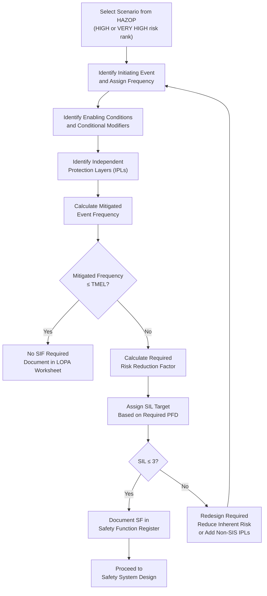
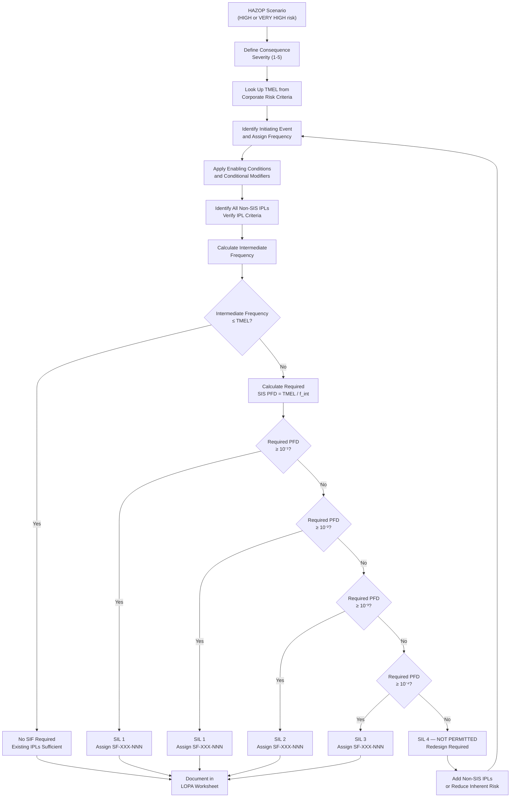
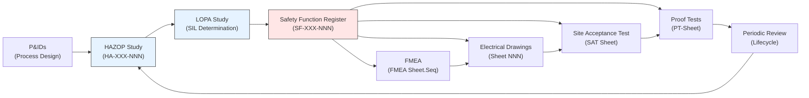
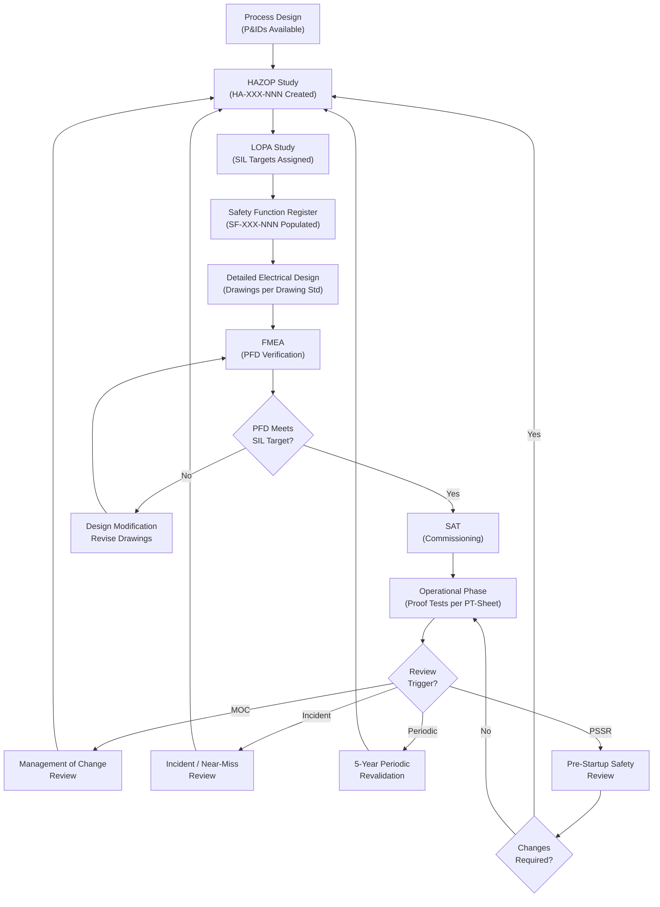

# Hazard Analysis Standard
## HAZOP and LOPA for Industrial Control Systems

**Status:** Draft
**Scope:** Hazard and Operability Study (HAZOP) methodology, Layer of Protection Analysis (LOPA) methodology, safety function identification, SIL determination, and integration with the Industrial Systems Drawing Standard for industrial control systems.

---

## Table of Contents

1. [Purpose and Scope](#1-purpose-and-scope)
2. [Standards References](#2-standards-references)
3. [Definitions and Terminology](#3-definitions-and-terminology)
4. [Numbering and Identification](#4-numbering-and-identification)
5. [HAZOP Methodology](#5-hazop-methodology)
6. [LOPA Methodology](#6-lopa-methodology)
7. [HA Document Structure](#7-ha-document-structure)
8. [Cross-Reference to Other Documents](#8-cross-reference-to-other-documents)
9. [Lifecycle and Review](#9-lifecycle-and-review)
10. [Risk Assessment Tools](#10-risk-assessment-tools)
11. [Implementation Checklist](#11-implementation-checklist)
12. [Document Information](#12-document-information)

---

## 1. Purpose and Scope

### 1.1 Purpose

This standard defines a consistent methodology for identifying hazards, assessing risks, and determining the required integrity level for safety functions in industrial systems. Integrity level is expressed as a Safety Integrity Level (SIL) for functions governed by IEC 61508 / IEC 61511 / IEC 62061, or as a Performance Level (PL) for functions governed by ISO 13849 (machine safety). It establishes the conventions for conducting Hazard and Operability Studies (HAZOP), Layer of Protection Analysis (LOPA) for SIL determination, and risk graph analysis per ISO 13849-1 Annex A for PL determination. The outputs of these studies integrate with the electrical drawing package and other safety lifecycle documentation.

The standard ensures that hazard analysis is performed systematically, that safety functions are identified and assigned appropriate integrity targets (SIL or PL), that the governing standard is declared per safety function, and that traceability is maintained from the hazard scenario through to the implemented safety system on the drawings.

### 1.2 Scope

This standard applies to:

- HAZOP studies for process systems requiring safety instrumented functions
- LOPA studies for SIL determination of identified safety functions
- Safety Function Register creation and maintenance
- Hazard Analysis document numbering and identification
- Cross-referencing between hazard analysis, drawing standard, FMEA, and verification documents

This standard does **not** define:

- Electrical drawing conventions — these are covered by the Industrial Systems Drawing Standard.
- FMEA methodology or content — these are covered by a separate FMEA Standard that references safety functions identified here.
- SAT or proof test procedures — these are produced downstream using safety functions and SIL targets from this standard.
- P&ID (Piping and Instrumentation Diagram) development — P&IDs are produced independently and serve as input to the HAZOP study.
- PLC safety application programming — software design references safety functions defined by this standard.

### 1.3 Design Philosophy

**The hazard analysis is the origin of all safety requirements.** Every safety function, every SIL target, every FMEA, and every safety-critical drawing traces back to a hazard scenario identified and documented per this standard. Where inherent dangerous undetected (DU) failures remain after architectural design, proof test requirements also trace back to the originating hazard.

**Hazards are risks to the process function.** The process function is defined in the Functional Requirements Standard (`01_Functional_Requirements_Standard`). Each HAZOP node's "Design Intent" statement should trace to one or more functional requirement entries (FR-XXX-NNN). A hazard is meaningful only in the context of a defined intended function.

Principles:

- Hazard identification precedes design — HAZOP findings drive the safety design, not the reverse.
- SIL targets are determined analytically through LOPA, not assigned by convention or assumption.
- Each safety function has a single, traceable path from hazard scenario to implemented drawing sheet.
- Numbering conventions align with the Drawing Standard to enable self-documenting cross-references. The HA itself does not depend on sheet numbering — sheet references become relevant only once implementation exists and the HA entry is linked to its implementing drawing sheets.
- The ALARP principle governs all risk decisions — risks shall be reduced to a level that is As Low As Reasonably Practicable.

---

## 2. Standards References

| Standard | Title | Application |
|----------|-------|-------------|
| IEC 61511 | Functional safety — Safety instrumented systems for the process industry sector | Primary standard for SIS lifecycle, SIL determination, LOPA methodology |
| IEC 61508 | Functional safety of electrical/electronic/programmable electronic safety-related systems | Parent standard for functional safety, SIL definitions, hardware fault tolerance |
| IEC 62061 | Safety of machinery — Functional safety of safety-related control systems | SIL-based functional safety for machinery. Governing standard option for machine safety functions. |
| ISO 13849-1 | Safety of machinery — Safety-related parts of control systems — Part 1: General principles for design | PL framework, risk graph method (Annex A) for PLr determination, Categories, MTTFd, DCavg |
| ISO 13849-2 | Safety of machinery — Safety-related parts of control systems — Part 2: Validation | Validation of PL path safety functions |
| IEC 61882 | Hazard and operability studies (HAZOP studies) — Application guide | HAZOP methodology, guidewords, study preparation, documentation |
| IEC 31010 | Risk management — Risk assessment techniques | General risk assessment framework |
| Industrial Systems Drawing Standard | Device, Wire, and Drawing Numbering Convention | Drawing numbering, device tagging, title block conventions, HA cross-reference format |
| SRS Standard | Safety Requirements Specification Methodology | SF entry structure and reliability calculations for safety functions identified in this standard |
| FMEA Standard | Failure Modes and Effects Analysis for Safety Instrumented Systems | FMEA methodology using safety functions identified in this standard and specified in the SRS |

**Relationship between standards:**

- IEC 61508 is the parent standard defining the overall safety lifecycle and SIL framework.
- IEC 61511 is the process industry implementation standard, and is the primary reference for this document.
- IEC 61882 provides detailed guidance on HAZOP study execution.
- This standard implements the hazard identification and risk assessment phases of the IEC 61511 safety lifecycle (Clauses 8 and 9).

---

## 3. Definitions and Terminology

| Term | Definition |
|------|-----------|
| **ALARP** | As Low As Reasonably Practicable. The principle that risk should be reduced until the cost of further reduction is grossly disproportionate to the benefit gained. |
| **Consequence** | The outcome of a hazardous event, expressed in terms of harm to people, environment, or assets. |
| **Demand mode** | A mode of operation where the safety function is required to act in response to a process demand. Low demand mode: demand rate ≤1 per year. High demand/continuous mode: demand rate >1 per year. |
| **Deviation** | A departure from the design intent of a process, expressed as a guideword applied to a process parameter. |
| **Enabling condition** | A condition that does not directly cause a hazardous event but that must be present for the initiating event to propagate to a consequence. |
| **Guideword** | A short word applied to a process parameter to suggest a deviation from design intent (e.g., NO, MORE, LESS). |
| **Hardware Fault Tolerance (HFT)** | The ability of a system to continue performing its safety function in the presence of hardware faults. HFT=N means the system can tolerate N faults. |
| **Hazard** | A potential source of harm. In process safety: a condition with the potential for an undesirable consequence (injury, environmental damage, asset loss). |
| **Hazardous event** | An event that can cause harm. The realization of a hazard. |
| **HAZOP** | Hazard and Operability Study. A structured and systematic technique for identifying hazards and operability problems in a process by examining deviations from design intent. |
| **Independent Protection Layer (IPL)** | A device, system, or action capable of preventing a hazardous event or mitigating its consequences independent of the initiating event and independent of any other IPL. |
| **Initiating event** | The first event in a sequence that, if not interrupted by protection layers, leads to a hazardous event. |
| **Layer of Protection Analysis (LOPA)** | A semi-quantitative risk assessment method that evaluates the adequacy of independent protection layers against specific hazard scenarios to determine if additional risk reduction (e.g., SIS) is needed and at what SIL. |
| **MooN** | An M-out-of-N voting architecture. The safety function acts when M out of N channels detect the hazardous condition. Example: 2oo3 means 2 out of 3 channels must agree. |
| **Node** | A defined section of a process system examined during a HAZOP study, typically bounded by major equipment or significant changes in process conditions. |
| **PFD** | Probability of Failure on Demand. The probability that a safety system will fail to perform its intended function when a demand occurs. |
| **Risk** | A combination of the probability of occurrence of harm and the severity of that harm. Risk = Frequency × Consequence. |
| **Safety Function (SF)** | A function to be implemented by a Safety Instrumented System (SIS) that is intended to achieve or maintain a safe state of the process in response to a specific hazardous condition. |
| **Safety Instrumented Function (SIF)** | Synonymous with Safety Function in the context of this standard. |
| **Safety Instrumented System (SIS)** | An instrumented system used to implement one or more safety functions. Composed of sensors, logic solvers, and final elements. |
| **Safety Integrity Level (SIL)** | A discrete level (1 through 4) corresponding to a range of probability of failure on demand for a safety function. SIL 1 is the lowest; SIL 4 is the highest. |
| **Tolerable risk** | The maximum level of risk that is acceptable to the organization, typically defined by corporate risk criteria or regulatory requirements. |
| **TMEL** | Target Mitigated Event Likelihood. The maximum tolerable frequency of a specific consequence, derived from corporate or regulatory risk criteria. |
| **Performance Level (PL)** | A discrete level (PLa through PLe) used to specify the ability of a safety-related part of a control system to perform a safety function under foreseeable conditions, per ISO 13849-1. PLe is the highest. |
| **Required Performance Level (PLr)** | The PL required for a safety function, determined by the risk graph method per ISO 13849-1 Annex A. |
| **Category (B, 1, 2, 3, 4)** | Architecture category per ISO 13849-1, describing the structural and diagnostic requirements of the safety-related control system. Category 4 is the most capable. |
| **MTTFd** | Mean Time To dangerous Failure (per channel). Expressed as Low (< 10 years), Medium (10–30 years), High (30–100 years), or Very High (> 100 years) per ISO 13849-1. |
| **DCavg** | Average Diagnostic Coverage per ISO 13849-1. Classified as None (< 60%), Low (60–90%), Medium (90–99%), or High (≥ 99%). |
| **PFHd** | Probability of Dangerous Failure per Hour. The ISO 13849 metric for high-demand / continuous mode safety functions; also used to express achieved PL as a numerical value. |
| **Governing Standard** | The standard that applies to a given safety function, declared at the HA level. Values: `IEC 62061`, `IEC 61511`, `IEC 61508`, `ISO 13849`. Determines whether the SIL or PL pathway is used downstream. |

### 3.1 SIL Definitions (Low Demand Mode, per IEC 61508/61511)

| SIL | PFDavg Range | Risk Reduction Factor |
|-----|-------------|----------------------|
| SIL 1 | ≥ 10⁻² to < 10⁻¹ | 10 to 100 |
| SIL 2 | ≥ 10⁻³ to < 10⁻² | 100 to 1,000 |
| SIL 3 | ≥ 10⁻⁴ to < 10⁻³ | 1,000 to 10,000 |

**Note:** SIL 4 is not addressed in IEC 61511 for the process industry. If a LOPA study indicates a requirement for SIL 4, the design shall be revisited to reduce the inherent risk or add non-SIS protection layers.

### 3.2 PL Definitions (per ISO 13849-1)

| PL | PFHd Range (per hour) | Approximate SIL Equivalence (informative) |
|----|----------------------|------------------------------------------|
| PLa | ≥ 10⁻⁵ to < 10⁻⁴ | — (below SIL 1) |
| PLb | ≥ 3×10⁻⁶ to < 10⁻⁵ | — (below SIL 1) |
| PLc | ≥ 10⁻⁶ to < 3×10⁻⁶ | ≈ SIL 1 |
| PLd | ≥ 10⁻⁷ to < 10⁻⁶ | ≈ SIL 2 |
| PLe | ≥ 10⁻⁸ to < 10⁻⁷ | ≈ SIL 3 |

**Important:** The SIL/PL equivalence above is informative only. SIL and PL are not interchangeable without full calculation under their respective standards. They address partially overlapping but distinct risk assessment frameworks, and a numerical equivalence does not constitute cross-certification.

### 3.3 Minimum Hardware Fault Tolerance (per IEC 61511)

| SIL | Minimum HFT (Type A) | Minimum HFT (Type B) | Typical Architecture |
|-----|----------------------|----------------------|---------------------|
| SIL 1 | 0 | 1 | 1oo1 or 1oo2 |
| SIL 2 | 1 | 1 | 1oo2 or 2oo3 |
| SIL 3 | 1 | 2 | 2oo3 or 1oo2D |

**Note:** HFT requirements may be relaxed per IEC 61511 Clause 11.4 (Route 2H) when supported by prior use evidence and quantitative analysis. The architectural constraints above represent the base requirements.

---

## 4. Numbering and Identification

### 4.1 Hazard Analysis Entry ID

**Format:** `HA-XXX-NNN`

**One HA document is produced per project.** The `HA-XXX-NNN` identifier refers to a **node entry** within that project-level HA document, not to a standalone document per entry. Each node entry may contain multiple scenarios (e.g., HA-PRES-001, Scenario 1; HA-PRES-001, Scenario 2). For example, `HA-PRES-001` is the first pressure-system node recorded in the project's HA document — it is not a separate file.

| Component | Description | Example |
|-----------|-------------|---------|
| `HA` | Entry type prefix — Hazard Analysis | HA |
| `XXX` | System abbreviation code (see Section 4.3) | PRES |
| `NNN` | Sequential node number within that system | 001 |

**Examples:**

- `HA-PRES-001` → Hazard Analysis entry for Pressure system, first node (may contain multiple scenarios)
- `HA-TEMP-003` → Hazard Analysis entry for Temperature system, third node
- `HA-FIRE-001` → Hazard Analysis entry for Fire protection system, first node

### 4.2 Safety Function ID

**Format:** `SF-XXX-NNN`

| Component | Description | Example |
|-----------|-------------|---------|
| `SF` | Document type prefix — Safety Function | SF |
| `XXX` | System abbreviation code (see Section 4.3) | PRES |
| `NNN` | Sequential safety function number within that system | 001 |

**Examples:**

- `SF-PRES-001` → Safety Function for Pressure system, first function
- `SF-TEMP-002` → Safety Function for Temperature system, second function
- `SF-LEV-001` → Safety Function for Level system, first function

**One safety function per identified hazard scenario.** If a single HAZOP deviation produces multiple distinct hazard scenarios requiring independent safety functions, each receives a separate SF number.

### 4.3 System Abbreviation Codes

| Code | System Type | Description |
|------|-------------|-------------|
| PRES | Pressure | Overpressure, underpressure, pressure containment |
| TEMP | Temperature | High temperature, low temperature, thermal runaway |
| FLOW | Flow | High flow, low flow, reverse flow, no flow |
| LEV | Level | High level, low level, overflow, dry running |
| FIRE | Fire | Fire detection and suppression |
| TOX | Toxic | Toxic gas/liquid release detection and mitigation |
| COMB | Combustible | Combustible gas detection and mitigation |
| COMP | Composition | Off-spec composition, contamination |
| REAC | Reaction | Reaction runaway, exothermic control |
| MECH | Mechanical | Rotating equipment, vibration, overspeed |
| ELEC | Electrical | Electrical safety, arc flash, ground fault |
| ENV | Environmental | Environmental release, containment failure |
| GUARD | Machine guarding | Access door interlocks, light curtains, two-hand control, enabling device functions (ISO 13849 PL path) |

**Adding new codes:** New system abbreviation codes may be added for project-specific needs. The code shall be 3–4 uppercase letters, mnemonic, and documented on the project Standard Definitions sheet.

### 4.4 Integrity Target Assignment Rules

Integrity targets shall be determined analytically through LOPA (SIL path) or risk graph (PL path), not assigned by assumption. The following rules govern integrity target assignment:

**SIL path (IEC 61511 / IEC 62061):**

1. **SIL 1** is the minimum for any safety instrumented function identified through HAZOP/LOPA.
2. **SIL 3** is the maximum addressed by this standard per IEC 61511 process sector practice.
3. If LOPA indicates no SIL requirement, the function may be implemented as a non-safety control function or alarm, documented accordingly.
4. If LOPA indicates a SIL 4 requirement, the design shall be reviewed to reduce inherent risk, add non-SIS IPLs, or re-evaluate consequence severity. SIL 4 is not permitted under IEC 61511.
5. SIL targets shall be documented in the HA safety function identification output (Section 7.4) with full LOPA traceability and the governing standard identified, then carried forward to the SRS entry (SF-XXX-NNN) for complete specification.
6. The SIL target determines the minimum architectural requirements (HFT) and diagnostic coverage for the implementing system per IEC 61511. Where inherent DU failure modes remain, the SIL target also constrains the maximum allowable proof test interval.

**PL path (ISO 13849):**

1. The PLr is determined by the ISO 13849-1 Annex A risk graph. Parameters S, F, and P are assessed for each safety function, and the graph output is the PLr.
2. PLr assignments range from PLa (lowest) to PLe (highest).
3. PLr shall be documented in the HA safety function identification output (Section 7.4) with the risk graph parameters recorded, and the governing standard identified as `ISO 13849`.
4. The PLr determines the required architecture Category, MTTFd, and DCavg for the implementing system per ISO 13849-1. Proof test intervals are not calculated on the PL path — integrity is verified through architecture Category, MTTFd, and DCavg as described in the SRS Standard Section 6B.

---

## 5. HAZOP Methodology

### 5.1 Study Preparation

#### 5.1.1 Prerequisites

The following shall be available before a HAZOP study commences:

- **Approved P&IDs** — at minimum Issued for Design (IFD) status
- **Process flow diagrams (PFDs)** with material and energy balances
- **Process descriptions** — operating procedures, startup/shutdown sequences
- **Equipment data sheets** — design pressures, temperatures, materials of construction
- **Cause and effect matrices** (if available from previous studies)
- **Previous hazard analyses** — any prior HAZOP, PHA, What-If studies for the same or similar systems
- **Applicable codes and regulations** — local regulatory requirements, corporate standards

#### 5.1.2 Scope Definition

The study scope shall define:

- **Physical boundaries** — which units, systems, or equipment are included
- **Process conditions** — which operating modes are considered (normal, startup, shutdown, maintenance, emergency)
- **Exclusions** — what is explicitly outside the study scope and why
- **Study objectives** — what decisions the study is expected to support

#### 5.1.3 Team Composition

The HAZOP team shall include at a minimum:

| Role | Responsibility | Required Competency |
|------|---------------|---------------------|
| **Study Leader** | Facilitates the study, ensures methodology is followed, manages documentation | Trained HAZOP leader with experience in the process type under study |
| **Process Engineer** | Explains process design intent, identifies deviations and consequences | Knowledge of the specific process, thermodynamics, reaction chemistry |
| **Control Systems Engineer** | Identifies control system responses, existing interlocks, SIS capabilities | Knowledge of BPCS/SIS architecture, IEC 61511 |
| **Operations Representative** | Provides operating experience, identifies practical failure modes, human factors | Direct experience operating the specific unit or similar units |
| **Maintenance Representative** | Identifies equipment failure modes, maintenance-related hazards | Direct experience maintaining the specific equipment or similar equipment |
| **Instrument Engineer** | Identifies sensor limitations, measurement reliability, instrument failure modes | Knowledge of field instrumentation, calibration, diagnostics |
| **Safety/Loss Prevention Specialist** | Provides consequence analysis, regulatory context, risk criteria | Knowledge of process safety management, risk assessment methods |
| **Scribe** | Records study findings in real time | Trained in HAZOP documentation, familiar with the recording format |

Additional participants as needed: electrical engineer, metallurgist, environmental specialist, project manager.

**Minimum team size:** 5 (study leader, process engineer, control systems engineer, operations, scribe).

### 5.2 Node Definition and Boundaries

#### 5.2.1 What Is a Node

A node is a section of the process defined by boundaries across which the process conditions or design intent changes significantly. Nodes are typically bounded by:

- Major equipment (vessels, reactors, heat exchangers, columns)
- Significant changes in process conditions (temperature, pressure, phase, composition)
- Control system boundaries
- Battery limits or unit boundaries

#### 5.2.2 Node Documentation

Each node shall be documented with:

- **Node number and name** — sequential number and descriptive name
- **Design intent** — a clear statement of what the process section is designed to do
- **Boundaries** — defined on the P&ID with reference to equipment tags and line numbers
- **Operating conditions** — normal operating ranges for temperature, pressure, flow, level, composition
- **P&ID reference** — specific P&ID sheet and revision

**Example:**

```
Node 1: Refinery Vessel XYZ — Overpressure Protection
Design Intent: Maintain vessel pressure between 50 and 150 psig during
               normal operation. Vessel receives hydrocarbon feed from
               Unit A and discharges to Unit B.
Boundaries:    Inlet block valve XV-100 to outlet block valve XV-105
               (P&ID: PFD-001 Rev C, P&ID-201 Rev D)
Operating:     Normal pressure 80-120 psig, design pressure 200 psig,
               temperature 350°F, flow 500 GPM
```

### 5.3 Standard Guidewords

Per IEC 61882, the following guidewords shall be systematically applied to each process parameter for every node:

| Guideword | Meaning | Application |
|-----------|---------|-------------|
| **NO** | Complete negation of the design intent | No flow, no pressure, no level, no reaction |
| **MORE** | Quantitative increase above design intent | More flow, more pressure, more temperature |
| **LESS** | Quantitative decrease below design intent | Less flow, less pressure, less temperature |
| **REVERSE** | Opposite of design intent | Reverse flow, reverse reaction |
| **AS WELL AS** | Qualitative modification — something in addition | Contamination, two-phase flow, extra component |
| **PART OF** | Qualitative modification — something missing | Incomplete reaction, partial composition |
| **OTHER THAN** | Complete substitution | Wrong material, wrong utility, wrong operation |

**Additional guidewords** may be added for specific studies:

| Guideword | Meaning | Application |
|-----------|---------|-------------|
| **EARLY** | Something happens before the intended time | Premature reaction, early valve opening |
| **LATE** | Something happens after the intended time | Delayed shutdown, late alarm |
| **WHERE ELSE** | Something happens in a different location | Leak to atmosphere, leak to another system |

### 5.4 Process Parameters

The following process parameters shall be considered for each node, as applicable:

| Parameter | Description | Typical Units |
|-----------|-------------|---------------|
| **FLOW** | Rate and direction of fluid movement | GPM, kg/h, m³/h |
| **PRESSURE** | Force per unit area within the system | psig, barg, kPa |
| **TEMPERATURE** | Thermal condition of the process | °F, °C |
| **LEVEL** | Height of liquid in a vessel | ft, m, % |
| **COMPOSITION** | Chemical makeup of the process stream | mol%, wt% |
| **PHASE** | Physical state (gas, liquid, solid, two-phase) | — |
| **MIXING** | Agitation, blending, homogeneity | RPM, % |
| **REACTION** | Chemical conversion, reaction rate, selectivity | %, mol/h |
| **TIME** | Sequence, duration, timing of operations | sec, min, h |
| **VISCOSITY** | Resistance to flow | cP, Pa·s |

### 5.5 Deviation Formation

A deviation is formed by combining a guideword with a process parameter:

```
Deviation = Guideword + Parameter
```

**Examples:**

| Guideword | Parameter | Deviation | Meaning |
|-----------|-----------|-----------|---------|
| MORE | PRESSURE | More Pressure | Pressure exceeds design intent upper limit |
| NO | FLOW | No Flow | Complete loss of flow through the node |
| LESS | TEMPERATURE | Less Temperature | Temperature drops below design intent lower limit |
| REVERSE | FLOW | Reverse Flow | Flow moves in the opposite direction |
| AS WELL AS | COMPOSITION | Composition As Well As | Unexpected additional component in the stream |

**Not all combinations are meaningful.** The study leader determines which deviations are relevant for each node. Non-applicable deviations are documented as "Not applicable" with a brief reason, not simply skipped.

### 5.6 Cause Identification

For each meaningful deviation, the team identifies all credible causes. Causes include:

- **Equipment failure** — valve fails open/closed, pump failure, instrument failure, structural failure
- **Human error** — incorrect valve lineup, wrong setpoint, skipped procedure step
- **External events** — loss of utilities (power, air, cooling water, steam), weather, adjacent unit upset
- **Process upset** — upstream or downstream disturbance, off-spec feed
- **Control system failure** — BPCS failure, sensor failure, logic error

### 5.7 Consequence Assessment

Consequences are assessed in two stages:

1. **Without safeguards** — What happens if the deviation occurs and no protective action is taken? This establishes the unmitigated consequence severity.
2. **With existing safeguards** — What protection already exists? This determines if additional safeguards (potentially a SIF) are needed.

Consequence categories:

| Category | Description | Examples |
|----------|-------------|---------|
| **Safety** | Harm to people | Fatality, injury, toxic exposure |
| **Environmental** | Harm to the environment | Release to atmosphere, groundwater contamination |
| **Asset** | Damage to equipment or property | Vessel rupture, fire damage, production loss |
| **Reputation** | Harm to company reputation | Media coverage, regulatory action, community impact |

### 5.8 Safeguard Identification and Classification

Existing safeguards are identified and classified by type:

| Safeguard Type | Description | Can Be IPL? |
|----------------|-------------|-------------|
| **Process design** | Inherent safety features (material selection, design margins, containment) | No (inherent, not a layer) |
| **BPCS control** | Basic Process Control System actions (PID loops, interlocks) | Yes, if meets IPL criteria |
| **Alarm + operator response** | Alarm with defined operator action within available response time | Yes, if meets IPL criteria |
| **Safety Instrumented System (SIS)** | Dedicated safety system meeting IEC 61511 | Yes |
| **Pressure relief device** | Relief valve, rupture disk | Yes, if meets IPL criteria |
| **Physical protection** | Dikes, blast walls, fireproofing | Yes, for mitigation |
| **Emergency response** | Plant emergency response, community response | No (mitigation, not prevention) |

**IPL criteria** (all three must be met per IEC 61511):

1. **Independence** — The IPL must be independent of the initiating event and independent of all other IPLs claimed for the same scenario.
2. **Dependability** — The IPL must provide a significant and quantifiable risk reduction with a known PFD.
3. **Auditability** — The IPL must be testable, and its performance must be verifiable through inspection, testing, or monitoring.

### 5.9 Risk Ranking

Qualitative risk ranking is performed for each scenario using the risk matrix defined in Section 10.1. The risk rank determines the required action:

| Risk Rank | Action |
|-----------|--------|
| **LOW** | Document and monitor. No additional safeguards required. |
| **MEDIUM** | Evaluate cost-effective risk reduction. ALARP demonstration required. |
| **HIGH** | Risk reduction required. Proceed to LOPA for SIL determination if SIF is a candidate safeguard. |
| **VERY HIGH** | Immediate action required. Redesign or add multiple independent protection layers. LOPA required. |

### 5.10 Recommendation Generation

HAZOP recommendations shall be:

- **Specific** — clearly state what action is required
- **Assignable** — identify a responsible discipline or person
- **Traceable** — reference the specific deviation, cause, and consequence
- **Prioritized** — based on risk ranking and urgency

Recommendation types:

| Type | Description |
|------|-------------|
| **Design change** | Modification to process design, equipment, or P&ID |
| **SIF required** | Safety Instrumented Function to be designed per SIL target from LOPA |
| **Alarm addition** | New alarm to be added to BPCS |
| **Procedure change** | Modification to operating or maintenance procedure |
| **Further study** | Additional analysis required (e.g., dispersion modeling, dynamic simulation) |
| **Informational** | No action required; note for documentation |

### 5.11 HAZOP Worksheet Format

The following table defines the standard HAZOP worksheet column layout. All HAZOP studies shall use this format or an approved equivalent containing all listed fields.

| Column | Header | Description |
|--------|--------|-------------|
| 1 | Node | Node number and name |
| 2 | Deviation | Guideword + Parameter |
| 3 | Cause | What could cause this deviation |
| 4 | Consequence (Unmitigated) | What happens if no safeguards act |
| 5 | Safeguards | Existing safeguards identified |
| 6 | Consequence Severity | Severity rating (1–5, per risk matrix) |
| 7 | Likelihood (Unmitigated) | Likelihood rating without IPLs (A–E, per risk matrix) |
| 8 | Risk Rank | From risk matrix (LOW/MEDIUM/HIGH/VERY HIGH) |
| 9 | Recommendation | Required action |
| 10 | Action Party | Responsible discipline/person |
| 11 | HA Reference | HA-XXX-NNN |
| 12 | SF Reference | SF-XXX-NNN (if SIF recommended) |

### 5.12 HAZOP Worksheet — Worked Example

**System: Overpressure Protection for Refinery Vessel XYZ**

```
Node: Node 1 — Refinery Vessel XYZ
Design Intent: Maintain vessel pressure between 50 and 150 psig
P&ID Reference: P&ID-201 Rev D
```

| Field | Entry |
|-------|-------|
| **Scenario 1** | |
| Node | Node 1 — Refinery Vessel XYZ |
| Deviation | MORE PRESSURE |
| Cause | Blocked outlet (valve XV-105 fails closed or operator error) while feed continues |
| Consequence (Unmitigated) | Vessel pressure exceeds design pressure (200 psig). Potential vessel rupture, release of hot hydrocarbons, fire/explosion. Multiple fatalities possible. |
| Safeguards | (a) BPCS high-pressure alarm at 140 psig with operator response; (b) Pressure relief valve PSV-201 set at 200 psig; (c) Vessel design margin (hydrostatic test pressure 300 psig) |
| Consequence Severity | **5 — Catastrophic** (potential multiple fatalities) |
| Likelihood (Unmitigated) | **C — Occasional** (once per 10 years based on blocked outlet frequency) |
| Risk Rank | **VERY HIGH** |
| Recommendation | (1) Implement SIF for high-pressure shutdown — proceed to LOPA for SIL determination. (2) Verify PSV-201 sizing for blocked outlet scenario. |
| Action Party | (1) Control Systems / Safety Engineer; (2) Process Engineer |
| HA Reference | HA-PRES-001 |
| SF Reference | SF-PRES-001 (pending LOPA) |

| Field | Entry |
|-------|-------|
| **Scenario 2** | |
| Node | Node 1 — Refinery Vessel XYZ |
| Deviation | MORE PRESSURE |
| Cause | External fire impinging on vessel (pool fire from adjacent unit) |
| Consequence (Unmitigated) | Vessel pressure rises due to heat input. PSV may not have adequate capacity for fire case. Potential BLEVE (Boiling Liquid Expanding Vapor Explosion) if liquid contents superheat. Multiple fatalities possible. |
| Safeguards | (a) PSV-201 (fire case may exceed relief capacity); (b) Fireproofing on vessel supports; (c) Fire detection and deluge system; (d) Emergency depressuring valve |
| Consequence Severity | **5 — Catastrophic** |
| Likelihood (Unmitigated) | **D — Remote** (external fire scenario frequency ~10⁻² per year) |
| Risk Rank | **HIGH** |
| Recommendation | (1) Verify PSV-201 fire case relief capacity. (2) Confirm fireproofing per API (American Petroleum Institute) 2218. (3) Evaluate emergency depressuring valve as IPL. |
| Action Party | (1) Process Engineer; (2) Mechanical Engineer; (3) Safety Engineer |
| HA Reference | HA-PRES-001 |
| SF Reference | — (fire scenario addressed by passive protection and depressuring; SIF not primary mitigation) |

| Field | Entry |
|-------|-------|
| **Scenario 3** | |
| Node | Node 1 — Refinery Vessel XYZ |
| Deviation | NO FLOW |
| Cause | Feed pump failure (loss of power or mechanical failure) |
| Consequence (Unmitigated) | Loss of feed to vessel. Vessel level drops, downstream units starved. Potential dry running of downstream pump. Economic loss. No safety consequence. |
| Safeguards | (a) BPCS low-flow alarm; (b) Low-level trip on downstream pump; (c) Operator monitoring |
| Consequence Severity | **2 — Minor** (economic loss only) |
| Likelihood (Unmitigated) | **B — Likely** (pump failures 1–10 per year) |
| Risk Rank | **MEDIUM** |
| Recommendation | (1) Confirm BPCS low-flow alarm setpoint. (2) Verify downstream pump low-level trip is functional. No SIF required. |
| Action Party | (1) Control Systems Engineer; (2) Instrument Engineer |
| HA Reference | HA-PRES-001 |
| SF Reference | — (no SIF required) |

---

## 6. Risk Assessment Methods — SIL Path and PL Path

### 6.0 Method Selection

The risk assessment method for determining the required integrity level depends on the governing standard for the safety function:

- **SIL path (IEC 61511 / IEC 62061):** LOPA is the preferred quantitative method for SIL determination. The LOPA study produces a required PFD from which the SIL target is assigned. The full LOPA methodology is described in Sections 6.1–6.11.

- **PL path (ISO 13849):** The risk graph method per ISO 13849-1 Annex A is used to determine the required PLr. The risk graph uses three parameters: **S** (Severity of injury), **F** (Frequency and/or exposure to hazard), and **P** (Possibility of avoiding or limiting harm). These parameters produce a PLr directly.

**ISO 13849 Risk Graph — PLr Determination:**

| Parameter | Option | Description |
|-----------|--------|-------------|
| S — Severity | S1 | Slight, reversible injury |
| | S2 | Severe, irreversible injury or death |
| F — Frequency | F1 | Infrequent to less frequent exposure |
| | F2 | Frequent to continuous exposure |
| P — Avoidance | P1 | Possible under specific conditions |
| | P2 | Scarcely possible |

The S / F / P combination maps to a PLr of PLa through PLe per ISO 13849-1 Figure A.1. A formal LOPA is not required for the PL path; the risk graph produces the PLr directly. Both methods satisfy ALARP requirements when applied correctly.

**Both methods are valid within this framework.** The choice follows the governing standard declared for the safety function. In a project with mixed SIL and PL safety functions, both methods may appear in the same HA document — each applied to its appropriate safety function.

---

## 6. LOPA Methodology (SIL Path — IEC 61511 / IEC 62061)

### 6.1 When LOPA Is Required

LOPA shall be performed when:

- A HAZOP study identifies a scenario with risk rank **HIGH** or **VERY HIGH** and a Safety Instrumented Function (SIF) governed by IEC 61511 or IEC 62061 (SIL path) is a candidate safeguard.
- An existing SIF requires SIL verification or revalidation.
- Management of Change (MOC) affects a safety-critical system and the SIL target must be confirmed.

LOPA is **not required** when:

- The HAZOP risk rank is LOW or MEDIUM and no SIF is proposed.
- The hazard can be eliminated through inherent safety design changes (preferred approach).
- The scenario consequence does not have a safety or environmental component (economic-only scenarios may use other methods).
- The safety function is governed by ISO 13849 (PL path) — use the risk graph method per Section 6.0 instead.

### 6.2 LOPA Process Overview



### 6.3 Initiating Event Identification and Frequency

The initiating event is the first event in the sequence that leads to the hazardous consequence. Initiating event frequencies are assigned based on historical data, industry databases, or engineering judgment.

**Typical initiating event frequencies:**

| Initiating Event | Typical Frequency (per year) | Source/Basis |
|-----------------|------------------------------|--------------|
| Control valve fails (stuck open or closed) | 1 × 10⁻¹ | Industry data (OREDA, CCPS) |
| Pressure regulator failure | 1 × 10⁻¹ | Industry data |
| Pump seal failure (major leak) | 1 × 10⁻¹ | Industry data |
| Cooling water failure (total loss) | 1 × 10⁻¹ | Plant-specific data |
| External fire (pool fire from adjacent unit) | 1 × 10⁻² | Plant-specific risk study |
| Operator error (routine task) | 1 × 10⁻¹ | Human reliability data |
| Operator error (non-routine/emergency) | 1 × 10⁰ (once per event) | Human reliability data |
| Power failure (total plant) | 1 × 10⁻¹ | Plant-specific data |
| Gasket/flange leak (major) | 1 × 10⁻² | Industry data |
| Vessel/piping failure (rupture) | 1 × 10⁻⁴ | Industry data |
| Lightning strike (direct) | 1 × 10⁻³ | Geographic data |

**Project-specific frequencies** should be used when plant-specific data is available and statistically valid. Generic frequencies from industry databases may be used when plant-specific data is not available.

### 6.4 Enabling Conditions and Conditional Modifiers

Enabling conditions and conditional modifiers reduce the frequency of the consequence but are not protection layers (they do not act to prevent the event; they simply reduce the probability that the event leads to the specific consequence).

| Factor | Description | Typical Range |
|--------|-------------|---------------|
| **Probability of ignition** | Given a release, what is the probability of ignition? | 0.01 – 1.0 depending on material, conditions |
| **Probability of fatal injury** | Given the event, what is the probability of fatality? | 0.01 – 1.0 depending on exposure, severity |
| **Occupancy factor** | Fraction of time personnel are present in the affected area | 0.01 – 1.0 |
| **Process condition present** | Fraction of time the enabling process condition exists | 0.01 – 1.0 |

### 6.5 Independent Protection Layer (IPL) Criteria

To be credited as an IPL in LOPA, a safeguard must meet **all three** criteria:

1. **Independence** — The IPL must be independent of:
   - The initiating event (a BPCS control loop cannot be an IPL if the initiating event is a BPCS failure)
   - All other IPLs claimed for the same scenario
   - Common utilities, unless backup is provided

2. **Dependability** — The IPL must:
   - Provide a quantifiable risk reduction (PFD is known or can be estimated)
   - Function reliably when demanded
   - Be designed, installed, and maintained to a standard commensurate with the claimed PFD

3. **Auditability** — The IPL must:
   - Be testable (proof testing, functional testing, inspection)
   - Have documented test/inspection records
   - Be included in the maintenance management system

### 6.6 Common IPL Types and Typical PFD Credits

| IPL Type | Description | Typical PFD | Conditions for Credit |
|----------|-------------|-------------|----------------------|
| **BPCS control loop** | Basic Process Control System PID loop or interlock | 1 × 10⁻¹ | Independent of initiating event. Single credit per BPCS. |
| **BPCS alarm + operator response** | Alarm with operator action within available time | 1 × 10⁻¹ | Alarm is independent. Operator has time (>20 min for routine, >40 min for non-routine). Procedure exists and is trained. Single credit for operator. |
| **Pressure relief valve (PRV)** | Spring-loaded or pilot-operated relief valve | 1 × 10⁻² | Properly sized, installed, and maintained. Regular inspection per API 510/576. |
| **Rupture disk** | Burst disk with known set pressure | 1 × 10⁻² | Properly sized and installed. Not subject to corrosion or fouling. |
| **Check valve** | Prevents reverse flow | 1 × 10⁻¹ | Correct type for service. Regularly inspected. |
| **Safety Instrumented System (SIS)** | Dedicated safety system per IEC 61511 | 10⁻¹ to 10⁻³ | PFD per SIL target. Designed, validated, and maintained per IEC 61511. |
| **Dike/bund** | Secondary containment | 1 × 10⁻² | Properly sized, maintained, and drained. Mitigation layer (reduces consequence). |
| **Fire and gas system** | F&G detection with automated response (deluge, isolation) | 1 × 10⁻¹ to 10⁻² | Designed per ISA 84.00.07 or equivalent. Automated response. |
| **Restricted access / occupancy** | Physical barriers preventing personnel access | Modifies occupancy factor | Not a PFD credit; applied as conditional modifier. |

**Important limitations:**

- **Maximum one BPCS credit per scenario** — regardless of how many BPCS loops exist.
- **Maximum one human action credit per scenario** — regardless of how many operator actions are identified.
- **IPLs must be independent of each other** — common-cause failures must be considered.
- **PFD values are average values** — they assume proper design, installation, and maintenance. If these cannot be assured, the IPL shall not be credited.

### 6.7 Target Mitigated Event Likelihood (TMEL)

The TMEL is the maximum tolerable frequency for a specific consequence severity. TMEL values are derived from corporate risk criteria or regulatory requirements.

**Example corporate risk criteria (individual risk basis):**

| Consequence Severity | Description | TMEL (events/year) |
|---------------------|-------------|---------------------|
| **Catastrophic** (Severity 5) | Multiple fatalities, major environmental disaster | 1 × 10⁻⁶ |
| **Severe** (Severity 4) | Single fatality or permanent disability, significant environmental damage | 1 × 10⁻⁵ |
| **Serious** (Severity 3) | Serious injury, moderate environmental impact | 1 × 10⁻⁴ |
| **Minor** (Severity 2) | Minor injury, minor environmental impact | 1 × 10⁻³ |
| **Negligible** (Severity 1) | No injury, negligible environmental impact | 1 × 10⁻² |

**Note:** These are example values. Each organization shall establish its own tolerable risk criteria, approved by management and consistent with applicable regulations and ALARP requirements. TMEL values shall be documented in the HA document.

### 6.8 SIL Determination — The Risk Gap

The required SIL is determined by the gap between the mitigated event frequency (after all non-SIS IPLs are credited) and the TMEL.

**Calculation:**

```
Intermediate Event Frequency = Initiating Event Frequency
                               × Enabling Conditions
                               × Conditional Modifiers
                               ÷ (non-SIS IPL₁ PFD × non-SIS IPL₂ PFD × ...)

Wait — correction. IPLs reduce frequency:

Mitigated Frequency (without SIS) = Initiating Event Frequency
                                     × Conditional Modifiers
                                     × PFD_IPL₁ × PFD_IPL₂ × ...
                                     (for non-SIS IPLs only)

Required SIS PFD = TMEL ÷ Mitigated Frequency (without SIS)
```

**Simplified formula:**

```
f_intermediate = f_initiating × C_enabling × Π(PFD_non-SIS IPLs)

PFD_SIS_required = TMEL / f_intermediate

Where:
  f_initiating   = Initiating event frequency (per year)
  C_enabling     = Product of all enabling conditions and conditional modifiers
  PFD_non-SIS    = PFD of each non-SIS IPL
  TMEL           = Target Mitigated Event Likelihood (per year)
  PFD_SIS        = Required PFD of the Safety Instrumented System
```

**SIL assignment from required PFD:**

| Required PFD | SIL Assignment |
|-------------|----------------|
| ≥ 10⁻¹ | No SIS required (or SIL 1 if SIS is chosen as the implementation) |
| 10⁻² to 10⁻¹ | SIL 1 |
| 10⁻³ to 10⁻² | SIL 2 |
| 10⁻⁴ to 10⁻³ | SIL 3 |
| < 10⁻⁴ | Redesign required (SIL 4 not permitted per IEC 61511) |

### 6.9 LOPA Worksheet Format

| Column | Header | Description |
|--------|--------|-------------|
| 1 | Scenario Reference | HA-XXX-NNN, scenario number |
| 2 | Consequence Description | Brief description of the hazardous event |
| 3 | Consequence Severity | Severity rating (1–5) |
| 4 | TMEL | Target Mitigated Event Likelihood (per year) |
| 5 | Initiating Event | Description of the initiating event |
| 6 | Initiating Event Frequency | Frequency (per year) |
| 7 | Enabling Conditions | Enabling conditions and conditional modifiers (product) |
| 8 | IPL 1 — Description | Description of first non-SIS IPL |
| 9 | IPL 1 — PFD | PFD value |
| 10 | IPL 2 — Description | Description of second non-SIS IPL |
| 11 | IPL 2 — PFD | PFD value |
| 12 | IPL 3 — Description | Description of third non-SIS IPL (if applicable) |
| 13 | IPL 3 — PFD | PFD value |
| 14 | Mitigated Frequency (without SIS) | Calculated intermediate frequency |
| 15 | Required SIS PFD | TMEL ÷ Mitigated Frequency |
| 16 | SIL Target | Assigned SIL based on required PFD |
| 17 | Safety Function | SF-XXX-NNN |
| 18 | Notes | Additional commentary, assumptions, basis |

### 6.10 LOPA Worksheet — Worked Example

**System: Overpressure Protection for Refinery Vessel XYZ**
**Scenario: MORE PRESSURE due to blocked outlet (from HAZOP Scenario 1)**

```
LOPA WORKSHEET

HA Reference:         HA-PRES-001, Scenario 1
Consequence:          Vessel overpressure leading to rupture, hydrocarbon
                      release, fire/explosion, potential multiple fatalities
Consequence Severity: 5 — Catastrophic
TMEL:                 1 × 10⁻⁶ per year (corporate criteria for Severity 5)
```

| Item | Value | Basis |
|------|-------|-------|
| **Initiating Event** | Blocked outlet — valve XV-105 fails closed or operator error | HAZOP Scenario 1 |
| **Initiating Event Frequency** | 1 × 10⁻¹ per year | Industry data: control valve failure rate |
| **Enabling Conditions** | 1.0 (no enabling conditions — feed is always present during operation) | Conservative: no credit for partial operation |
| **Conditional Modifiers** | 1.0 (probability of ignition = 1.0 for hot hydrocarbon release, occupancy = 1.0 for operator area) | Conservative: worst case |
| | | |
| **IPL 1: BPCS high-pressure alarm + operator response** | PFD = 1 × 10⁻¹ | Alarm at 140 psig, operator has >30 min to respond. Independent of initiating event (operator error cause is different operator action than alarm response). Procedure exists. |
| **IPL 2: Pressure relief valve PSV-201** | PFD = 1 × 10⁻² | Sized for blocked outlet. Inspected per API 576. Set at 200 psig. Independent of initiating event and IPL 1. |
| | | |
| **Mitigated Frequency (without SIS)** | 1 × 10⁻¹ × 1.0 × 1.0 × (1 × 10⁻¹) × (1 × 10⁻²) = **1 × 10⁻⁴** per year | |
| **Required SIS PFD** | TMEL ÷ f_intermediate = 1 × 10⁻⁶ ÷ 1 × 10⁻⁴ = **1 × 10⁻²** | |
| **SIL Determination** | PFD = 10⁻² → lower bound of **SIL 2** range | |
| | | |
| **Conservative Assessment** | Apply **SIL 3** | Given: (a) catastrophic consequence, (b) PFD at SIL 2/3 boundary, (c) uncertainty in PRV performance, (d) ALARP principle requires further risk reduction when practicable. |
| **Safety Function** | **SF-PRES-001 — SIL 3** | High-pressure shutdown: upon 2oo3 voting of pressure transmitters exceeding high-high setpoint (170 psig), de-energize safety relay to close emergency shutdown valve XV-106. |

**Architecture selected:** 2oo3 pressure transmitter voting → Safety logic solver → Emergency shutdown valve

- 2oo3 voting provides HFT=1 (required for SIL 3)
- Three independent pressure transmitters: +300-B301.1, +300-B301.2, +300-B301.3
- Safety relay: +200-K201.1
- Implementing sheet: Sheet 201 (Overpressure Protection Control Logic)

### 6.11 LOPA Decision Process



---

## 7. HA Document Structure

### 7.1 Required Document Sections

Every Hazard Analysis document shall include the following sections:

| Section | Title | Description |
|---------|-------|-------------|
| 1 | **Cover Page** | Document ID (HA-XXX-NNN), title, revision, date, approvals |
| 2 | **Executive Summary** | Key findings, number of scenarios reviewed, SIFs identified, critical recommendations |
| 3 | **Study Basis** | Scope, nodes, team members, P&IDs reviewed (with revisions), operating modes, assumptions, risk criteria |
| 4 | **HAZOP Worksheets** | Complete worksheets per Section 5.11 format |
| 5 | **LOPA Worksheets** | Complete worksheets per Section 6.9 format for all scenarios requiring LOPA |
| 6 | **Safety Function Register** | Register of all identified SIFs per Section 7.4 format |
| 7 | **Action Item Register** | All recommendations with assigned responsibility and target dates per Section 7.5 format |
| 8 | **Appendices** | Supporting material — P&ID excerpts, consequence modeling results, reference data |

### 7.2 Cover Page Format

The cover page belongs to the **HA document as a whole** — not to any individual entry. The document is titled by project, not by entry ID. The entries (HA-PRES-001, HA-TEMP-001, etc.) appear within the document body, not as the document title.

```
┌──────────────────────────────────────────────────────────────┐
│                                                              │
│               HAZARD ANALYSIS DOCUMENT                       │
│               Refinery Vessel XYZ Project                    │
│                                                              │
│  Title:    Hazard Analysis — Refinery Vessel XYZ             │
│  Project:  Refinery Vessel XYZ Overpressure Protection       │
│  Client:   ABC Chemical Co.                                  │
│                                                              │
│  Revision: A                                                 │
│  Date:     2025-01-10                                        │
│  Status:   Approved                                          │
│                                                              │
│  Study Leader:   A. Thompson (Certified HAZOP Leader)        │
│  Prepared By:    J. Smith (Control Systems Engineer)         │
│  Reviewed By:    R. Jones (Process Safety Engineer)          │
│  Approved By:    T. Brown (Plant Manager)                    │
│                                                              │
│  HA Entries in This Document:                                │
│    HA-PRES-001  Vessel XYZ overpressure (blocked outlet)     │
│    HA-PRES-002  Vessel XYZ overpressure (external fire)      │
│    HA-TEMP-001  Reactor high temperature (cooling failure)   │
│    HA-LEV-001   Tank overflow (level control failure)        │
│                                                              │
│  Safety Functions Identified:                                │
│    SF-PRES-001 (SIL 3) — pending SRS                        │
│    SF-TEMP-001 (SIL 2) — pending SRS                        │
│    SF-LEV-001  (SIL 1) — pending SRS                        │
│                                                              │
│  Source Documents:                                           │
│    P&IDs: P&ID-201 Rev D, P&ID-301 Rev C                    │
│    Drawing Standard: Industrial Systems Drawing Std          │
│                                                              │
└──────────────────────────────────────────────────────────────┘
```

### 7.3 Executive Summary Format

The executive summary shall include:

1. **Study scope** — brief description of the system studied and operating modes considered
2. **Study dates** — when the HAZOP/LOPA sessions were conducted
3. **Team members** — names and roles (full detail in Study Basis section)
4. **Key statistics:**
   - Number of nodes examined
   - Number of deviations evaluated
   - Number of scenarios with HIGH or VERY HIGH risk rank
   - Number of SIFs identified (with SIL breakdown)
5. **Critical findings** — top 3–5 most significant hazard scenarios and recommendations
6. **Safety Function summary** — list of identified SIFs with SIL targets

### 7.4 Safety Function Identification

The HA document identifies safety functions as an output of the risk assessment study (LOPA for SIL path; risk graph for PL path). For each safety function, the HA records the following fields within the HA document:

| Field | Content |
|-------|---------|
| SF ID | Safety Function identifier (SF-XXX-NNN) — assigned during risk assessment |
| Description | Brief description of the safety function and the hazard it prevents |
| **Governing Standard** | The standard governing this safety function: `IEC 62061`, `IEC 61511`, `IEC 61508`, or `ISO 13849` |
| **Integrity Target** | SIL level (SIL 1/2/3) for the SIL path; or PL level (PLa–e) for the PL path |
| HA Entry Reference | Source HA entry (HA-XXX-NNN) and scenario number |
| Initiating Cause | Primary initiating event from LOPA (SIL path) or risk graph parameters S/F/P (PL path) |
| Consequence | Hazardous event being prevented |
| Required PFD / PLr | Required PFD from LOPA (SIL path) or required PLr from risk graph (PL path) |
| Status | SRS status: `pending SRS` → `SRS issued` → `In Service` |

**The Governing Standard field is mandatory for every safety function.** It determines which verification pathway (SIL or PL) flows through the SRS and FMEA for that safety function.

**The HA is not the owner of the full safety function specification.** The HA records that a safety function is required, assigns its integrity target and governing standard, and flags it as `SF-XXX-NNN (pending SRS)`. The full functional requirements (setpoints, voting logic, response time, architecture, reliability calculations) are defined in the SRS entry for that function. See the SRS Standard (03_SRS_Standard) for the complete SF entry methodology.

**Worked Example — HA Safety Function Identification Output (SIL path):**

| Field | Value |
|-------|-------|
| SF ID | SF-PRES-001 |
| Description | Overpressure shutdown — high-pressure shutdown for Vessel XYZ |
| Governing Standard | IEC 62061 |
| Integrity Target | SIL 3 |
| HA Entry Reference | HA-PRES-001, Scenario 1 |
| Initiating Cause | Blocked outlet (valve XV-105 fails closed or operator error) |
| Consequence | Vessel rupture, hydrocarbon release, fire/explosion, multiple fatalities |
| Required PFD | ≤ 1 × 10⁻² (conservatively assigned SIL 3: ≤ 1 × 10⁻³) |
| Status | SRS issued (SRS-RefineryXYZ Rev A) |

**Worked Example — HA Safety Function Identification Output (PL path):**

| Field | Value |
|-------|-------|
| SF ID | SF-GUARD-001 |
| Description | Machine guard interlock — prevent access to hazardous zone during operation |
| Governing Standard | ISO 13849 |
| Integrity Target | PLd |
| HA Entry Reference | HA-GUARD-001, Scenario 1 |
| Initiating Cause | Risk graph: S2 (severe injury), F2 (frequent exposure), P2 (scarcely avoidable) → PLd |
| Consequence | Operator contact with moving machinery, severe injury or fatality |
| Required PLr | PLd (from ISO 13849-1 Annex A risk graph) |
| Status | SRS issued (SRS-RefineryXYZ Rev A) |

The full SF definitions — including architecture, setpoints, reliability calculations, and implementing sheet numbers — reside in the corresponding SRS entries within the project SRS document.

### 7.5 Action Item Tracking Format

| Column | Header | Description |
|--------|--------|-------------|
| 1 | HA Reference | Source HA document (HA-XXX-NNN) |
| 2 | Scenario | HAZOP scenario number |
| 3 | Recommendation | Description of the required action |
| 4 | Type | Design change / SIF / Alarm / Procedure / Study / Info |
| 5 | Priority | Critical / High / Medium / Low |
| 6 | Responsible | Assigned discipline or person |
| 7 | Target Date | Required completion date |
| 8 | Status | Open / In Progress / Complete / Cancelled |
| 9 | Resolution | How the action was resolved, with reference to evidence |
| 10 | Closed By | Name and date of closure |

**Worked Example:**

| HA Ref | Scenario | Recommendation | Type | Priority | Responsible | Target | Status | Resolution |
|--------|----------|---------------|------|----------|-------------|--------|--------|------------|
| HA-PRES-001 | 1 | Implement SIF SF-PRES-001 (SIL 3) for high-pressure shutdown with 2oo3 pressure voting | SIF | Critical | Control Systems | 2025-03-01 | Complete | SF-PRES-001 implemented on Sheet 201. FMEA 201.1 complete. SAT 201 passed. |
| HA-PRES-001 | 1 | Verify PSV-201 sizing for blocked outlet scenario | Study | High | Process Eng | 2025-02-15 | Complete | PSV-201 confirmed adequate. Calc ref: PSV-CALC-201. |
| HA-PRES-001 | 2 | Verify PSV-201 fire case relief capacity | Study | High | Process Eng | 2025-02-15 | Complete | Fire case requires additional relief. PSV-202 added. |
| HA-PRES-001 | 3 | Confirm BPCS low-flow alarm setpoint | Alarm | Medium | Control Sys | 2025-02-28 | Complete | Alarm LAL-101 set at 200 GPM. |

---

## 8. Cross-Reference to Other Documents

### 8.1 Document Flow Overview

The following diagram shows how the Hazard Analysis integrates with the full safety lifecycle documentation:



**Traceability chain:**

```
HA-PRES-001 → SF-PRES-001 → SRS entry → FMEA 201.1 → Sheet 201 → SAT 201 → PT-201
  (HA entry)   (SF in SRS)   (SRS reqts)  (Analysis)   (Drawing)   (Test)    (Ongoing)
```

Every element in this chain references the elements before and after it. A change to any element triggers a review of downstream elements.

### 8.2 Integration with Drawing Standard Title Blocks

Per Section 8.2 of the Industrial Systems Drawing Standard, safety-critical sheets include the HA reference in the title block:

```
┌──────────────────────────────────────────────────────────────┐
│ Sheet 201: Overpressure Protection Control Logic             │
│ Cabinet: +200                                    Rev: 5      │
│                                                              │
│ ╔════════════════════════════════════════════════════════╗  │
│ ║           SAFETY-CRITICAL SYSTEM (SIL 3)               ║  │
│ ╚════════════════════════════════════════════════════════╝  │
│                                                              │
│ SF: SF-PRES-001 (SIL 3)     HA: HA-PRES-001                │
│ Architecture: 2oo3, HFT=1   FMEA: 201.1                    │
│ Proof Test: PT-201 (6-month) Related: 301, 302              │
│                                                              │
│ ...                                                          │
└──────────────────────────────────────────────────────────────┘
```

**Requirements:**

- The `HA:` field on the drawing shall reference the specific HA document that identified the safety function implemented on that sheet.
- The `SF:` field shall reference the safety function from the Safety Function Register.
- The SIL target on the drawing shall match the SIL target in the Safety Function Register and LOPA worksheet.
- Any discrepancy between the HA, Safety Function Register, and drawing constitutes a nonconformance requiring resolution before the drawing is approved.

### 8.3 Integration with Device Description Fields

Per Section 5.3 of the Industrial Systems Drawing Standard, safety-critical devices carry HA references in their description fields:

```
+200-K201.1
Desc: Safety Relay — Valve Close Command (HA: HA-PRES-001)

+300-B301.1
Desc: Pressure Transmitter #1 (P&ID: PT-201A) (HA: HA-PRES-001)

+300-B301.2
Desc: Pressure Transmitter #2 (P&ID: PT-201B) (HA: HA-PRES-001)

+300-B301.3
Desc: Pressure Transmitter #3 (P&ID: PT-201C) (HA: HA-PRES-001)
```

**Requirements:**

- Every device implementing a safety function shall carry the HA reference in its description field using the format `(HA: HA-XXX-NNN)`.
- The HA reference shall match the Safety Function Register entry for the device.
- Devices implementing multiple safety functions shall list all applicable HA references.

### 8.4 How Safety Functions Drive FMEA Scope

The FMEA Standard uses safety functions identified in this standard and specified in the SRS to define its scope:

- Each safety function (SF-XXX-NNN) generates at least one FMEA entry.
- The FMEA entry number is based on the implementing sheet number per the Drawing Standard: `FMEA [Sheet].[Sequence]`.
- The FMEA analyzes failure modes of all devices in the safety function's device mapping (defined in the SRS entry).
- The FMEA verifies that the achieved PFD meets or exceeds the SIL target from LOPA as specified in the SRS entry.
- FMEA findings may trigger changes to the safety function design, which flow back to the SRS and this HA for re-evaluation.

**Example:** HA entry HA-PRES-001 identifies SF-PRES-001 → SRS specifies SF-PRES-001 (SIL 3, 2oo3 voting, Sheet 201) → FMEA 201.1 is produced → FMEA 201.1 analyzes +300-B301.1, +300-B301.2, +300-B301.3, +200-K201.1, and +300-Y301.1.

### 8.5 How Safety Functions Drive SAT and Proof Test Requirements

- Each safety function generates a Site Acceptance Test: `SAT [Sheet]`.
- Where the FMEA identifies inherent DU failure modes that cannot be eliminated by architectural design, a Proof Test procedure is required: `PT-[Sheet]`. A safety function with no inherent DU failure modes requires no proof test — this is the design objective.
- Where required, the proof test interval is determined during FMEA/SIL verification and documented in the Safety Function Register.
- SAT validates the safety function at commissioning; proof tests (where required) validate it periodically during operation to reveal any inherent DU failures that may have occurred.

**Example:** SF-PRES-001 on Sheet 201 → SAT 201 (commissioning validation) → PT-201 (6-month proof test, required because sensor drift and valve spring fatigue are inherent DU failure modes).

### 8.6 Complete Traceability Map

The following table demonstrates the full traceability for the Overpressure Protection example:

| Lifecycle Phase | Document | Reference | Content |
|----------------|----------|-----------|---------|
| Hazard Identification | HAZOP Worksheet | HA entry HA-PRES-001 | MORE PRESSURE deviation, blocked outlet cause |
| SIL Determination | LOPA Worksheet | HA entry HA-PRES-001 | SIL 3 target for SF-PRES-001 |
| Safety Function Definition | SRS entry SF-PRES-001 (in SRS-RefineryXYZ) | SF-PRES-001 | 2oo3 pressure voting, HFT=1, SIL 3, PFDavg calculation |
| Detailed Design | Electrical Drawings | Sheet 201 (logic), Sheet 301 (field) | Control logic, device wiring |
| Failure Analysis | FMEA entry FMEA 201.1 | FMEA 201.1 | Hardware failure modes, diagnostic coverage, SIL verification |
| Commissioning | SAT | SAT 201 | End-to-end functional test |
| Operation | Proof Test (if inherent DU exists) | PT-201 | 6-month validation of inherent DU failure modes |
| Review | HA Revalidation | HA entry HA-PRES-001 Rev B | 5-year periodic review or triggered review |

---

## 9. Lifecycle and Review

### 9.1 HA Lifecycle Diagram



### 9.2 Initial Creation Timing

The Hazard Analysis shall be initiated:

- **After** P&IDs are issued for design (IFD) — P&IDs are required input to HAZOP.
- **Before** detailed electrical design begins — the HA identifies safety functions that drive the electrical design.
- **Before** equipment procurement for safety-critical items — SIL targets determine equipment specifications.

**Typical project timeline:**

```
P&IDs (IFD) → HAZOP → LOPA → SF Register → Electrical Design → FMEA → SAT
     ↑                                            ↑
  HA input required                        HA output consumed
```

### 9.3 Review Triggers

The Hazard Analysis shall be reviewed and revalidated when any of the following triggers occur:

| Trigger | Description | Scope of Review |
|---------|-------------|-----------------|
| **Management of Change (MOC)** | Any change to process, equipment, instrumentation, operating procedures, or safety systems | Review all scenarios affected by the change. Full LOPA revalidation if SIL targets may be affected. |
| **Incident or near-miss** | Any safety-related incident or near-miss involving the system | Review the specific scenario(s) related to the incident. Evaluate if the HA adequately identified the hazard and if safeguards performed as credited. |
| **Periodic revalidation** | Maximum interval of 5 years per IEC 61511 | Full revalidation of the entire HA document. Review all assumptions, IPL credits, initiating event frequencies, and risk criteria. |
| **Pre-Startup Safety Review (PSSR)** | Before restart after major turnaround, modification, or extended shutdown | Confirm all HA recommendations are closed. Verify all safety functions are operational. Review any changes made during the outage. |
| **Regulatory change** | Changes to applicable codes, standards, or regulations | Review risk criteria, TMEL values, and SIL assignment methodology for compliance with updated requirements. |
| **Organizational change** | Changes to corporate risk criteria, tolerable risk levels, or safety management system | Review TMEL values and reassess all SIL targets. |

### 9.4 Revision Control

**Version numbering:** Revisions use letter designations (Rev A, Rev B, Rev C, etc.) to distinguish from numeric document numbering.

**Revision history table format:**

| Rev | Date | Description | Study Leader | Approved By |
|-----|------|-------------|--------------|-------------|
| A | 2025-01-10 | Initial HAZOP and LOPA study | A. Thompson | T. Brown |
| B | 2025-06-15 | Revalidation after MOC-2025-042 (added PSV-202 for fire case) | A. Thompson | T. Brown |
| C | 2030-01-10 | 5-year periodic revalidation. No changes to SIL targets. Updated initiating event frequencies per latest plant data. | B. Wilson | T. Brown |

**Approval workflow:**

1. **Study Leader** prepares or revises the HA document.
2. **Independent Reviewer** (qualified process safety engineer not on the original study team) reviews for technical accuracy and completeness.
3. **Plant Manager** (or delegated authority) approves the document for use.
4. **Document Control** issues the approved revision and archives the previous revision.

### 9.5 Competency Requirements for HA Team

Per IEC 61511, personnel involved in hazard analysis shall be competent in the following areas:

| Role | Required Competency |
|------|---------------------|
| **HAZOP Study Leader** | Formal HAZOP leader training. Minimum 3 studies as leader (or 5 as participant). Knowledge of the process type under study. Familiarity with IEC 61882. |
| **LOPA Practitioner** | Formal LOPA training. Understanding of probability concepts, IPL criteria, and SIL determination. Familiarity with IEC 61511 Clauses 8 and 9. |
| **Process Safety Engineer** | Degree in chemical, mechanical, or process engineering. Knowledge of consequence analysis, risk assessment, and applicable regulations. |
| **All Team Members** | Basic understanding of HAZOP methodology and their role in the study. Process-specific knowledge relevant to their discipline. |

**Competency records** shall be maintained and available for audit. Training shall be refreshed at intervals not exceeding 5 years or when standards are revised.

---

## 10. Risk Assessment Tools

### 10.1 Qualitative Risk Matrix

The following 5×5 risk matrix is used for initial risk ranking during HAZOP. It provides a qualitative assessment to identify scenarios requiring LOPA.

**Consequence Severity Scale:**

| Rating | Category | Safety | Environmental | Asset |
|--------|----------|--------|---------------|-------|
| **1** | Negligible | No injury | No environmental impact | < $10K damage |
| **2** | Minor | First aid injury | Minor, contained release | $10K – $100K damage |
| **3** | Serious | Lost time injury, hospitalization | Reportable release, localized impact | $100K – $1M damage |
| **4** | Severe | Permanent disability or single fatality | Major release, significant remediation | $1M – $10M damage |
| **5** | Catastrophic | Multiple fatalities | Widespread, long-term environmental damage | > $10M damage |

**Likelihood Scale:**

| Rating | Category | Frequency | Description |
|--------|----------|-----------|-------------|
| **A** | Frequent | > 1 per year | Expected to occur multiple times during plant life |
| **B** | Likely | 1 per 1–10 years | Expected to occur at least once during plant life |
| **C** | Occasional | 1 per 10–100 years | May occur during plant life |
| **D** | Remote | 1 per 100–1,000 years | Unlikely but conceivable during plant life |
| **E** | Improbable | < 1 per 1,000 years | Very unlikely to occur during plant life |

**Risk Matrix:**

```
                        CONSEQUENCE SEVERITY
                  1           2          3          4          5
              Negligible   Minor     Serious    Severe   Catastrophic
         ┌──────────┬──────────┬──────────┬──────────┬──────────┐
    A    │  MEDIUM  │   HIGH   │   HIGH   │ VERY HIGH│ VERY HIGH│
Frequent │          │          │          │          │          │
         ├──────────┼──────────┼──────────┼──────────┼──────────┤
    B    │   LOW    │  MEDIUM  │   HIGH   │   HIGH   │ VERY HIGH│
Likely   │          │          │          │          │          │
         ├──────────┼──────────┼──────────┼──────────┼──────────┤
    C    │   LOW    │   LOW    │  MEDIUM  │   HIGH   │ VERY HIGH│
Occasional│         │          │          │          │          │
         ├──────────┼──────────┼──────────┼──────────┼──────────┤
    D    │   LOW    │   LOW    │   LOW    │  MEDIUM  │   HIGH   │
Remote   │          │          │          │          │          │
         ├──────────┼──────────┼──────────┼──────────┼──────────┤
    E    │   LOW    │   LOW    │   LOW    │   LOW    │  MEDIUM  │
Improbable│         │          │          │          │          │
         └──────────┴──────────┴──────────┴──────────┴──────────┘
```

### 10.2 Risk Ranking Categories and Required Actions

| Risk Rank | Color | Required Action | LOPA Required? |
|-----------|-------|-----------------|----------------|
| **LOW** | Green | Acceptable risk. Document and monitor. No additional safeguards required. Verify existing safeguards are maintained. | No |
| **MEDIUM** | Yellow | Tolerable risk with ALARP demonstration. Evaluate cost-effective risk reduction measures. Implement if reasonably practicable. Document ALARP justification. | Only if SIF is a candidate |
| **HIGH** | Orange | Risk reduction required. Specific recommendations must be made and tracked to closure. If SIF is a candidate safeguard, proceed to LOPA for SIL determination. | Yes, if SIF is a candidate |
| **VERY HIGH** | Red | Immediate action required. Interim risk mitigation measures must be in place until permanent solution is implemented. Multiple independent protection layers required. LOPA mandatory. | Yes |

### 10.3 Worked Example — Risk Matrix Application

**Overpressure Protection Scenario (HAZOP Scenario 1):**

- **Consequence:** Vessel rupture, hydrocarbon release, fire/explosion, potential multiple fatalities → **Severity 5 (Catastrophic)**
- **Likelihood (unmitigated):** Blocked outlet frequency ~10⁻¹/year → **C (Occasional)**
- **Risk Matrix lookup:** Severity 5, Likelihood C → **VERY HIGH**
- **Action:** Immediate risk reduction required. LOPA mandatory. SIF recommended.

**No Flow Scenario (HAZOP Scenario 3):**

- **Consequence:** Loss of feed, downstream starvation, economic loss → **Severity 2 (Minor)**
- **Likelihood (unmitigated):** Pump failure ~1/year → **B (Likely)**
- **Risk Matrix lookup:** Severity 2, Likelihood B → **MEDIUM**
- **Action:** Evaluate ALARP. Confirm existing alarms and interlocks. No SIF required.

### 10.4 Tolerable Risk Criteria Discussion

Tolerable risk criteria define the boundary between acceptable and unacceptable risk. They are the foundation of LOPA's TMEL values and shall be:

1. **Established by management** — not determined by the study team.
2. **Documented and approved** — formally issued as a corporate standard or project-specific document.
3. **Consistent with regulations** — meet or exceed all applicable regulatory requirements.
4. **Based on recognized frameworks** — aligned with HSE (UK), OSHA PSM (US), or equivalent national/regional frameworks.
5. **Reviewed periodically** — at minimum every 5 years or when regulations change.

**Key concepts:**

- **Individual risk** — the risk to the most exposed individual. Typical tolerable level: 10⁻⁴ to 10⁻⁶ per year (fatality frequency).
- **Societal risk** — the risk to groups of people, typically expressed as F-N curves. More stringent for events affecting many people.
- **ALARP region** — the zone between broadly acceptable risk and intolerable risk, where risk must be reduced to a level that is As Low As Reasonably Practicable.

```
Risk Level
    │
    │  ╔═══════════════════════════════╗
    │  ║     INTOLERABLE REGION        ║  Risk cannot be justified
    │  ║  (Risk must be reduced)       ║  except in extraordinary
    │  ║                               ║  circumstances
    │  ╠═══════════════════════════════╣ ← Upper tolerable limit
    │  ║                               ║
    │  ║       ALARP REGION            ║  Risk tolerable only if
    │  ║  (Reduce if reasonably        ║  further reduction is
    │  ║   practicable)                ║  impracticable or costs
    │  ║                               ║  are grossly disproportionate
    │  ║                               ║  to benefit
    │  ╠═══════════════════════════════╣ ← Lower tolerable limit
    │  ║                               ║
    │  ║  BROADLY ACCEPTABLE REGION    ║  No further action required
    │  ║  (Negligible risk)            ║  (but maintain existing
    │  ║                               ║   safeguards)
    │  ╚═══════════════════════════════╝
    │
    └──────────────────────────────────────
```

---

## 11. Implementation Checklist

### 11.1 Pre-Study Preparation

- [ ] Confirm P&IDs are issued for design (IFD) or later
- [ ] Obtain process flow diagrams and material balances
- [ ] Obtain process descriptions and operating procedures
- [ ] Obtain equipment data sheets (design pressures, temperatures)
- [ ] Compile previous hazard studies for the system or similar systems
- [ ] Identify applicable codes, regulations, and corporate standards
- [ ] Define study scope, boundaries, and exclusions
- [ ] Assemble HAZOP team (minimum 5 members, see Section 5.1.3)
- [ ] Verify team competency (especially study leader qualification)
- [ ] Establish corporate risk criteria and TMEL values
- [ ] Prepare HAZOP and LOPA worksheet templates
- [ ] Schedule study sessions (allow adequate time — typically 2–4 hours per node)

### 11.2 During HAZOP Study

- [ ] Document all nodes with design intent, boundaries, and operating conditions
- [ ] Apply all guidewords systematically to each parameter for each node
- [ ] Document "Not applicable" deviations with rationale (do not skip silently)
- [ ] Identify all credible causes for each meaningful deviation
- [ ] Assess consequences without safeguards first, then with existing safeguards
- [ ] Classify safeguards and identify potential IPLs
- [ ] Apply risk matrix to rank each scenario
- [ ] Generate specific, assignable recommendations for HIGH and VERY HIGH scenarios
- [ ] Assign HA reference numbers (HA-XXX-NNN)
- [ ] Flag scenarios requiring LOPA

### 11.3 During LOPA Study

- [ ] Select all scenarios flagged for LOPA from HAZOP
- [ ] Identify and quantify initiating events with frequency
- [ ] Identify and quantify enabling conditions and conditional modifiers
- [ ] Identify candidate IPLs and verify each meets all three IPL criteria
- [ ] Assign PFD values to each credited IPL
- [ ] Calculate mitigated event frequency (without SIS)
- [ ] Compare to TMEL to determine if SIF is required
- [ ] Calculate required SIS PFD and assign SIL target
- [ ] Apply engineering judgment for boundary cases (ALARP)
- [ ] Assign SF-XXX-NNN identifiers to all identified safety functions
- [ ] Document all assumptions and basis for frequencies/PFDs

### 11.4 Post-Study Documentation

- [ ] Complete all HAZOP worksheets in standard format
- [ ] Complete all LOPA worksheets in standard format
- [ ] Populate Safety Function Register with all identified SIFs
- [ ] Create Action Item Register with all recommendations
- [ ] Write executive summary with key findings
- [ ] Assemble complete HA document per Section 7.1
- [ ] Submit for independent review
- [ ] Obtain management approval
- [ ] Issue to document control
- [ ] Distribute SF Register to Control Systems, FMEA, and Drawing teams

### 11.5 Integration with Downstream Documents

- [ ] Verify all SF references appear in Drawing Standard title blocks (Section 8.2)
- [ ] Verify all HA references appear in device description fields (Section 5.3 of Drawing Standard)
- [ ] Verify FMEA scope covers all devices in each safety function
- [ ] Verify SAT scope covers all safety functions
- [ ] Verify proof test procedures exist for all safety functions with inherent DU failure modes
- [ ] Verify proof test intervals are documented in Safety Function Register (where applicable)
- [ ] Confirm SIL targets are consistent across HA, FMEA, drawings, and SAT
- [ ] Establish schedule for 5-year periodic revalidation

---

