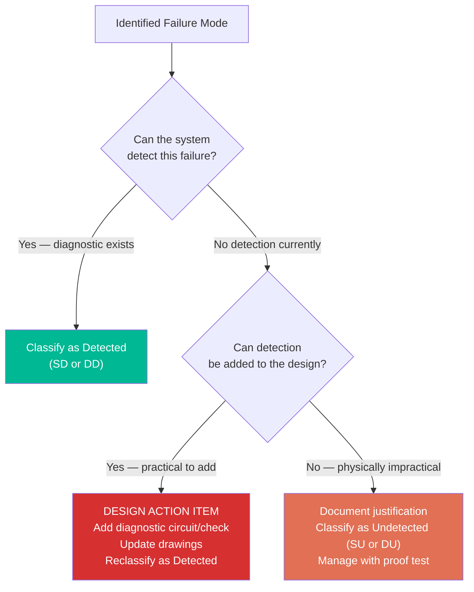
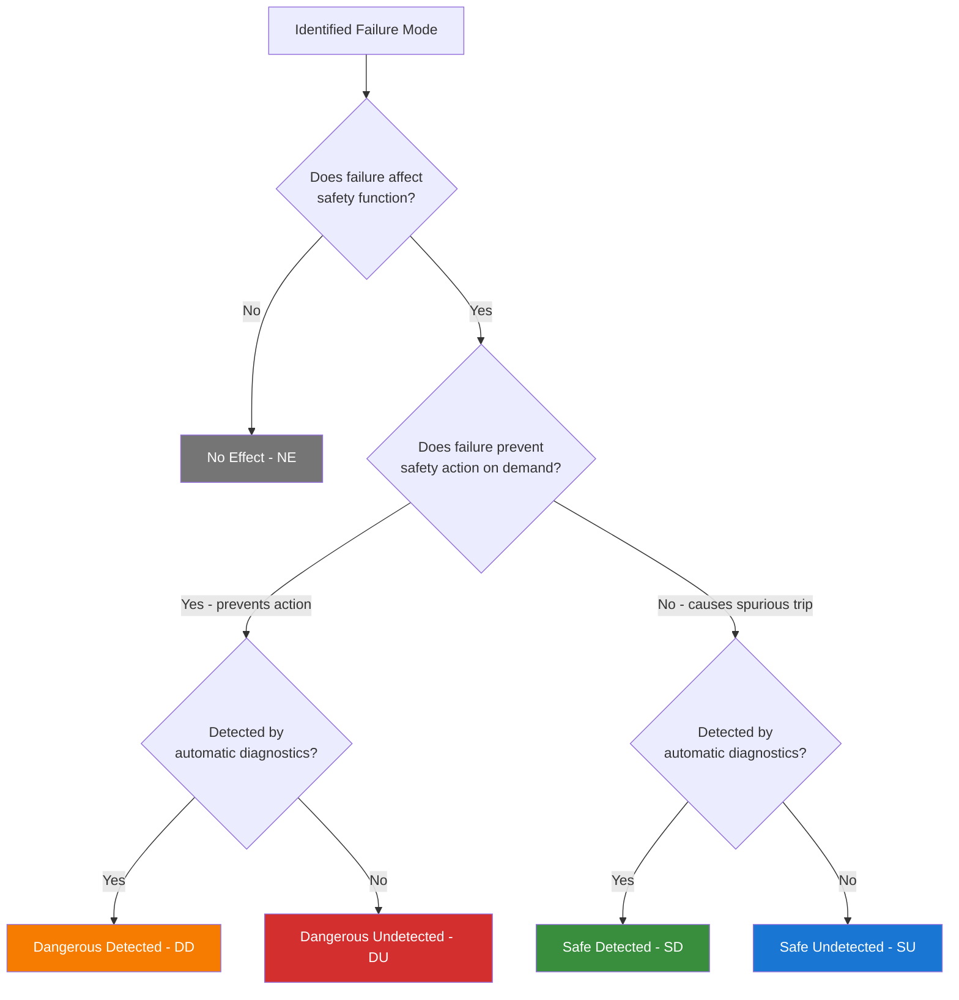
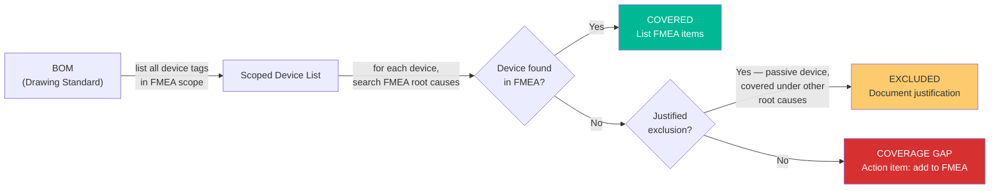
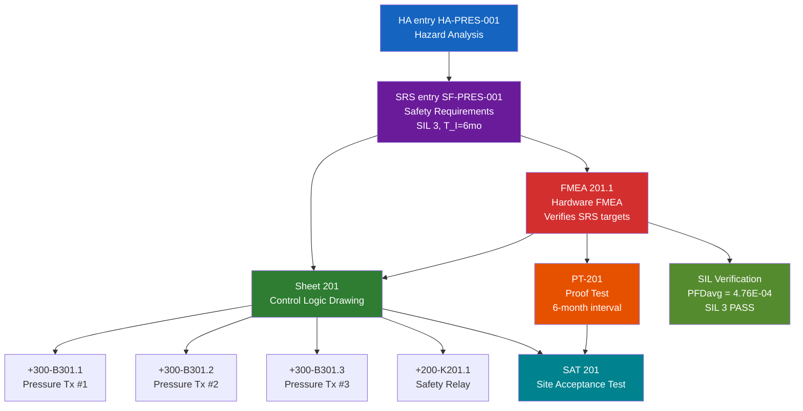

# FMEA Standard for Industrial Control Systems
## Failure Modes and Effects Analysis — Detection-Point Methodology

**Status:** Draft
**Scope:** FMEA methodology for both safety instrumented systems (SIL verification) and non-safety control systems (reliability and availability analysis). Uses detection-point organization: failure modes are grouped by how they present to the monitoring system, with root cause decomposition to individual devices. Aligned to the sheet-based numbering conventions of the Industrial Systems Drawing Standard.

---

## Table of Contents

1. [Purpose and Scope](#1-purpose-and-scope)
2. [Standards References](#2-standards-references)
3. [Definitions and Terminology](#3-definitions-and-terminology)
4. [Numbering and Identification](#4-numbering-and-identification)
5. [Failure Classification](#5-failure-classification)
6. [FMEA Methodology — Step by Step](#6-fmea-methodology--step-by-step)
7. [FMEA Worksheet Format](#7-fmea-worksheet-format)
8. [Proof Test Requirements Derived from FMEA](#8-proof-test-requirements-derived-from-fmea)
9. [Non-Safety Reliability FMEA](#9-non-safety-reliability-fmea)
10. [Coverage Analysis and BOM Reconciliation](#10-coverage-analysis-and-bom-reconciliation)
11. [Cross-Reference to Other Documents](#11-cross-reference-to-other-documents)
12. [Lifecycle and Review](#12-lifecycle-and-review)
13. [Implementation Checklist](#13-implementation-checklist)
14. [Document Information](#14-document-information)

---

## 1. Purpose and Scope

### 1.1 Purpose

This standard defines the methodology for performing Failure Modes and Effects Analysis (FMEA) on industrial control systems. It serves two complementary purposes:

**For safety instrumented systems (SIS):**
- Identify all credible failure modes and classify per IEC 61508 (safe/dangerous, detected/undetected).
- Calculate hardware safety integrity metrics (PFDavg, SFF, architectural constraints).
- Verify that SIL targets established by Hazard Analysis and LOPA are achievable by the hardware design.
- Derive proof test requirements and diagnostic test specifications.
- **Drive design iteration** — every failure mode without a detection method is a design gap to be resolved, not merely classified.
- Note that "safe" failures (spurious trips) have operational consequences traceable to the functional requirements defined in the Functional Requirements Standard (`01_Functional_Requirements_Standard`). A safe failure prevents the process function even though it does not create a safety hazard.

**For non-safety control systems (reliability FMEA):**
- Identify failure modes and their impact on process availability.
- Calculate MTBF (Mean Time Between Failures), expected failure frequency, and availability.
- Determine recommended spare parts, maintenance intervals, and monitoring requirements.
- Optimize maintenance strategy based on failure mode analysis.

The FMEA uses **detection-point organization**: failure modes are grouped by how they present to the monitoring system, not by individual device. Multiple physical root causes that produce the same observable failure are analyzed as a single mode with decomposed root causes.

### 1.2 Scope

This standard applies to:

- FMEA of SIS subsystems (sensors, logic solvers, final elements) for SIL verification
- FMEA of non-safety control systems (drives, motors, control loops, instrumentation) for reliability analysis
- SIL verification calculations derived from FMEA data
- Proof test procedure derivation from identified failure modes
- Maintenance interval optimization from reliability analysis

This standard does **not** apply to:

- General product quality FMEA (DFMEA/PFMEA per AIAG or SAE J1739).
- Software FMEA. Software safety integrity is addressed separately per IEC 61508 Part 3.
- Process Hazard Analysis or LOPA. Those are upstream activities that establish SIL targets; this FMEA verifies hardware can meet those targets.

### 1.3 Design Philosophy

**The FMEA exists to answer two questions:** For safety systems: *can this hardware achieve the required SIL?* For all systems: *how does this system fail, and can the design detect it?*

**A failure mode without a detection method is an incomplete design, not a completed analysis.**

Every FMEA entry requires three things:
1. **Failure presentation** — what does the monitoring system see?
2. **Detection method** — how is the failure detected? If blank, this is a **design action item**.
3. **System reaction** — what does the system do about it? (alarm, trip, degrade, log)

A "Dangerous Undetected" classification is not a default — it is a last resort. Before accepting DU, the analyst must ask: *can detection be added?* A feedback contact, a comparison check, a heartbeat signal — these are cheap during design. The cost of an undetected failure (extended proof test intervals, risk of failure on demand) is orders of magnitude higher.

**Distinguish between two types of DU:**
- **Designable DU:** Detection could be added but hasn't been. This generates a design action item: add the diagnostic, update the drawings, reclassify as DD.
- **Inherent DU:** The physics of the failure mode make real-time detection impractical (e.g., slow sensor drift within tolerance, spring fatigue). This is a legitimate DU, documented with justification, managed with proof tests.



**The PFDavg math proves why this matters:**
- DD contribution: `λ_DD × MTTR` (hours of exposure)
- DU contribution: `λ_DU × T_I / 2` (months of exposure)
- With MTTR = 8 hours and T_I = 4,380 hours, the DU term is ~500× larger per unit failure rate. Every failure mode moved from DU to DD is a massive improvement — more effective than adding redundant channels, which get consumed by common cause.

Additional principles:

- **Detection-point organization.** Failure modes are grouped by how they present to the monitoring system. Multiple root causes producing the same observable failure (transmitter fails low, cable open, I/O card failure) are one failure mode with one test action. This eliminates redundant entries and maps directly to proof test procedures.
- **Conservative analysis.** Where failure rate data is uncertain, use the higher credible value. Where classification is ambiguous, classify as dangerous undetected. The FMEA is not the place for optimistic assumptions.
- **Complete coverage.** Every device in the safety function path (for safety FMEA) or control loop (for reliability FMEA) requires analysis.
- **Quantitative results.** The FMEA produces numbers — PFDavg and SFF for safety; MTBF and availability for reliability — compared against defined acceptance criteria.

---

## 2. Standards References

| Standard | Title | Application |
|----------|-------|-------------|
| IEC 61508-1 | Functional Safety — General requirements | Safety lifecycle, SIL targets |
| IEC 61508-2 | Functional Safety — Requirements for E/E/PE safety-related systems | Hardware safety integrity, architectural constraints, SFF, PFDavg |
| IEC 61508-6 | Functional Safety — Guidelines on the application of Parts 2 and 3 | PFDavg formulas, beta factor scoring, failure rate estimation |
| IEC 61508-7 | Functional Safety — Overview of techniques and measures | FMEA technique description |
| IEC 61511-1 | Functional safety — Safety instrumented systems for the process industry sector | Process sector SIS requirements, proof testing |
| IEC 61511-2 | Functional safety — Guidelines for the application of IEC 61511-1 | Practical guidance for SIS design verification |
| IEC 60812 | Failure modes and effects analysis (FMEA and FMECA) | FMEA methodology, worksheet formats, severity classification |
| Industrial Systems Drawing Standard | Device, Wire, and Drawing Numbering Convention | Sheet numbering, device tags, cross-referencing |
| Hazard Analysis Standard | HAZOP and LOPA methodology | HA numbering, safety function identification, SIL allocation |
| SRS Standard | Safety Requirements Specification Methodology | Source of SIL targets, T_I values, architecture specification, and PFDavg calculation methodology |

---

## 3. Definitions and Terminology

| Term | Symbol | Definition |
|------|--------|------------|
| Failure Mode | — | The manner in which a component fails (e.g., coil open circuit, contact weld, output drift high) |
| Failure Rate | lambda | The probability of failure per unit time, expressed in failures per hour (FIT = failures in 10^9 hours) |
| Safe Failure | lambda_S | A failure that causes the safety function to go to its safe state (e.g., spurious trip) or has no effect on the safety function |
| Dangerous Failure | lambda_D | A failure that prevents the safety function from operating correctly on demand |
| Safe Detected | lambda_SD | A safe failure that is detected by automatic diagnostics |
| Safe Undetected | lambda_SU | A safe failure that is not detected by automatic diagnostics (detected only by proof test or operational observation) |
| Dangerous Detected | lambda_DD | A dangerous failure that is detected by automatic diagnostics and can be acted upon within the process safety time |
| Dangerous Undetected | lambda_DU | A dangerous failure that is not detected by automatic diagnostics; only found by proof testing or upon actual demand |
| No Effect | lambda_NE | A failure that has no effect on the safety function (component failure is outside the safety function path) |
| Safe Failure Fraction | SFF | Ratio of safe and dangerous detected failures to total failures: SFF = (lambda_SD + lambda_SU + lambda_DD) / (lambda_SD + lambda_SU + lambda_DD + lambda_DU) |
| Hardware Fault Tolerance | HFT | The number of faults a subsystem can tolerate before losing its safety function. HFT=N means (N+1) faults are needed to cause failure. |
| Probability of Failure on Demand (average) | PFDavg | The average probability that the safety function will fail to perform its intended function when demanded. Used for low-demand mode SIS. |
| Probability of Dangerous Failure per Hour | PFH | The probability of a dangerous failure of the safety function per hour. Used for high-demand or continuous mode SIS. |
| Common Cause Failure | CCF | A failure of multiple components from a single shared cause (e.g., environmental stress, design defect, maintenance error) |
| Beta Factor | beta | The fraction of undetected dangerous failures that affect all redundant channels simultaneously due to common cause |
| Diagnostic Coverage | DC | The fraction of a failure mode's total failure rate that is detected by automatic diagnostics: DC = lambda_DD / (lambda_DD + lambda_DU) for dangerous failures |
| Mean Time to Restoration | MTTR | The average time from detection of a dangerous detected failure to restoration of the safety function to its fully functional state |
| Proof Test Interval | T_I | The time interval between comprehensive tests that reveal dangerous undetected failures |
| Proof Test Coverage | PTC | The fraction of dangerous undetected failures that are detected by the proof test procedure |
| Mission Time | — | The total operational period for which the SIS is designed to function before replacement or major overhaul (typically 15-25 years per IEC 61508) |
| Safety Integrity Level | SIL | A discrete level (1-4) representing the required safety performance of a safety function, where SIL 4 is the most dependable |
| Safety Instrumented Function | SIF | A specific safety function implemented by a SIS, consisting of sensors, logic solver, and final elements |
| Safety Function | SF-XXX-NNN | Identifier for a specific safety function per the HA Standard (e.g., SF-PRES-001) |

---

## 4. Numbering and Identification

### 4.1 FMEA Document Identification

**Format:** `FMEA [Sheet].[Sequence]`

| Component | Description | Example |
|-----------|-------------|---------|
| `[Sheet]` | The **detection/logic sheet** — where failures are observed and acted upon | 201, 235, 150 |
| `.[Sequence]` | Distinguishes multiple FMEAs for the same sheet | .1, .2 |

**The sheet number references the detection point, not the failing device.** A pressure transmitter on Sheet 301 that is monitored by logic on Sheet 201 is analyzed in FMEA 201.1, not FMEA 301.1. This is because:

- Multiple physical failures present identically at the detection point (transmitter fails low, cable open, I/O card fails — all read "signal low" at the logic)
- Tests are executed from the detection point (pull the wire at the PLC input terminal)
- One failure presentation = one FMEA entry = one test action = no redundancy

**Examples:**

- `FMEA 201.1` — Failures as seen by the logic on Sheet 201 (safety: SF-PRES-001)
- `FMEA 235.1` — Failures as seen by the control on Sheet 235 (non-safety: VFD reliability)
- `FMEA 150.1` — Failures as seen by the utility control on Sheet 150 (non-safety: HVAC reliability)

### 4.2 FMEA Item Numbering

**Format:** `FMEA Sheet.Device.Mode`

Each FMEA worksheet entry is identified by the detection sheet number, the device sequence on that sheet, and the failure mode sequence for that device. This three-level format directly encodes context: which sheet, which device, which failure mode.

| Component | Description | Example |
|-----------|-------------|---------|
| `Sheet` | Detection/logic sheet number | 201 |
| `.Device` | Device sequence on that sheet | .1 (first device), .2 (second device) |
| `.Mode` | Sequential failure mode number for that device | .1, .2, .3 |

**Single device or subsystem on the detection sheet:**

When one primary device or subsystem is analyzed per sheet, the device level is omitted and the format simplifies to `FMEA Sheet.Mode`:

- `FMEA 201.1` — First failure mode of the safety function on Sheet 201
- `FMEA 201.2` — Second failure mode of the safety function on Sheet 201

**Multiple devices on the detection sheet:**

When multiple independent devices are analyzed on the same detection sheet, each gets its own device number:

- `FMEA 201.1.1` — First failure mode of Device 1 on Sheet 201
- `FMEA 201.1.2` — Second failure mode of Device 1 on Sheet 201
- `FMEA 201.2.1` — First failure mode of Device 2 on Sheet 201
- `FMEA 201.2.2` — Second failure mode of Device 2 on Sheet 201

**Examples (three-level):**

- `FMEA 201.1.3` — Third failure mode of the first device analyzed on Sheet 201 (e.g., transmitter B301.1 fixed output)
- `FMEA 201.2.3` — Same failure mode for the second device (transmitter B301.2 fixed output)
- `FMEA 201.3.3` — Same failure mode for the third device (transmitter B301.3 fixed output)

For identical redundant devices (e.g., B301.1 / B301.2 / B301.3 in a 2oo3 group), the mode numbers correspond across devices: `.x.3` is always the same failure mode type across all channels. This allows compact cross-references like `FMEA 201.x.3` to mean "fixed output failure mode for all three transmitters."

### 4.3 One FMEA per Function per Detection Sheet

A single detection sheet may serve multiple independent functions. Each function receives its own FMEA:

```
Sheet 201 logic implements:
  SF-PRES-001 (Overpressure Protection) → FMEA 201.1
  SF-TEMP-001 (Overtemperature Protection) → FMEA 201.2 (if on same logic sheet)
```

For non-safety:
```
Sheet 235 VFD control:
  Feed Pump Motor Control → FMEA 235.1
```

### 4.4 Detection-Point Organization

The FMEA is organized around **how failures present to the monitoring system**, not around individual devices. This naturally handles the fact that safety functions span multiple sheets:

```
FMEA 201.1 — Detection-Point View
  Logic Sheet: 201 (Overpressure Protection Control Logic)

  Channel 1 Input (PLC AI:Ch1, serves +300-B301.1):
    Failure presentations at this channel:
      "Signal reads low / loss of signal"
        Root causes: transmitter drift low, cable open, AI card fail
      "Signal reads high"
        Root causes: transmitter drift high, cable short, AI card fail high
      "Signal frozen (mid-range)"
        Root causes: transmitter stuck, AI card latched

  Channel 2 Input (PLC AI:Ch2, serves +300-B301.2):
    [Same structure]

  Channel 3 Input (PLC AI:Ch3, serves +300-B301.3):
    [Same structure]

  Output (PLC DO:Ch1, drives +200-K201.1):
    Failure presentations:
      "Output stuck energized (cannot trip)"
        Root causes: DO card stuck ON, relay contact weld, mechanical binding
      "Output de-energizes (spurious trip)"
        Root causes: DO card fail OFF, relay coil open, relay coil short
```

Device tags from other sheets (+300-B301.1, CBL-301-01) are captured as **root causes** within each failure presentation. The physical device traceability is preserved without creating redundant FMEA entries.

### 4.5 FMEA Scope Definition

The FMEA scope section lists all sheets and devices whose failures are observed at this detection point:

```
FMEA 201.1 — Scope
  Safety Function: SF-PRES-001 (Overpressure Protection, SIL 3)
  Hazard Analysis: HA-PRES-001
  Detection Sheet: 201

  Input Channels:
    Ch1 → +300-B301.1 (Pressure Tx #1, Sheet 301) via CBL-301-01
    Ch2 → +300-B301.2 (Pressure Tx #2, Sheet 301) via CBL-301-02
    Ch3 → +300-B301.3 (Pressure Tx #3, Sheet 302) via CBL-301-03

  Logic:
    2oo3 voting, safety PLC on Sheet 201

  Output:
    DO:Ch1 → +200-K201.1 (Safety Relay, Sheet 201) → XV-201 (shutdown valve)

  Architecture: Sensor 2oo3 (HFT=1) | Logic 1oo1 | Final Element 1oo1
```

---

## 5. Failure Classification

### 5.1 Failure Mode Taxonomy (IEC 61508-2)

Every identified failure mode shall be classified into one of the following categories:

| Category | Code | Description | Effect on Safety Function |
|----------|------|-------------|--------------------------|
| Safe Detected | SD | Failure causes spurious trip or safe-state action; detected by diagnostics | Spurious shutdown; nuisance trip |
| Safe Undetected | SU | Failure causes spurious trip or safe-state action; not detected by diagnostics | Spurious shutdown discovered operationally |
| Dangerous Detected | DD | Failure prevents safety action on demand; detected by diagnostics | Safety function impaired but detected; operator/system can respond |
| Dangerous Undetected | DU | Failure prevents safety action on demand; not detected by diagnostics | Safety function impaired, unknown until proof test or actual demand |
| No Effect | NE | Failure does not affect the safety function | No impact on safety |

### 5.2 Classification Decision Process

For each failure mode, answer two questions in order:

**Question 1: What is the effect on the safety function?**

- If the failure prevents the safety function from performing its intended action on demand (e.g., valve fails to close, transmitter reads normal when pressure is high) -- classify as **Dangerous (D)**.
- If the failure causes the safety function to act without a genuine demand (e.g., transmitter reads high when pressure is normal, relay de-energizes without cause) -- classify as **Safe (S)**.
- If the failure has no effect on the ability of the safety function to operate correctly -- classify as **No Effect (NE)**.

**Question 2: Is the failure detected by automatic diagnostics?**

- If yes -- append **Detected (D)**: the failure becomes SD or DD.
- If no -- append **Undetected (U)**: the failure becomes SU or DU.

Detection means automatic diagnostics that run during normal operation (watchdog timers, comparison voting, line monitoring, self-test). Proof testing is not automatic diagnostic detection -- failures found only by proof test are classified as Undetected.

### 5.3 Failure Classification Decision Tree



### 5.4 De-Energize-to-Trip Convention

For safety systems designed with de-energize-to-trip architecture (the standard practice per IEC 61511):

| Physical Failure | Effect | Classification |
|-----------------|--------|----------------|
| Relay coil open circuit | Relay de-energizes, contacts move to safe state | Safe |
| Relay coil short circuit | Depends on failure effect -- may blow fuse (safe) or lock on (dangerous) | Analyze case by case |
| Relay contact weld (N.O. in energize path) | Contact stuck closed, cannot de-energize to trip | Dangerous |
| Relay contact fail open (N.O. in energize path) | Circuit opens, system trips | Safe |
| Transmitter output high (above trip setpoint) | System sees overpressure, trips | Safe |
| Transmitter output low (below trip setpoint) | System sees low pressure, does not trip on actual overpressure | Dangerous |
| Transmitter fixed output (mid-range) | System sees normal pressure, does not trip on actual overpressure | Dangerous |
| Loss of transmitter signal | Depends on input module failsafe configuration | Analyze per configuration |

### 5.5 Voting Architecture Effects on Classification

In redundant voting architectures, a single-channel failure may not cause loss of the safety function. The classification considers the effect on the overall SIF:

**2oo3 Voting (as in the example system):**

- One transmitter fails dangerous: voting logic still has two good channels. The safety function still operates. However, the failure is still classified as **Dangerous** at the component level because it degrades the architecture from 2oo3 to 2oo2 (reduced fault tolerance). The voting benefit is captured in the PFDavg calculation, not in the classification.
- One transmitter fails safe (reads high): voting logic may see a 1oo3 trip condition (one channel above setpoint). Depending on configuration, this may or may not cause a spurious trip. For 2oo3 voting, a single safe failure does not cause a trip -- it degrades to 1oo2 for spurious trips. Classified as **Safe** at the component level.

**Key principle:** Classify at the component level. The architecture's fault tolerance is accounted for in the PFDavg formulas, not in the failure classification.

---

## 6. FMEA Methodology — Step by Step

### 6.1 Overview

```mermaid
graph LR
    S1[Step 1<br/>Identify SF<br/>and SIL Target] --> S2[Step 2<br/>Define System<br/>Boundaries]
    S2 --> S3[Step 3<br/>Decompose into<br/>Subsystems]
    S3 --> S4[Step 4<br/>Identify<br/>Failure Modes]
    S4 --> S5[Step 5<br/>Obtain Failure<br/>Rate Data]
    S5 --> S6[Step 6<br/>Calculate<br/>Diagnostic Coverage]
    S6 --> S7[Step 7<br/>Determine Effect<br/>on SF]
    S7 --> S8[Step 8<br/>Calculate Subsystem<br/>and Overall Metrics]
    S8 --> S9[Step 9<br/>Verify Against<br/>SIL Target]
    S9 --> S10[Step 10<br/>Document<br/>Recommendations]
```



### 6.2 Step 1: Identify the Safety Function and SIL Target

From the SRS entry for this safety function (which was derived from the HA and LOPA):

- **Safety Function ID:** SF-PRES-001 (SRS entry in SRS-RefineryXYZ)
- **Description:** On detection of high pressure in Vessel XYZ (2oo3 voting), de-energize safety relay +200-K201.1 to close shutdown valve XV-201 within 3 seconds.
- **SIL Target:** SIL 3 (from LOPA, documented in HA entry HA-PRES-001, specified in SRS entry SF-PRES-001)
- **Demand Mode:** Low demand (< 1 demand per year)
- **Required PFDavg:** < 1.0E-03 (SIL 3 per SRS)
- **Proof Test Interval:** 6 months (T_I = 4,380 hr, per SRS)
- **Process Safety Time:** 10 seconds

### 6.3 Step 2: Define System Boundaries Using Drawing Sheets

Identify all drawing sheets and devices that implement the safety function. Use the Drawing Standard's sheet organization:

```
SF-PRES-001 System Boundary:
  ┌─────────────────────────────────────────────────┐
  │ SENSOR SUBSYSTEM (Cabinet +300, Sheets 310-312) │
  │   +300-B301.1  Pressure Transmitter #1          │
  │   +300-B301.2  Pressure Transmitter #2          │
  │   +300-B301.3  Pressure Transmitter #3          │
  └──────────────────────┬──────────────────────────┘
                         │ 4-20mA signals
  ┌──────────────────────┴──────────────────────────┐
  │ LOGIC SOLVER SUBSYSTEM (Cabinet +200, Sheet 201)│
  │   Safety PLC / Relay Logic on Sheet 201         │
  │   2oo3 voting logic                             │
  └──────────────────────┬──────────────────────────┘
                         │ Trip command
  ┌──────────────────────┴──────────────────────────┐
  │ FINAL ELEMENT SUBSYSTEM (Cabinet +200, Sht 201) │
  │   +200-K201.1  Safety Relay                     │
  │   (drives shutdown valve XV-201 in field)       │
  └─────────────────────────────────────────────────┘
```

Note: The shutdown valve XV-201 in the field is the final process element. If it is within the SIF boundary (it typically is), its failure modes must also be analyzed. For this worked example, the FMEA boundary includes sensor, logic solver, and final element subsystems up to and including the safety relay output. The valve FMEA would be a separate analysis or included as an extension.

### 6.4 Step 3: Decompose into Subsystems

Per IEC 61508-2 and IEC 61511, decompose the SIF into three subsystems for independent reliability assessment:

| Subsystem | Architecture | Devices | HFT |
|-----------|-------------|---------|-----|
| Sensor | 2oo3 | +300-B301.1, B301.2, B301.3 | 1 |
| Logic Solver | 1oo1 | Safety PLC on Sheet 201 | 0 |
| Final Element | 1oo1 | +200-K201.1 (Safety Relay) | 0 |

Overall SIF PFDavg = PFD_sensor + PFD_logic + PFD_final

Each subsystem is analyzed independently. The subsystem with the weakest SFF determines the architectural constraint for that subsystem.

### 6.5 Step 4: Identify Failure Modes for Each Device

For each device identified by its tag on the drawing, list all credible failure modes. Sources for failure mode identification:

- Manufacturer FMEA data (if available in device safety manual)
- IEC 61508 generic failure mode tables
- OREDA (Offshore and Onshore Reliability Data)
- Published literature and industry databases (e.g., SINTEF PDS Data Handbook)
- Engineering judgment by competent functional safety engineer

**Minimum failure modes to consider per device type:**

**Pressure Transmitter (+300-B301.x):**
| Failure Mode | Description |
|-------------|-------------|
| Drift high | Output drifts above true value |
| Drift low | Output drifts below true value |
| Fixed output (mid-range) | Output stuck at a value within normal range |
| Loss of signal | Output drops to 0 mA or cable fault |
| Sensor element failure | Sensing element degraded or failed |
| Electronics failure | Internal electronics failure |

**Safety Relay (+200-K201.1):**
| Failure Mode | Description |
|-------------|-------------|
| Coil open circuit | Coil winding breaks, relay cannot energize |
| Coil short circuit | Coil winding shorts, may blow fuse or overheat |
| Contact weld (N.O.) | Normally open contact stuck closed |
| Contact fail open | Contact fails to make, circuit opens |
| Contact high resistance | Contact resistance increases, degraded circuit |
| Mechanical binding | Armature stuck, relay fails to change state |

**Logic Solver (Safety PLC on Sheet 201):**
| Failure Mode | Description |
|-------------|-------------|
| Input module failure — reads high | Analog input reads above true process value |
| Input module failure — reads low | Analog input reads below true process value |
| Input module failure — fixed output | Analog input stuck at last value or default |
| CPU failure | Processor stops executing safety program |
| Output module failure — stuck ON | Digital output stuck in energized state |
| Output module failure — stuck OFF | Digital output stuck in de-energized state |
| Communication failure | Internal bus or network failure |
| Power supply failure | Loss of internal power to logic solver |
| Watchdog failure | Watchdog timer fails to detect CPU fault |

### 6.6 Step 5: Obtain Failure Rate Data

For each failure mode, obtain the failure rate from the most authoritative source available, in this priority order:

1. **Device Safety Manual** (manufacturer-certified data per IEC 61508). This is the preferred source for SIL-rated devices.
2. **Third-party certification body data** (e.g., TÜV, Exida certificates).
3. **IEC 61508-2/6 generic data tables.**
4. **OREDA Handbook** (for process industry equipment).
5. **SINTEF PDS Data Handbook.**
6. **Conservative engineering estimate** (document the basis and apply additional safety margin).

**Units:** Failure rates shall be expressed in failures per hour. For reference: 1 FIT = 1.0E-09 failures per hour.

**Record the source** for each failure rate value in the FMEA worksheet. Traceability of failure rate data is essential for review and audit.

### 6.7 Step 6: Calculate Diagnostic Coverage for Each Failure Mode

Diagnostic coverage (DC) is the fraction of each dangerous failure mode's rate that is detected by automatic diagnostics:

```
DC = lambda_DD / (lambda_DD + lambda_DU)
```

Sources for DC values:

- Device Safety Manual (SIL-certified devices provide DC per failure mode)
- IEC 61508-2 Table A.1 through A.14 (generic DC values by diagnostic technique)
- IEC 61508-7 Annex A through E

**Common diagnostic techniques and typical DC values (IEC 61508-2):**

| Diagnostic Technique | Typical DC |
|---------------------|------------|
| Input comparison (2oo3 voting, deviation alarm) | 90% |
| Watchdog timer with separate time base | 90% |
| Relay contact feedback monitoring | 90% |
| Analog input range check (out-of-range detection) | 60% |
| Cross-monitoring of redundant channels | 90% |
| Power supply monitoring | 90% |
| CPU self-test (RAM, ROM, registers) | 90% |
| Output pulse test (partial stroke test) | 60-90% |
| No diagnostics | 0% |

### 6.8 Step 7: Determine Effect on Safety Function

For each failure mode, document:

1. **Local effect:** What happens at the device level (e.g., "transmitter reads 4 mA").
2. **System effect:** What happens at the SIF level considering the architecture (e.g., "2oo3 voting degraded to 2oo2, safety function still available but with reduced fault tolerance").
3. **End effect:** What happens if a demand occurs with this failure present (e.g., "safety function operates correctly via remaining two channels" or "safety function fails to operate").
4. **Severity:** Critical / Marginal / Negligible based on the end effect.

### 6.9 Step 8: Calculate Subsystem and Overall Metrics

Using the classified failure rates from the worksheet:

1. Sum failure rates by category for each device: lambda_SD, lambda_SU, lambda_DD, lambda_DU
2. Calculate SFF for each subsystem
3. Calculate PFDavg for each subsystem using the appropriate architecture formula (see SRS Standard Section 6)
4. Calculate overall SIF PFDavg

### 6.10 Step 9: Verify Against SIL Target

Compare calculated values against:

1. **PFDavg target** for the required SIL (see SRS Standard Section 6.2)
2. **Architectural constraints** per IEC 61508-2 Route 1H (see SRS Standard Section 6.4)
3. **Both checks must pass** for the SIL to be claimed

### 6.11 Step 10: Document Recommendations

Where the analysis reveals issues:

- Failure modes with insufficient DC: recommend additional diagnostics
- PFDavg exceeds target: recommend architecture upgrade, shorter proof test interval, or higher-reliability components
- Architectural constraints not met: recommend redundancy upgrade or higher-SFF components
- DU failure modes with no proof test coverage: recommend proof test procedure enhancements

---

## 7. FMEA Worksheet Format

### 7.1 Worksheet Template

The FMEA worksheet shall include the following columns. The header block identifies the safety function; the table body lists each failure mode:

**Header Block:**
```
FMEA Document:    FMEA 201.1
Safety Function:  SF-PRES-001 — Overpressure Protection, Vessel XYZ
SIL Target:       SIL 3
HA Reference:     HA-PRES-001
Architecture:     Sensor: 2oo3 | Logic: 1oo1 | Final Element: 1oo1
Drawing Sheets:   201, 310, 311, 312
Prepared By:      [Name]                    Date: [Date]
Reviewed By:      [Name]                    Date: [Date]
Approved By:      [Name]                    Date: [Date]
```

**Worksheet Columns:**

| Column | Content | Units/Format |
|--------|---------|-------------|
| Item # | Device tag + failure sequence: `[DeviceTag].[Seq]` | B301.1.1, A201.1.3, K201.1.2 |
| Subsystem | Sensor / Logic Solver / Final Element | Text |
| Device Tag | Per Drawing Standard | +300-B301.1 |
| Device Description | Per drawing description field | Pressure Transmitter #1 |
| Failure Mode | Specific failure mode | Text description |
| Failure Rate (lambda) | Total failure rate for this mode | per hour |
| S/D/NE | Safe, Dangerous, or No Effect | S / D / NE |
| Detection Method | How the failure is detected | Auto diag / Proof test / Demand |
| DC (%) | Diagnostic coverage percentage | 0-100% |
| lambda_SD | Safe detected failure rate | per hour |
| lambda_SU | Safe undetected failure rate | per hour |
| lambda_DD | Dangerous detected failure rate | per hour |
| lambda_DU | Dangerous undetected failure rate | per hour |
| Effect on SF | Description of effect on safety function | Text |
| Severity | Critical / Marginal / Negligible | Text |
| Recommendations | Actions to improve | Text |
| Data Source | Source of failure rate | Manufacturer / OREDA / IEC 61508 |

### 7.2 Worked Example: FMEA 201.1 — Overpressure Protection System

**System Description:**

Refinery Vessel XYZ Overpressure Protection (SF-PRES-001, SIL 3). Three pressure transmitters (+300-B301.1, B301.2, B301.3) in 2oo3 voting configuration feed a safety logic solver on Sheet 201, which commands safety relay +200-K201.1 to de-energize and close shutdown valve XV-201.

The system uses de-energize-to-trip architecture: the safety relay is normally energized. On detection of 2oo3 high-pressure condition, the logic solver de-energizes the relay, which opens its N.O. contacts, removing power to the valve solenoid, causing the valve to close (spring-return fail-closed).

#### 7.2.1 Sensor Subsystem — Pressure Transmitters (2oo3)

Device: Smart Pressure Transmitter, 4-20 mA HART, SIL 2 rated individually.
Total failure rate per transmitter: lambda_total = 3.40E-06 per hour (from manufacturer safety manual).

The failure rate split per manufacturer safety manual:

| Item | Device Tag | Device Description | Failure Mode | lambda (per hr) | S/D/NE | Detection Method | DC% | lambda_SD | lambda_SU | lambda_DD | lambda_DU | Effect on SF | Severity | Data Source |
|------|------------|-------------------|-------------|-----------------|--------|-----------------|-----|-----------|-----------|-----------|-----------|-------------|----------|-------------|
| B301.1.1 | +300-B301.1 | Pressure Transmitter #1 | Drift high (above setpoint) | 4.08E-07 | S | Input comparison (2oo3 voting deviation) | 90% | 3.67E-07 | 4.08E-08 | — | — | Spurious trip contribution (1 of 3 channels high); 2oo3 prevents single-channel spurious trip | Negligible | Mfr Safety Manual |
| B301.1.2 | +300-B301.1 | Pressure Transmitter #1 | Drift low (below setpoint) | 4.08E-07 | D | Input comparison (2oo3 voting deviation) | 90% | — | — | 3.67E-07 | 4.08E-08 | One channel reads low; does not trip on demand. 2oo3 degraded to 2oo2. | Marginal | Mfr Safety Manual |
| B301.1.3 | +300-B301.1 | Pressure Transmitter #1 | Fixed output (mid-range, within normal band) | 6.80E-07 | D | Input comparison (2oo3 voting deviation) | 60% | — | — | 4.08E-07 | 2.72E-07 | One channel stuck; may not trip on demand. 2oo3 degraded to 2oo2. | Marginal | Mfr Safety Manual |
| B301.1.4 | +300-B301.1 | Pressure Transmitter #1 | Loss of signal (< 3.6 mA) | 5.10E-07 | S | Input range check (under-range detection) | 99% | 5.05E-07 | 5.10E-09 | — | — | Signal loss detected; channel flagged invalid. De-energize-to-trip: loss treated as safe. | Negligible | Mfr Safety Manual |
| B301.1.5 | +300-B301.1 | Pressure Transmitter #1 | Sensor element failure (zero shift) | 5.44E-07 | D | Input comparison (2oo3 voting deviation) | 60% | — | — | 3.26E-07 | 2.18E-07 | Sensor reads incorrect value; may not trip. 2oo3 degraded to 2oo2. | Marginal | Mfr Safety Manual |
| B301.1.6 | +300-B301.1 | Pressure Transmitter #1 | Electronics failure (output saturates high, > 21 mA) | 5.10E-07 | S | Input range check (over-range detection) | 99% | 5.05E-07 | 5.10E-09 | — | — | Output high; appears as overpressure. 2oo3 prevents single-channel spurious trip. | Negligible | Mfr Safety Manual |
| B301.1.7 | +300-B301.1 | Pressure Transmitter #1 | Electronics failure (output saturates low) | 3.40E-07 | D | Input range check (under-range detection) | 90% | — | — | 3.06E-07 | 3.40E-08 | Output low; does not trip. 2oo3 degraded to 2oo2. | Marginal | Mfr Safety Manual |

**Transmitter #1 summary totals:**

| Category | Rate (per hour) |
|----------|----------------|
| lambda_SD | 1.38E-06 |
| lambda_SU | 5.12E-08 |
| lambda_DD | 1.41E-06 |
| lambda_DU | 5.65E-07 |
| **lambda_total** | **3.40E-06** |
| **lambda_S** | **1.43E-06** |
| **lambda_D** | **1.97E-06** |

**SFF per transmitter:**
```
SFF = (lambda_SD + lambda_SU + lambda_DD) / (lambda_SD + lambda_SU + lambda_DD + lambda_DU)
SFF = (1.38E-06 + 5.12E-08 + 1.41E-06) / (1.38E-06 + 5.12E-08 + 1.41E-06 + 5.65E-07)
SFF = 2.84E-06 / 3.40E-06
SFF = 0.834 (83.4%)
```

Transmitters B301.2 and B301.3 are identical type and model; the same failure mode analysis applies with the same rates. Items B301.2.1–B301.2.7 and B301.3.1–B301.3.7 repeat the above table with updated device tags.

#### 7.2.2 Logic Solver Subsystem — Safety PLC (1oo1)

Device: SIL 3 rated safety PLC, certified per IEC 61508. Manufacturer provides pre-assessed failure rate data.
Total safety-relevant failure rate: lambda_total = 1.50E-06 per hour.

| Item | Device Tag | Device Description | Failure Mode | lambda (per hr) | S/D/NE | Detection Method | DC% | lambda_SD | lambda_SU | lambda_DD | lambda_DU | Effect on SF | Severity | Data Source |
|------|------------|-------------------|-------------|-----------------|--------|-----------------|-----|-----------|-----------|-----------|-----------|-------------|----------|-------------|
| A201.1.1 | +200-A201.1 | Safety PLC — AI Module | Input reads high (all 3 channels) | 7.50E-08 | S | Self-test, cross-channel comparison | 99% | 7.43E-08 | 7.50E-10 | — | — | All inputs read high; 2oo3 trips; spurious trip | Marginal | Mfr Safety Manual |
| A201.1.2 | +200-A201.1 | Safety PLC — AI Module | Input reads low (single channel) | 7.50E-08 | D | Self-test, range monitoring | 95% | — | — | 7.13E-08 | 3.75E-09 | One input reads low; does not trip. Voting degraded. | Marginal | Mfr Safety Manual |
| A201.1.3 | +200-A201.1 | Safety PLC — AI Module | Input stuck at last value | 1.50E-07 | D | Heartbeat monitoring, deviation check | 60% | — | — | 9.00E-08 | 6.00E-08 | Input frozen; may not detect pressure rise. | Marginal | Mfr Safety Manual |
| A201.1.4 | +200-A201.1 | Safety PLC — CPU | CPU stops / halts | 3.00E-07 | S | Independent watchdog (separate time base) | 99% | 2.97E-07 | 3.00E-09 | — | — | Watchdog trips; outputs de-energize (safe state) | Negligible | Mfr Safety Manual |
| A201.1.5 | +200-A201.1 | Safety PLC — CPU | CPU logic corruption | 1.50E-07 | D | Program flow monitoring, CRC checks | 90% | — | — | 1.35E-07 | 1.50E-08 | Incorrect computation; may not trip correctly | Critical | Mfr Safety Manual |
| A201.1.6 | +200-A201.1 | Safety PLC — DO Module | Output stuck ON (energized) | 2.25E-07 | D | Output readback monitoring | 90% | — | — | 2.03E-07 | 2.25E-08 | Cannot de-energize relay; safety function fails | Critical | Mfr Safety Manual |
| A201.1.7 | +200-A201.1 | Safety PLC — DO Module | Output stuck OFF (de-energized) | 2.25E-07 | S | Output readback monitoring | 90% | 2.03E-07 | 2.25E-08 | — | — | Output off; relay de-energizes; spurious trip | Marginal | Mfr Safety Manual |
| A201.1.8 | +200-A201.1 | Safety PLC — Power Supply | Loss of internal power | 1.50E-07 | S | Power supply monitoring | 99% | 1.49E-07 | 1.50E-09 | — | — | PLC loses power; outputs de-energize; spurious trip | Marginal | Mfr Safety Manual |
| A201.1.9 | +200-A201.1 | Safety PLC — Communication | Internal bus failure | 1.50E-07 | D | Communication timeout monitoring | 95% | — | — | 1.43E-07 | 7.50E-09 | Voting cannot execute; response depends on failsafe config | Marginal | Mfr Safety Manual |

**Logic Solver summary totals:**

| Category | Rate (per hour) |
|----------|----------------|
| lambda_SD | 7.23E-07 |
| lambda_SU | 2.79E-08 |
| lambda_DD | 6.42E-07 |
| lambda_DU | 1.09E-07 |
| **lambda_total** | **1.50E-06** |
| **lambda_S** | **7.51E-07** |
| **lambda_D** | **7.51E-07** |

**SFF for Logic Solver:**
```
SFF = (lambda_SD + lambda_SU + lambda_DD) / (lambda_SD + lambda_SU + lambda_DD + lambda_DU)
SFF = (7.23E-07 + 2.79E-08 + 6.42E-07) / (7.23E-07 + 2.79E-08 + 6.42E-07 + 1.09E-07)
SFF = 1.39E-06 / 1.50E-06
SFF = 0.927 (92.7%)
```

#### 7.2.3 Final Element Subsystem — Safety Relay (1oo1)

Device: Safety relay, force-guided contacts, SIL rated, de-energize-to-trip architecture.
Total failure rate: lambda_total = 5.00E-07 per hour.

| Item | Device Tag | Device Description | Failure Mode | lambda (per hr) | S/D/NE | Detection Method | DC% | lambda_SD | lambda_SU | lambda_DD | lambda_DU | Effect on SF | Severity | Data Source |
|------|------------|-------------------|-------------|-----------------|--------|-----------------|-----|-----------|-----------|-----------|-----------|-------------|----------|-------------|
| K201.1.1 | +200-K201.1 | Safety Relay | Coil open circuit | 1.00E-07 | S | Coil current monitoring | 90% | 9.00E-08 | 1.00E-08 | — | — | Relay de-energizes; valve closes; spurious trip | Marginal | Mfr Safety Manual |
| K201.1.2 | +200-K201.1 | Safety Relay | Coil short circuit | 5.00E-08 | S | Coil current monitoring / fuse blow | 90% | 4.50E-08 | 5.00E-09 | — | — | Fuse blows or overcurrent; relay de-energizes; spurious trip | Marginal | Mfr Safety Manual |
| K201.1.3 | +200-K201.1 | Safety Relay | Contact weld (N.O. power contact) | 1.50E-07 | D | Force-guided contact feedback | 90% | — | — | 1.35E-07 | 1.50E-08 | Contact stuck closed; relay cannot de-energize valve; safety function fails | Critical | Mfr Safety Manual |
| K201.1.4 | +200-K201.1 | Safety Relay | Contact fail open (N.O. power contact) | 5.00E-08 | S | Output monitoring / valve position feedback | 90% | 4.50E-08 | 5.00E-09 | — | — | Contact open; valve closes; spurious trip | Marginal | Mfr Safety Manual |
| K201.1.5 | +200-K201.1 | Safety Relay | Contact high resistance | 5.00E-08 | D | None (gradual degradation) | 0% | — | — | 0.00E+00 | 5.00E-08 | Increased resistance may prevent valve operation at reduced voltage | Marginal | Engineering Est. |
| K201.1.6 | +200-K201.1 | Safety Relay | Mechanical binding (armature stuck energized) | 1.00E-07 | D | Force-guided contact feedback | 90% | — | — | 9.00E-08 | 1.00E-08 | Relay cannot de-energize; safety function fails | Critical | Mfr Safety Manual |

**Final Element summary totals:**

| Category | Rate (per hour) |
|----------|----------------|
| lambda_SD | 1.80E-07 |
| lambda_SU | 2.00E-08 |
| lambda_DD | 2.25E-07 |
| lambda_DU | 7.50E-08 |
| **lambda_total** | **5.00E-07** |
| **lambda_S** | **2.00E-07** |
| **lambda_D** | **3.00E-07** |

**SFF for Final Element:**
```
SFF = (lambda_SD + lambda_SU + lambda_DD) / (lambda_SD + lambda_SU + lambda_DD + lambda_DU)
SFF = (1.80E-07 + 2.00E-08 + 2.25E-07) / (1.80E-07 + 2.00E-08 + 2.25E-07 + 7.50E-08)
SFF = 4.25E-07 / 5.00E-07
SFF = 0.850 (85.0%)
```

### 7.3 FMEA Summary Table

| Subsystem | Architecture | lambda_SD | lambda_SU | lambda_DD | lambda_DU | lambda_total | SFF |
|-----------|-------------|-----------|-----------|-----------|-----------|-------------|-----|
| Sensor (per channel) | 2oo3 | 1.38E-06 | 5.12E-08 | 1.41E-06 | 5.65E-07 | 3.40E-06 | 83.4% |
| Logic Solver | 1oo1 | 7.23E-07 | 2.79E-08 | 6.42E-07 | 1.09E-07 | 1.50E-06 | 92.7% |
| Final Element | 1oo1 | 1.80E-07 | 2.00E-08 | 2.25E-07 | 7.50E-08 | 5.00E-07 | 85.0% |

---

## 8. Proof Test Requirements Derived from FMEA

> **Note on SIL Verification Calculations:** PFDavg formulas, architectural constraint verification, and common cause failure (CCF) / beta factor analysis have been relocated to the **SRS Standard (03_SRS_Standard)**. These are design-intent calculations performed when specifying the safety function — they belong in the SRS, not in the FMEA. The FMEA uses the SRS-specified failure rate targets and T_I values to verify that selected hardware achieves the required SIL. See the SRS Standard Section 6 for the full calculation methodology.

### 8.1 Proof Test Identification

Per the Drawing Standard, proof tests are numbered by the sheet they test:

**Format:** `PT-[Sheet]`

**Example:** `PT-201` — Proof test for the safety system on Sheet 201 (and related sheets 310-312)

> **Note:** The following content was previously Section 10 of this standard. It has been renumbered to Section 8 following the relocation of SIL verification calculations and CCF analysis to the SRS Standard.

### 8.2 Proof Test Interval and PFDavg Sensitivity

The proof test interval (T_I) is specified in the SRS entry and used as a calculation input in the FMEA PFDavg verification. The relationship between T_I and PFDavg is documented in the SRS Standard Section 6.5.

**The proof test interval is the SRS's specification.** If the FMEA shows that the specified T_I leads to a PFDavg that misses the SIL target, the FMEA result drives an SRS revision — either to specify a shorter T_I or to revise the architecture.

The proof test interval for each SIF is documented in:

- The SRS entry (SF-XXX-NNN) — where the T_I is specified
- The FMEA (FMEA Sheet.Seq) — where the T_I is used as a calculation input
- The drawing title block (Sheet NNN) — where "PT-NNN (interval)" is noted
- The proof test procedure (PT-NNN) — where the interval is on the cover page

**Any change to the proof test interval requires an SRS revision followed by FMEA recalculation.**

### 8.3 Proof Test Coverage

Not all failure modes may be detectable by the proof test. Proof test coverage (PTC) is the fraction of lambda_DU that the proof test can detect:

```
lambda_DU_effective = PTC * lambda_DU    (detected by proof test)
lambda_DU_residual  = (1 - PTC) * lambda_DU    (only found by replacement)
```

Residual undetected failures accumulate over the mission time and must be accounted for in the overall PFDavg if PTC < 100%.

For the purposes of this worked example, PTC = 100% is assumed (comprehensive proof test). If partial proof tests are used, the PFDavg formulas must be extended to include the residual term.

### 8.4 Partial vs. Comprehensive Proof Test

| Type | Description | Coverage | Example |
|------|------------|----------|---------|
| Partial Proof Test | Tests a subset of failure modes; typically non-intrusive | 50-80% PTC | Transmitter range check without process isolation; relay energize/de-energize without valve stroke |
| Comprehensive Proof Test | Tests all identified failure modes; typically requires process isolation | ~100% PTC | Full transmitter calibration with applied pressure; relay test with full valve stroke; end-to-end trip test |

**If partial proof tests are used between comprehensive tests:**
- Partial test at interval T_P (e.g., monthly)
- Comprehensive test at interval T_I (e.g., annually)
- Effective DU failure rate is split between failure modes covered by partial test and those requiring comprehensive test
- Separate PFDavg terms are calculated for each group

### 8.5 Failure Mode to Proof Test Action Mapping

The FMEA identifies what can fail; the proof test defines how to find those failures. The following table maps FMEA failure modes to required proof test actions for PT-201:

#### 8.5.1 Sensor Proof Test Actions (Transmitters +300-B301.1/B301.2/B301.3)

| FMEA Item | Failure Mode | Proof Test Action | Pass Criteria | Partial/Comprehensive |
|-----------|-------------|-------------------|---------------|----------------------|
| B301.x.1 | Drift high | Apply known pressure at multiple points across range; verify output within tolerance | Output within +/-0.5% of applied pressure at each test point | Comprehensive |
| B301.x.2 | Drift low | Apply known pressure at multiple points across range; verify output within tolerance | Output within +/-0.5% of applied pressure at each test point | Comprehensive |
| B301.x.3 | Fixed output | Apply pressure step change; verify output responds | Output tracks applied pressure within response time specification | Comprehensive |
| B301.x.4 | Loss of signal | Disconnect transmitter; verify logic solver detects fault and alarms | Fault alarm within diagnostic cycle time | Partial |
| B301.x.5 | Sensor element failure | Apply known pressure; verify accuracy at zero, mid-range, and full-scale | Zero within +/-0.1%, span within +/-0.5% | Comprehensive |
| B301.x.6 | Electronics failure (high) | Verify over-range detection; check transmitter diagnostics | Transmitter internal diagnostics report no faults | Partial |
| B301.x.7 | Electronics failure (low) | Verify under-range detection; apply pressure and confirm response | Transmitter responds to applied pressure | Comprehensive |

#### 8.5.2 Logic Solver Proof Test Actions (Safety PLC, Sheet 201)

| FMEA Item | Failure Mode | Proof Test Action | Pass Criteria | Partial/Comprehensive |
|-----------|-------------|-------------------|---------------|----------------------|
| A201.1.1 | Input reads high | Apply simulated input; verify logic solver reads correct value | Displayed value within +/-0.25% of simulated input | Comprehensive |
| A201.1.2 | Input reads low | Apply simulated input; verify logic solver reads correct value | Displayed value within +/-0.25% of simulated input | Comprehensive |
| A201.1.3 | Input stuck | Apply step change to input; verify logic solver value updates | Value updates within one scan cycle | Comprehensive |
| A201.1.4 | CPU stops | Verify watchdog function by monitoring diagnostic outputs | Watchdog test passes; diagnostic LED status normal | Partial |
| A201.1.5 | Logic corruption | Inject simulated trip condition (2oo3); verify correct output response | Output de-energizes within specified response time | Comprehensive |
| A201.1.6 | Output stuck ON | Command output OFF; verify output de-energizes | Output confirmed de-energized by readback | Comprehensive |
| A201.1.7 | Output stuck OFF | Command output ON; verify output energizes | Output confirmed energized by readback | Partial |
| A201.1.8 | Power supply failure | Verify power supply diagnostics; check voltage levels | Supply voltage within specification; diagnostics normal | Partial |
| A201.1.9 | Communication failure | Verify communication status; check diagnostic counters | No communication errors; counters normal | Partial |

#### 8.5.3 Final Element Proof Test Actions (Safety Relay +200-K201.1)

| FMEA Item | Failure Mode | Proof Test Action | Pass Criteria | Partial/Comprehensive |
|-----------|-------------|-------------------|---------------|----------------------|
| K201.1.1 | Coil open circuit | De-energize relay; measure coil resistance | Coil resistance within manufacturer specification | Comprehensive |
| K201.1.2 | Coil short circuit | Energize relay; measure coil current | Coil current within manufacturer specification | Comprehensive |
| K201.1.3 | Contact weld (N.O.) | De-energize relay; verify all N.O. contacts open | Contact resistance > 10 MOhm when de-energized; force-guided feedback confirms open | Comprehensive |
| K201.1.4 | Contact fail open | Energize relay; verify all N.O. contacts close | Contact resistance < 100 mOhm when energized; load circuit continuity confirmed | Comprehensive |
| K201.1.5 | Contact high resistance | Energize relay; measure contact voltage drop under load | Voltage drop < 0.5V at rated current | Comprehensive |
| K201.1.6 | Mechanical binding | Full cycle test: energize and de-energize multiple times; verify consistent operation | Relay operates within specified response time for 5 consecutive cycles | Comprehensive |

### 8.6 End-to-End Trip Test

In addition to individual device tests, the comprehensive proof test shall include an end-to-end trip test:

```
PT-201 End-to-End Trip Test Procedure (Summary):

1. Notify operations; place process in safe state for testing.
2. Apply simulated overpressure to 2 of 3 transmitters (2oo3 trip condition).
3. Verify logic solver detects 2oo3 condition and commands trip.
4. Verify safety relay +200-K201.1 de-energizes.
5. Verify shutdown valve XV-201 moves to closed position.
6. Measure total response time from simulated input to valve closed.
7. Pass criteria: valve fully closed within 3 seconds (process safety time = 10 seconds).
8. Return system to normal; verify all channels healthy; clear alarms.
9. Document results in PT-201 record.
```

---

## 9. Non-Safety Reliability FMEA

### 9.1 Purpose

Not every system requires SIL verification, but every system benefits from understanding its failure modes. The reliability FMEA uses the same detection-point methodology and worksheet structure as the safety FMEA, applied to non-safety control systems where failures impact production availability, equipment life, or maintenance cost — not personnel safety.

### 9.2 When to Use

Apply a reliability FMEA to any non-safety system where:

- Failure causes significant production loss (> 4 hours downtime)
- Equipment replacement cost is high (drives, motors, specialized instrumentation)
- Failure has cascading effects on other systems
- Maintenance strategy needs optimization (predictive vs. preventive vs. run-to-failure)
- Spare parts stocking decisions need justification

### 9.3 Numbering

Same format as safety FMEA: `FMEA [Sheet].[Sequence]` where Sheet is the detection/control sheet.

There is no conflict with safety FMEAs — safety functions and non-safety control loops are on different sheets per the Drawing Standard's sheet allocation strategy.

### 9.4 Reliability FMEA Worksheet

The reliability FMEA uses the same failure presentation / root cause structure. Replace SIL-specific columns with reliability metrics:

**Header Block:**
```
FMEA Document:    FMEA 235.1
System:           Feed Pump Motor Control (Non-Safety)
Criticality:      High (production loss on failure)
Drawing Sheets:   235, 320
Prepared By:      [Name]                    Date: [Date]
Reviewed By:      [Name]                    Date: [Date]
```

**Worksheet Columns:**

| Column | Content | Units/Format |
|--------|---------|-------------|
| Item # | Sequential line number | 1, 2, 3... |
| I/O Point / Channel | Detection point | PLC AI:Ch5, DO:Ch3, etc. |
| Failure Presentation | How the failure appears to the control system | Text |
| Root Causes | Contributing physical failures | Device tag, description, λ |
| Combined λ | Sum of root cause failure rates | per hour |
| MTBF | 1 / Combined λ | hours (and years) |
| Detection Method | How the failure is detected | Auto diag / alarm / operator / none |
| System Reaction | What the control system does | Alarm, shutdown, degrade, log |
| Process Impact | Effect on production | Downtime estimate, throughput loss |
| Criticality | High / Medium / Low | Based on process impact |
| Recommended Spares | Spare parts to stock | Quantity and part number |
| Maint. Interval | Recommended maintenance frequency | Based on MTBF and criticality |
| Maint. Type | Predictive / Preventive / Run-to-failure | Based on failure characteristics |

### 9.5 Worked Example: FMEA 235.1 — VFD Motor Control

**System:** Feed Pump Variable Frequency Drive on Sheet 235, Cabinet +200. VFD drives a 50HP feed pump motor (+200-M235.1). PLC monitors VFD status via digital inputs and analog feedback on Sheet 235.

```
FMEA 235.1 — Feed Pump Motor Control (Non-Safety)
Detection Sheet: 235
```

| Item | I/O Point | Failure Presentation | Root Causes | Combined λ (/hr) | MTBF (yr) | Detection | System Reaction | Process Impact | Criticality | Maint. Interval | Maint. Type |
|------|-----------|---------------------|-------------|------------------|-----------|-----------|----------------|---------------|-------------|----------------|-------------|
| 1 | DI:Ch3 (VFD Fault) | "VFD reports fault" | VFD overcurrent trip (2.0E-05), VFD overvoltage (5.0E-06), VFD ground fault (3.0E-06), VFD overtemperature (8.0E-06) | 3.6E-05 | 3.2 | VFD fault relay → PLC DI | Alarm, auto-restart ×3, then lock out | Pump stops, 0-15 min if auto-restart succeeds | High | 12 months | Preventive (thermal scan, connection torque) |
| 2 | AI:Ch5 (Motor current) | "Motor current reads zero / loss of feedback" | Current transformer failure (1.0E-06), analog cable open (3.0E-07), AI card channel fail (2.0E-07) | 1.5E-06 | 76 | PLC analog range check | Alarm, operator to investigate. No auto-shutdown. | No immediate production impact — monitoring lost | Medium | 24 months | Run-to-failure (CT), preventive (cable check) |
| 3 | DI:Ch4 (Motor running) | "Motor running feedback lost" | Auxiliary contact failure (5.0E-07), feedback wire open (3.0E-07), DI card fail (2.0E-07) | 1.0E-06 | 114 | PLC start/run mismatch alarm | Alarm, operator verify motor status visually | No production impact — status indication lost | Low | Run-to-failure | Run-to-failure |
| 4 | DO:Ch3 (VFD run command) | "Cannot start VFD" | DO card stuck OFF (2.0E-07), control cable open (3.0E-07), VFD control input fail (1.0E-07) | 6.0E-07 | 190 | Operator observes pump won't start | Manual investigation, swap to backup pump | Pump unavailable until repaired, backup pump available | Medium | 24 months | Preventive (connection check) |
| 5 | AI:Ch6 (VFD speed feedback) | "Speed feedback frozen / reads zero" | VFD analog output fail (5.0E-07), cable open (3.0E-07), AI card fail (2.0E-07) | 1.0E-06 | 114 | PLC command vs. feedback deviation alarm | Alarm, operator to verify process flow | Speed control degraded — operator manual oversight | Medium | 24 months | Run-to-failure |

**Reliability Summary for FMEA 235.1:**

| Metric | Value |
|--------|-------|
| Total system failure rate (all modes) | 4.07E-05 /hr |
| System MTBF | 2.8 years |
| Dominant failure mode | VFD internal fault (88% of failures) |
| Recommended critical spares | 1× VFD (same model), 1× current transformer |
| Maintenance strategy | 12-month VFD preventive maintenance; run-to-failure for feedback instruments |

### 9.6 Reliability vs. Safety FMEA — Comparison

| Aspect | Safety FMEA | Reliability FMEA |
|--------|------------|-----------------|
| Scope | SIS devices in safety function path | Any control system with availability impact |
| Target metric | PFDavg < SIL threshold | MTBF, availability % |
| Failure classification | SD/SU/DD/DU per IEC 61508 | By detection method and process impact |
| Calculations | PFDavg, SFF, architectural constraints | MTBF, annualized failure frequency |
| DU treatment | Design gap → add detection or justify | Same — detection drives maintenance strategy |
| Output | SIL verification, proof test requirements | Spare parts list, maintenance schedule |
| Regulatory requirement | Yes (IEC 61508/61511) | No — best practice for reliability |
| Worksheet structure | **Same detection-point organization** | **Same detection-point organization** |

---

## 10. Coverage Analysis and BOM Reconciliation

### 10.1 Purpose

The FMEA is only as good as its coverage. A failure mode analysis that misses devices is incomplete — and an incomplete analysis provides false confidence in the calculated PFDavg or MTBF.

The Coverage Analysis reconciles the FMEA against the Bill of Materials (BOM) from the Drawing Standard (Section 10.5). It answers two questions:

1. **Is every device in scope analyzed?** (BOM → FMEA)
2. **Does every FMEA root cause reference a real device?** (FMEA → BOM)

### 10.2 Coverage Audit Method

Start from the BOM, not from the FMEA. For every device tag within the FMEA scope, verify that it appears as a root cause in at least one FMEA failure presentation entry.



### 10.3 Coverage Table Format

Every FMEA shall include a Coverage Analysis table as an appendix. The table lists every device within scope and its FMEA coverage status.

| Column | Content |
|--------|---------|
| BOM Device Tag | Device tag per Drawing Standard |
| Description | Device description from BOM |
| Parent Sheet | Drawing sheet where device is documented |
| FMEA Entry | FMEA item number(s) where this device appears as a root cause |
| Failure Modes Analyzed | Summary of failure modes covered |
| Covered? | YES / EXCLUDED / GAP |
| Justification | Required for EXCLUDED and GAP — why excluded, or action to resolve gap |

### 10.4 Worked Example: Coverage Table for FMEA 201.1

**Scope:** SF-PRES-001 Overpressure Protection — all devices in the safety function path from sensor through final element, including interconnecting cables.

| BOM Device Tag | Description | Parent Sheet | FMEA Entry | Failure Modes Analyzed | Covered? | Justification |
|----------------|-------------|:------------:|------------|----------------------|----------|---------------|
| +300-B301.1 | Pressure Transmitter #1 | 301 | B301.1.1–B301.1.7 | Drift low, drift high, frozen, loss of signal, sensor fail, electronics fail | YES | — |
| +300-B301.2 | Pressure Transmitter #2 | 301 | B301.2.1–B301.2.7 | Drift low, drift high, frozen, loss of signal, sensor fail, electronics fail | YES | — |
| +300-B301.3 | Pressure Transmitter #3 | 301 | B301.3.1–B301.3.7 | Drift low, drift high, frozen, loss of signal, sensor fail, electronics fail | YES | — |
| CBL-301-01 | Signal cable, B301.1 to +200 | — | B301.1.4 (root cause) | Open circuit, short circuit | YES | — |
| CBL-301-02 | Signal cable, B301.2 to +200 | — | B301.2.4 (root cause) | Open circuit, short circuit | YES | — |
| CBL-301-03 | Signal cable, B301.3 to +200 | — | B301.3.4 (root cause) | Open circuit, short circuit | YES | — |
| +300-X315.1 | Field junction box terminal strip | 315 | — | — | EXCLUDED | Passive device; connection failures covered as root causes under "signal loss" modes (B301.1.4, B301.2.4, B301.3.4). Terminal strip failure presents identically to cable open circuit at the detection point. |
| +200-X201.1 | Cabinet terminal strip | 201 | — | — | EXCLUDED | Same justification as +300-X315.1. |
| +200-A201.1 | Safety PLC (AI, CPU, DO, PSU) | 201 | A201.1.1–A201.1.9 | Input fail, CPU halt, output stuck, logic corruption, PSU fail, comm fail | YES | — |
| +200-K201.1 | Safety Relay | 201 | K201.1.1–K201.1.6 | Coil fail, contact weld, contact open, high resistance, mechanical binding | YES | — |
| +200-F201.1 | Control fuse (relay circuit) | 201 | — | — | GAP | **Action: Add fuse failure modes.** Fuse open = safe (relay de-energizes). Fuse fails to clear on short = dangerous. Add as root cause under K201.1.x. |

### 10.5 Coverage Metrics

Calculate and report coverage at the bottom of the coverage table:

```
FMEA 201.1 Coverage Summary:
  Devices in scope (from BOM):     11
  Covered (YES):                    8   (72.7%)
  Justified exclusions (EXCLUDED):  2   (18.2%)
  Coverage gaps (GAP):              1   (9.1%)

  Effective coverage:  (YES + EXCLUDED) / Total = 90.9%
  Action items:        1 — add fuse F201.1 failure modes
```

**Coverage requirements:**

| FMEA Type | Minimum Coverage (YES + EXCLUDED) | GAP Disposition |
|-----------|----------------------------------|----------------|
| Safety FMEA | **100%** — no unresolved gaps permitted | Every GAP must be resolved before FMEA approval |
| Reliability FMEA | Project-defined (recommend > 80% of critical path devices) | GAPs documented as accepted risk |

### 10.6 Bidirectional Check

After completing the BOM → FMEA direction, verify the reverse:

**FMEA → BOM:** For every device tag referenced as a root cause in the FMEA, confirm it exists on the BOM. Discrepancies indicate:
- FMEA references a device that was removed from the design (phantom device — remove from FMEA)
- FMEA references a device not yet on the BOM (BOM incomplete — update BOM)
- Device tag mismatch (typo — correct in FMEA or BOM)

### 10.7 When to Perform Coverage Analysis

- **Initial:** After completing the first draft of the FMEA worksheet
- **After design changes:** When devices are added, removed, or replaced (MOC)
- **Before approval:** Coverage table must show 100% (safety) or target coverage (reliability) before the FMEA is approved
- **Periodic review:** Re-verify against current BOM at each FMEA review cycle

---

## 11. Cross-Reference to Other Documents

### 11.1 Traceability Chain

The following chain links the hazard to the proof test through a complete, auditable path:

```
HA entry HA-PRES-001   Hazard identified: Overpressure of Vessel XYZ
     │
     ▼
SRS entry SF-PRES-001  Safety function fully specified: SIL 3, 2oo3 voting,
(in SRS-RefineryXYZ)   PFDavg target, T_I = 6 months, implementing Sheet 201
     │
     ▼
FMEA 201.1             Hardware FMEA verifies that selected hardware achieves SRS targets
     │
     ▼
Sheet 201              Drawing defines implementation (devices, wiring, logic)
(+ Sheets 310-312)    (+ field instrumentation sheets)
     │
     ▼
Device Tags            +300-B301.1, B301.2, B301.3, +200-K201.1
     │
     ▼
PT-201                 Proof test procedure derived from FMEA failure modes
     │
     ▼
SAT 201                Site acceptance test verifies installed system
```

### 11.2 Traceability Diagram



### 11.3 Feedback Paths

The FMEA is not a one-way document. Results may require changes to upstream and downstream documents:

**FMEA to HA (feedback):**
- If the FMEA shows the hardware cannot achieve the required SIL, feed back to the HA/LOPA team. Options include: revise SIL allocation, add independent protection layers, or redesign the SIS architecture.
- If the FMEA reveals failure modes not considered in the HA, update the HA to include these scenarios.

**FMEA to Drawing (feedback):**
- If the FMEA identifies that additional redundancy is needed (e.g., final element requires HFT=1), the drawing must be updated to include the additional hardware.
- If the FMEA identifies that additional diagnostics are needed (e.g., contact feedback monitoring), the drawing must show the diagnostic circuits.

**FMEA to Proof Test (downstream):**
- Every DU failure mode in the FMEA must have a corresponding proof test action in PT-[Sheet].
- The proof test interval is derived from the FMEA PFDavg calculation.
- Changes to the FMEA (new failure modes, revised rates) require review of the proof test procedure.

**FMEA to SAT (downstream):**
- The SAT verifies that the as-built system matches the FMEA assumptions (correct devices installed, diagnostics functioning, architecture as designed).
- SAT pass/fail criteria are informed by the FMEA: verify each diagnostic function operates, verify end-to-end response time, verify voting logic.

---

## 12. Lifecycle and Review

### 12.1 Initial FMEA Creation

The FMEA shall be created during the detailed design phase, after:

1. Hazard Analysis and LOPA are complete (SIL targets established).
2. Safety function specifications are defined (SF-XXX-NNN documented).
3. Preliminary SIS architecture is selected (sensor/logic/final element configuration).
4. Device selection is sufficiently advanced to obtain failure rate data.

The FMEA is completed before:

5. Final procurement of SIS hardware (FMEA may influence device selection).
6. Site Acceptance Testing (SAT uses FMEA results for test criteria).
7. Commissioning and startup.

### 12.2 FMEA Review Triggers

The FMEA shall be reviewed and updated when any of the following occur:

| Trigger | Action | Example |
|---------|--------|---------|
| Device change | Re-analyze affected subsystem with new device failure data | Pressure transmitter model changed — update sensor FMEA |
| Architecture change | Re-analyze entire SIF; recalculate PFDavg | 2oo3 changed to 1oo2 — full recalculation required |
| New failure rate data | Update failure rates; recalculate metrics | Manufacturer issues revised safety manual with updated lambda values |
| Field failure experience | Add observed failure modes; update failure rates if statistically significant | Contact weld observed in service — verify included in FMEA |
| Management of Change (MOC) | Review scope of change against FMEA assumptions | Process operating pressure increased — verify transmitter range adequate |
| Proof test results | If proof tests consistently reveal failures not in the FMEA, update FMEA | Proof tests finding cable degradation — add cable failure modes |
| Periodic review | Full review at least every 5 years regardless of other triggers | Scheduled review per functional safety management plan |
| Drawing revision | Verify FMEA aligns with revised drawing; update device tags, sheet references | Sheet 201 revised to Rev 6 — verify FMEA 201.1 still current |

### 12.3 Revision Control

FMEA revision numbering aligns with drawing revisions:

- FMEA 201.1 Rev A corresponds to the initial analysis based on Sheet 201 Rev 1.
- When Sheet 201 is revised (e.g., Rev 5 adds a new device), FMEA 201.1 is reviewed and revised if affected.
- FMEA revisions are tracked in the FMEA document revision history table.
- All revisions require review and approval by a competent functional safety engineer.

### 12.4 Competency Requirements

FMEA preparation and review shall be performed by personnel meeting the following competency requirements per IEC 61508-1 Clause 6 and IEC 61511-1 Clause 5:

| Role | Minimum Competency |
|------|-------------------|
| FMEA Preparer | Functional safety engineer with training in FMEA methodology, IEC 61508/61511, and SIL verification. Minimum 2 years of relevant experience. |
| FMEA Reviewer | Senior functional safety engineer or independent assessor. Competent in SIL verification and the specific process application. Not the preparer. |
| FMEA Approver | Project functional safety authority or equivalent. Responsible for the overall functional safety management plan. |

---

## 13. Implementation Checklist

- [ ] Define safety functions and SIL targets from HA/LOPA (SF-XXX-NNN, SIL X)
- [ ] Identify all drawing sheets implementing each safety function
- [ ] Assign FMEA entry numbers (FMEA [Sheet].[Device].[Mode] format per FMEA Standard §4.2)
- [ ] Define system boundaries for each FMEA (sensors, logic solver, final elements)
- [ ] Decompose into subsystems with architecture notation (1oo1, 1oo2, 2oo3, etc.)
- [ ] Obtain device safety manuals and failure rate data for all SIS devices
- [ ] Complete failure mode identification for every device in the safety function path
- [ ] Classify each failure mode (SD, SU, DD, DU, NE) per the decision tree
- [ ] Determine diagnostic coverage for each failure mode
- [ ] Calculate lambda_SD, lambda_SU, lambda_DD, lambda_DU per device
- [ ] Calculate SFF per subsystem
- [ ] Verify architectural constraints per IEC 61508-2 Route 1H (or IEC 61511 Route 2H)
- [ ] Determine beta factor for redundant subsystems using IEC 61508-6 scoring
- [ ] Calculate PFDavg per subsystem using appropriate architecture formula
- [ ] Calculate overall SIF PFDavg and verify against SIL target
- [ ] Document proof test interval and verify PFDavg sensitivity to T_I
- [ ] Map every DU failure mode to a proof test action (PT-[Sheet])
- [ ] Document recommendations for any deficiencies found
- [ ] Verify traceability chain: HA → SF → FMEA → Drawing → PT → SAT
- [ ] Review FMEA with independent reviewer (competent functional safety engineer)
- [ ] Obtain approval from functional safety authority
- [ ] File FMEA in project functional safety documentation package

---

