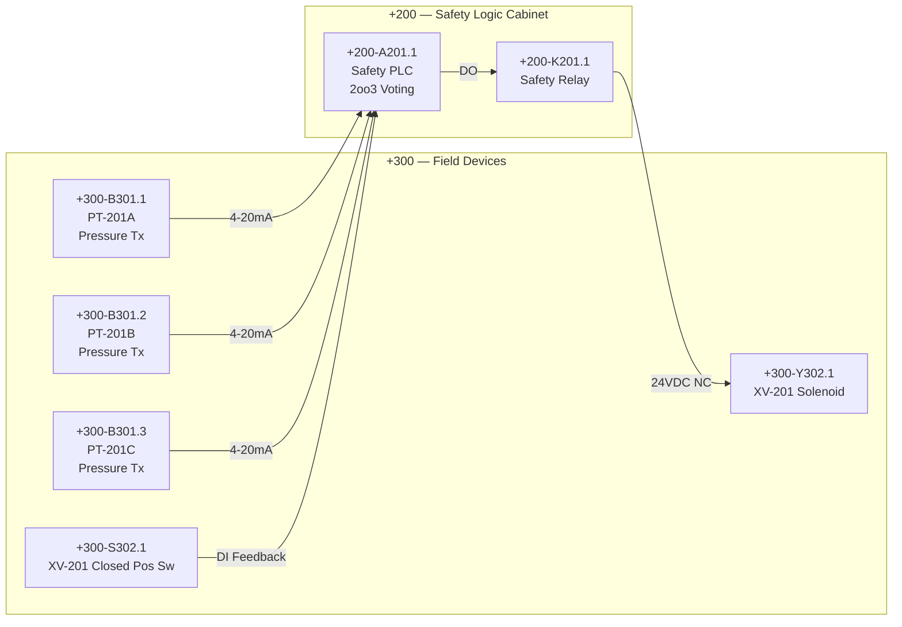

# Drawing Package Map — Overpressure Protection SF-PRES-001

## Project Header

| Field | Value |
|---|---|
| **Functional Requirement** | FR-PRES-001 — Vessel XYZ Pressure Control |
| **Safety Function** | SF-PRES-001 — Overpressure Protection (protects people and equipment when FR-PRES-001 fails) |
| **Hazard Analysis** | HA-PRES-001 |
| **SIL Target** | SIL 3 (PFDavg < 1.0E-03) |
| **Architecture** | 2oo3 sensor voting, 1oo1 logic solver, 1oo1 final element |
| **FMEA Reference** | FMEA 201.1 |
| **Proof Test** | PT-201 (6-month interval) |
| **Process Tag** | Vessel XYZ — Pressure Relief |
| **De-energize to Trip** | Yes — loss of power closes XV-201 |

---

## Drawing Index

| Sheet | Title | Cabinet | Contents | Safety Classification |
|---|---|---|---|---|
| 001 | Title Sheet and Drawing Index | — | Project information, revision history, sheet list | General |
| 002 | Standard Definitions, Symbol Legend | — | IEC 81346 codes, wire/cable conventions, drawing symbols | General |
| 201 | Overpressure Protection Control Logic | +200 | Safety PLC A201.1, safety relay K201.1, branch fuse F201.1 | SIL 3 · SF-PRES-001 · HA-PRES-001 · FMEA 201.1 · PT-201 |
| 202 | Safety System Power Distribution | +200 | 24VDC PSU G202.1, main fuse F202.1, field supply fuse F202.2 | SIL 3 · SF-PRES-001 |
| 301 | Pressure Transmitters | +300 | B301.1, B301.2, B301.3 — 3× 4-20mA HART, field wiring to +200 | SIL 3 · SF-PRES-001 |
| 302 | Shutdown Valve XV-201 | +300 | Solenoid Y302.1, closed-position switch S302.1, field wiring from K201.1 | SIL 3 · SF-PRES-001 |

---

## Safety Function Block Diagram



**Trip sequence:** Any 2 of 3 transmitters exceed setpoint → A201.1 de-energizes K201.1 → relay contact opens → Y302.1 solenoid de-energizes → XV-201 fails closed → S302.1 confirms closed position.

---

## Bill of Materials

| Tag | Description | Generic P/N | Qty | Sheet | Cabinet | P&ID Tag | FMEA Status |
|---|---|---|---|---|---|---|---|
| +200-A201.1 | Safety PLC, SIL 3 rated, 3× AI + 1× DI + 1× DO | Safety-PLC-SIL3 | 1 | 201 | +200 | — | FMEA 201.1 |
| +200-K201.1 | Safety relay, 24VDC coil, 1NO forced-guided contact | Safety-Relay-24V | 1 | 201 | +200 | — | FMEA 201.1 |
| +200-F201.1 | Fuse, 2A, 24VDC, logic branch protection | Fuse-2A-24VDC | 1 | 201 | +200 | — | — |
| +200-G202.1 | 24VDC power supply, safety rated, redundant input | PSU-24VDC-Safety | 1 | 202 | +200 | — | FMEA 201.1 |
| +200-F202.1 | Fuse, 6A, 24VDC, main safety bus protection | Fuse-6A-24VDC | 1 | 202 | +200 | — | — |
| +200-F202.2 | Fuse, 4A, 24VDC, field supply protection | Fuse-4A-24VDC | 1 | 202 | +200 | — | — |
| +300-B301.1 | Pressure transmitter, 4-20mA HART, SIL 2 rated | PxTx-4-20mA-HART | 1 | 301 | +300 | PT-201A | FMEA 201.1 |
| +300-B301.2 | Pressure transmitter, 4-20mA HART, SIL 2 rated | PxTx-4-20mA-HART | 1 | 301 | +300 | PT-201B | FMEA 201.1 |
| +300-B301.3 | Pressure transmitter, 4-20mA HART, SIL 2 rated | PxTx-4-20mA-HART | 1 | 301 | +300 | PT-201C | FMEA 201.1 |
| +300-Y302.1 | Solenoid valve, 24VDC, fail-closed, SIL 3 rated | Sol-Valve-24V-FC | 1 | 302 | +300 | XV-201 | FMEA 201.1 |
| +300-S302.1 | Limit switch, closed-position indication, SPDT | Limit-Sw-SPDT | 1 | 302 | +300 | ZSC-201 | FMEA 201.1 |

---

## Wire Schedule

Wire naming convention: `[Sheet]-[Column].[Sequence]` per Drawing Standard §3.

### Sheet 202 — Safety System Power Distribution

| Wire | From | To | Signal Type | Gauge | Notes |
|---|---|---|---|---|---|
| 202-1.1 | G202.1 (+) | F202.1 line side | +24V raw | 14 AWG | PSU positive output |
| 202-1.2 | G202.1 (−) | 0V bus | 0V safety common | 14 AWG | PSU negative output |
| 202-2.1 | F202.1 load side | +24V safety bus | +24V safety bus | 14 AWG | Main fused supply |
| 202-3.1 | F202.2 line side: 202-2.1 | F202.2 load side | +24V branch | 16 AWG | Field supply branch |
| 202-3.2 | F202.2 load side | TB-202:1 | +24V field supply | 16 AWG | To cable W-202/301 |

### Sheet 201 — Overpressure Protection Control Logic

| Wire | From | To | Signal Type | Gauge | Notes |
|---|---|---|---|---|---|
| 201-1.1 | F201.1 load side | A201.1 V+ | +24V logic | 16 AWG | F201.1 line side = 202-2.1 |
| 201-1.2 | A201.1 V− | 0V bus (202-1.2) | 0V logic return | 16 AWG | |
| 201-2.1 | A201.1 AI1+ | TB-201:1 | 4-20mA loop+ (B301.1) | 18 AWG | To cable W-201/301 |
| 201-2.2 | A201.1 AI1− | TB-201:2 | 4-20mA loop− (B301.1) | 18 AWG | To cable W-201/301 |
| 201-3.1 | A201.1 AI2+ | TB-201:3 | 4-20mA loop+ (B301.2) | 18 AWG | To cable W-201/301 |
| 201-3.2 | A201.1 AI2− | TB-201:4 | 4-20mA loop− (B301.2) | 18 AWG | To cable W-201/301 |
| 201-4.1 | A201.1 AI3+ | TB-201:5 | 4-20mA loop+ (B301.3) | 18 AWG | To cable W-201/301 |
| 201-4.2 | A201.1 AI3− | TB-201:6 | 4-20mA loop− (B301.3) | 18 AWG | To cable W-201/301 |
| 201-5.1 | A201.1 DO1 | K201.1 coil A1 | Relay drive | 18 AWG | Safety relay coil |
| 201-5.2 | K201.1 coil A2 | 0V bus (202-1.2) | Relay return | 18 AWG | |
| 201-6.1 | 202-3.2 (field +24V) | K201.1 contact 13 | +24V switched | 16 AWG | Relay NC input |
| 201-6.2 | K201.1 contact 14 | TB-201:7 | +24V valve supply | 16 AWG | De-energize to open contact |
| 201-7.1 | A201.1 DI1+ | TB-201:9 | Position feedback+ | 18 AWG | Closed pos switch input |
| 201-7.2 | A201.1 DI1− | TB-201:10 | Position feedback− | 18 AWG | Closed pos switch return |
| 201-6.3 | TB-201:8 | 0V bus (202-1.2) | 0V valve return | 16 AWG | Solenoid return path |

### Sheet 301 — Pressure Transmitters

| Wire | From | To | Signal Type | Gauge | Notes |
|---|---|---|---|---|---|
| 301-1.1 | TB-301:1 | B301.1 (+) | 4-20mA loop+ | 18 AWG | Field side, from TB-201:1 via cable |
| 301-1.2 | B301.1 (−) | TB-301:2 | 4-20mA loop− | 18 AWG | Return to TB-201:2 via cable |
| 301-2.1 | TB-301:3 | B301.2 (+) | 4-20mA loop+ | 18 AWG | Field side, from TB-201:3 via cable |
| 301-2.2 | B301.2 (−) | TB-301:4 | 4-20mA loop− | 18 AWG | Return to TB-201:4 via cable |
| 301-3.1 | TB-301:5 | B301.3 (+) | 4-20mA loop+ | 18 AWG | Field side, from TB-201:5 via cable |
| 301-3.2 | B301.3 (−) | TB-301:6 | 4-20mA loop− | 18 AWG | Return to TB-201:6 via cable |

### Sheet 302 — Shutdown Valve XV-201

| Wire | From | To | Signal Type | Gauge | Notes |
|---|---|---|---|---|---|
| 302-1.1 | TB-302:1 | Y302.1 (+) | +24V solenoid | 16 AWG | From TB-201:7 via cable |
| 302-1.2 | Y302.1 (−) | TB-302:2 | 0V solenoid return | 16 AWG | Return to TB-201:8 via cable |
| 302-2.1 | TB-302:3 | S302.1 (C) | Position switch+ | 18 AWG | From TB-201:9 via cable |
| 302-2.2 | S302.1 (NO) | TB-302:4 | Position switch− | 18 AWG | Return to TB-201:10 via cable |

---

## Cable Schedule

| Cable ID | From | To | Cores | Type | Length | Sheets Referenced |
|---|---|---|---|---|---|---|
| W-201/301 | +200 TB-201:1–6 | +300 TB-301:1–6 | 3 pairs (6 core) | Shielded instrument, 18 AWG | Field route | 201, 301 |
| W-201/302 | +200 TB-201:7–10 | +300 TB-302:1–4 | 2 pairs (4 core) | Shielded instrument, 16/18 AWG | Field route | 201, 302 |
| W-202/200 | AC supply | +200 G202.1 input | Per PSU spec | Power cable | Facility route | 202 |

> **Note:** All inter-cabinet cables carry wire identities from their source sheet. Cable shields bonded at +200 cabinet end only (single-point ground).

---

## I/O List

| PLC Tag | Channel | Type | Range | Engineering Units | Field Device | P&ID Tag | Wire Pair | Sheet |
|---|---|---|---|---|---|---|---|---|
| A201.1:AI1 | Analog In 1 | 4-20mA | 0–300 psig | psig | +300-B301.1 | PT-201A | 201-2.1 / 201-2.2 | 201 |
| A201.1:AI2 | Analog In 2 | 4-20mA | 0–300 psig | psig | +300-B301.2 | PT-201B | 201-3.1 / 201-3.2 | 201 |
| A201.1:AI3 | Analog In 3 | 4-20mA | 0–300 psig | psig | +300-B301.3 | PT-201C | 201-4.1 / 201-4.2 | 201 |
| A201.1:DI1 | Digital In 1 | 24VDC | ON/OFF | — | +300-S302.1 | ZSC-201 | 201-7.1 / 201-7.2 | 201 |
| A201.1:DO1 | Digital Out 1 | 24VDC | ON/OFF | — | +200-K201.1 | — | 201-5.1 / 201-5.2 | 201 |

**Voting logic:** 2oo3 on AI1, AI2, AI3. Trip setpoint: 170 psig. Any 2 of 3 channels exceeding setpoint de-energizes DO1 → K201.1 opens → XV-201 closes.

---

## Terminal Strip Schedule

### Cabinet +200 — Safety Logic Cabinet

**TB-201** (Signal terminals, Sheet 201 circuits)

| Terminal | Wire (Cabinet Side) | Cable Core | Wire (Field Side) | Function |
|---|---|---|---|---|
| TB-201:1 | 201-2.1 | W-201/301 core 1 | 301-1.1 | AI1 loop+ (B301.1) |
| TB-201:2 | 201-2.2 | W-201/301 core 2 | 301-1.2 | AI1 loop− (B301.1) |
| TB-201:3 | 201-3.1 | W-201/301 core 3 | 301-2.1 | AI2 loop+ (B301.2) |
| TB-201:4 | 201-3.2 | W-201/301 core 4 | 301-2.2 | AI2 loop− (B301.2) |
| TB-201:5 | 201-4.1 | W-201/301 core 5 | 301-3.1 | AI3 loop+ (B301.3) |
| TB-201:6 | 201-4.2 | W-201/301 core 6 | 301-3.2 | AI3 loop− (B301.3) |
| TB-201:7 | 201-6.2 | W-201/302 core 1 | 302-1.1 | Solenoid +24V |
| TB-201:8 | 201-6.3 | W-201/302 core 2 | 302-1.2 | Solenoid 0V return |
| TB-201:9 | 201-7.1 | W-201/302 core 3 | 302-2.1 | Position switch+ |
| TB-201:10 | 201-7.2 | W-201/302 core 4 | 302-2.2 | Position switch− |

**TB-202** (Power terminals, Sheet 202 circuits)

| Terminal | Wire (Internal) | Cable Core | Function |
|---|---|---|---|
| TB-202:1 | 202-3.2 | W-202 to 201-6.1 | +24V field supply to K201.1 |

### Cabinet +300 — Field Junction Box

**TB-301** (Transmitter terminals, Sheet 301 circuits)

| Terminal | Wire (Cable Side) | Cable Core | Wire (Field Side) | Function |
|---|---|---|---|---|
| TB-301:1 | W-201/301 core 1 | 1 | 301-1.1 | B301.1 loop+ |
| TB-301:2 | W-201/301 core 2 | 2 | 301-1.2 | B301.1 loop− |
| TB-301:3 | W-201/301 core 3 | 3 | 301-2.1 | B301.2 loop+ |
| TB-301:4 | W-201/301 core 4 | 4 | 301-2.2 | B301.2 loop− |
| TB-301:5 | W-201/301 core 5 | 5 | 301-3.1 | B301.3 loop+ |
| TB-301:6 | W-201/301 core 6 | 6 | 301-3.2 | B301.3 loop− |

**TB-302** (Valve terminals, Sheet 302 circuits)

| Terminal | Wire (Cable Side) | Cable Core | Wire (Field Side) | Function |
|---|---|---|---|---|
| TB-302:1 | W-201/302 core 1 | 1 | 302-1.1 | Y302.1 solenoid+ |
| TB-302:2 | W-201/302 core 2 | 2 | 302-1.2 | Y302.1 solenoid− |
| TB-302:3 | W-201/302 core 3 | 3 | 302-2.1 | S302.1 switch+ |
| TB-302:4 | W-201/302 core 4 | 4 | 302-2.2 | S302.1 switch− |

---

## Cross-Reference Summary

Every document in the safety lifecycle references back to this drawing package through sheet numbers and device tags.

| Document | Reference ID | Provides | Uses from This Package |
|---|---|---|---|
| Hazard Analysis | HA-PRES-001 | SIL target, required safety function | — (upstream) |
| Safety Function Spec | SF-PRES-001 | Architecture, voting, trip setpoint | — (upstream) |
| **This Drawing Package** | **Sheets 201, 202, 301, 302** | **Device tags, wiring, I/O, terminals** | **Implements SF-PRES-001** |
| FMEA | FMEA 201.1 | Failure classification (DD/DU), PFDavg, SFF | Device list, sheet numbers, detection points |
| Proof Test Procedure | PT-201 | 10-step fault test sequence, 6-month interval | I/O list (inject points), wire pairs, terminal IDs |
| FAT Report | FAT-201 | Factory test results, punch list | Sheet 201 logic, I/O assignments, wire schedule |
| SAT Report | SAT-201 | Site commissioning results | Cable schedule, terminal strips, field wiring |

### Traceability Chain

```
FR-PRES-001          Functional requirement defines process function
    ↓
HA-PRES-001          Hazard Analysis identifies risks arising from the function
    ↓
SF-PRES-001          Safety function defined (SIL 3, 2oo3) — protects people and equipment
    ↓
Sheets 201–302       Electrical design implements the function
    ↓
FMEA 201.1           Verifies design meets SIL 3 target
    ↓
PT-201               Proof test derived from FMEA DU failure modes
    ↓
FFAT-150 / SAT-201   Validates functional and safety performance
    ↓
PT-201 execution     Ongoing proof testing every 6 months
```

### Sheet-to-Document Cross-Reference

| Sheet | FMEA Items | PT-201 Steps | FAT Tests | SAT Tests |
|---|---|---|---|---|
| 201 | Logic solver failures, relay failures, voting errors | Steps 5–8 (voting, relay trip, de-energize, reset) | Logic simulation, I/O forcing | End-to-end trip test |
| 202 | PSU failures, fuse failures | Step 1 (pre-test verification) | Power supply load test | Supply voltage at terminals |
| 301 | Transmitter failures (×3), cable faults | Steps 2–4 (inject signals per channel) | Simulated input sweep | Live process reading verification |
| 302 | Solenoid failures, position switch failures | Steps 7, 10 (valve stroke, position confirm) | Solenoid energize/de-energize | Full valve stroke test |
