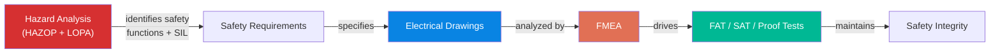

# Industrial Systems Design Documentation Standard

A complete, self-documenting standards framework for industrial control system design — from hazard identification through commissioning and ongoing maintenance.

## Overview

This repository contains a suite of interconnected standards that define how to design, verify, validate, and maintain industrial control systems. The standards use a unified numbering system anchored to drawing sheet numbers, ensuring full traceability from hazard analysis through proof testing without lookup tables.

## Documents

| Document | Description | Key Topics |
|----------|-------------|------------|
| [Drawing Standard](Industrial_Systems_Drawing_Standard_v1.1.md) | Electrical drawing organization, device tagging, wire numbering | IEC 61082/81346, sheet numbering by cabinet, self-documenting device tags, grid cross-referencing |
| [Hazard Analysis Standard](Hazard_Analysis_Standard_v1.0.md) | HAZOP and LOPA methodology | IEC 61511/61508, guideword-based deviation analysis, SIL determination, safety function identification |
| [FMEA Standard](FMEA_Standard_v1.0.md) | Failure mode analysis for safety and reliability | Detection-point methodology, SIL verification (PFDavg, SFF, HFT), non-safety reliability FMEA, proof test derivation |
| [FAT/SAT Standard](SAT_FAT_Standard_v1.0.md) | Factory and site acceptance testing, proof tests | Test procedures, pass/fail criteria, bypass management, PSSR integration |
| [Safety Documentation Standard](Safety_Documentation_Standard_v1.0.md) | Umbrella framework | Document hierarchy, traceability matrices, SRS format, document register, MOC integration |

## Key Design Principles

**The drawing is the source of truth.** Sheet numbers are the common key across all documents. `FMEA 201.1`, `FAT 201`, `SAT 201`, and `PT-201` all trace to Sheet 201.

**Self-documenting numbering.** Device tag `+300-B301.1` tells you: Cabinet +300, transmitter, Sheet 301, first of its type. No lookup tables needed.

**Detection-point FMEA.** Failure modes are grouped by how they present to the monitoring system. A transmitter failing low, a cable going open, and an I/O card failing all present as "signal reads low" — one FMEA entry, one test action, no redundancy.

**DU is a last resort, not a default.** A failure mode without a detection method is an incomplete design. The FMEA drives design iteration to add diagnostics before accepting Dangerous Undetected classification.

**Full traceability chain:** HA &rarr; SF &rarr; SRS &rarr; Drawings &rarr; FMEA &rarr; FAT &rarr; SAT &rarr; Proof Tests

## Numbering Quick Reference

| Item | Format | Example |
|------|--------|---------|
| Drawing sheet | `[NNN]` | Sheet 201 |
| Device tag | `+[Loc]-[Dev][Sheet].[Seq]` | +300-B301.1 |
| Wire number | `[Sheet]-[Col].[Seq]` | 201-4.1 |
| Hazard Analysis | `HA-[SYS]-[NNN]` | HA-PRES-001 |
| Safety Function | `SF-[SYS]-[NNN]` | SF-PRES-001 |
| FMEA | `FMEA [Sheet].[Seq]` | FMEA 201.1 |
| FAT / SAT | `FAT [Sheet]` / `SAT [Sheet]` | FAT 201 / SAT 201 |
| Proof Test | `PT-[Sheet]` | PT-201 |

## Worked Example

All documents use a consistent example system for illustration:

- **System:** Overpressure Protection, Refinery Vessel XYZ
- **Safety Function:** SF-PRES-001, SIL 3
- **Architecture:** 2oo3 pressure voting (HFT=1), 1oo1 logic solver, 1oo1 final element
- **Devices:** +300-B301.1/B301.2/B301.3 (pressure transmitters), +200-K201.1 (safety relay)
- **Result:** PFDavg = 4.76E-04, SIL 3 PASS

## Standards Referenced

- IEC 61508 (Functional safety — general)
- IEC 61511 (Safety instrumented systems — process industry)
- IEC 61082 (Electrotechnical document preparation)
- IEC 81346 (Reference designations)
- IEC 61882 (HAZOP application guide)
- IEC 60812 (FMEA/FMECA techniques)
- IEC 62382 (Loop checking)

## Status

All documents are in **Draft** status (v1.0/v1.1). The framework is structurally complete and internally consistent. Contributions, corrections, and industry feedback are welcome.

## License

This work is provided as-is for educational and professional reference purposes.
