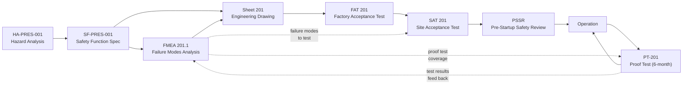
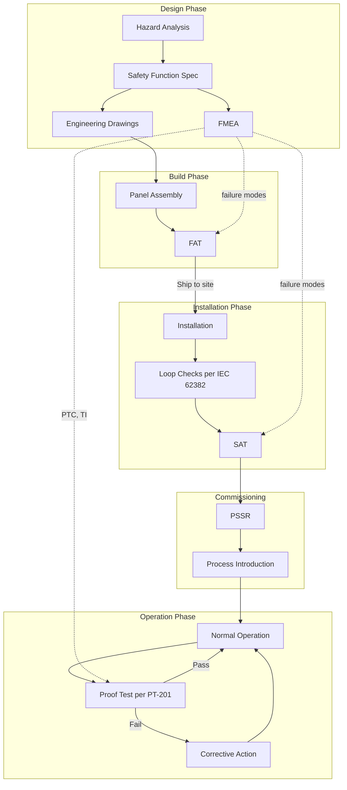

# Factory Acceptance Testing and Site Acceptance Testing Standard
## FAT, SAT, and Proof Test Methodology for Industrial Control Systems

**Version:** 1.0
**Date:** 2025-02-15
**Author:** Reid
**Status:** Draft
**Scope:** Factory acceptance testing (FAT), site acceptance testing (SAT), and proof test procedure methodology for industrial control systems, with particular focus on safety instrumented systems (SIS) designed per IEC 61511.

---

## Table of Contents

1. [Purpose and Scope](#1-purpose-and-scope)
2. [Standards References](#2-standards-references)
3. [Definitions and Terminology](#3-definitions-and-terminology)
4. [Numbering and Identification](#4-numbering-and-identification)
5. [FAT --- Factory Acceptance Testing](#5-fat--factory-acceptance-testing)
6. [SAT --- Site Acceptance Testing](#6-sat--site-acceptance-testing)
7. [Proof Test Procedures](#7-proof-test-procedures)
8. [Test Documentation Requirements](#8-test-documentation-requirements)
9. [Cross-Reference to Other Documents](#9-cross-reference-to-other-documents)
10. [Pre-Startup Safety Review (PSSR) Integration](#10-pre-startup-safety-review-pssr-integration)
11. [Bypass and Override Management During Testing](#11-bypass-and-override-management-during-testing)
12. [Implementation Checklist](#12-implementation-checklist)
13. [Document Information](#13-document-information)

---

## 1. Purpose and Scope

### 1.1 Purpose

This standard defines a consistent methodology for testing industrial control systems across their lifecycle: factory acceptance testing prior to shipment, site acceptance testing after installation, and proof testing during operation.

The standard establishes repeatable, traceable test procedures that connect directly to engineering drawings, hazard analysis, and failure modes and effects analysis. Every test step traces to a specific drawing sheet, device tag, and --- for safety systems --- a specific failure mode identified in the FMEA.

### 1.2 Scope

This standard covers three testing phases:

| Phase | When | Where | Purpose |
|-------|------|-------|---------|
| **Prerequisite Checks** | Before FAT/SAT | Factory or site | Point-to-point wiring verification, insulation testing, power-up checks. These are construction verification, not system testing. |
| **FAT** | After panel/system assembly, before shipment | Factory/shop | Complete system test — same procedure as SAT. Deviations from SAT (e.g., simulated field devices) documented and justified. |
| **SAT** | After installation, before process introduction | Site | Complete system test — same procedure as FAT, executed with actual field devices and site conditions. |
| **Proof Test** | Periodically during operation | Site | Verify SIS functionality has not degraded; detect dangerous undetected failures |

This standard applies to:

- Safety instrumented systems (SIS) designed per IEC 61511
- Non-safety control systems where formal acceptance testing is required
- Electrical, instrumentation, and control panel assemblies
- Field-installed instrumentation and final elements

This standard does **not** define:

- Drawing conventions (see Industrial Systems Drawing Standard v1.1)
- Hazard analysis methodology (see HA Standard v1.0)
- FMEA methodology (see FMEA Standard v1.0)
- Process commissioning procedures (chemical cleaning, line flushing, etc.)
- Mechanical completion procedures

### 1.3 Design Philosophy

**FAT and SAT are the same test.** The FAT procedure is the SAT procedure, executed in the factory. Any element of the SAT that cannot be performed during FAT must be documented and justified in the FAT deviation log. The goal is to discover every possible issue before the system leaves the shop.

**Point-to-point wiring, insulation resistance, and power-up checks are prerequisite construction verifications — not part of FAT or SAT.** These checks confirm the system is built correctly and safe to energize. They are completed and signed off before FAT begins. FAT and SAT are system-level functional tests that assume construction verification is already complete.

**The drawing is the source of truth for what to test.** Every test step verifies something shown on a drawing --- a device, a wire, a logic function, a signal path.

**The FMEA is the source of truth for what failure modes to cover.** For safety systems, the FMEA identifies which failure modes must be detected during proof testing and which diagnostic functions must be verified during FAT/SAT.

Principles:

- **FAT = SAT.** Same procedure, same acceptance criteria. The only permitted differences are physical constraints of the factory environment (e.g., no actual field devices), and these are documented deviations, not reduced scope.
- **Construction checks are prerequisites, not test steps.** Continuity, megger, power-up are completed before FAT begins. They appear on the prerequisite checklist, not in the test procedure.
- Test procedures are derived from drawings and FMEAs, not invented independently.
- Test step numbering traces directly to drawing sheet numbers for immediate cross-reference.
- A test procedure is only as good as the drawing it references. If the drawing is incomplete, the test will be incomplete.
- Test records provide objective evidence of SIS validation per IEC 61511 clause 12.

---

## 2. Standards References

| Standard | Title | Application |
|----------|-------|-------------|
| IEC 61511 | Functional safety --- Safety instrumented systems for the process industry | Clauses 12 (SIS validation), 15 (pre-startup), 16 (proof testing) |
| IEC 61508 Part 2 | Functional safety --- Hardware | Diagnostic coverage verification, hardware fault tolerance |
| IEC 61508 Part 7 | Functional safety --- Overview of techniques and measures | Test techniques for SIS |
| IEC 62382 | Electrical and instrumentation loop checking | Loop check methodology for SAT |
| Industrial Systems Drawing Standard v1.1 | Device, wire, and drawing numbering convention | Source of sheet numbers, device tags, wire numbers used in test procedures |
| HA Standard v1.0 | Hazard Analysis Standard | Source of safety function definitions (SF-XXX-NNN) and HA references |
| FMEA Standard v1.0 | Failure Modes and Effects Analysis Standard | Source of failure modes, diagnostic coverage, proof test coverage requirements |

---

## 3. Definitions and Terminology

| Term | Definition |
|------|------------|
| **Factory Acceptance Test (FAT)** | Formal testing performed at the factory or panel shop prior to shipment, verifying that an assembled system matches its engineering drawings and performs its intended functions in a controlled environment. |
| **Site Acceptance Test (SAT)** | Formal testing performed at the installation site after field wiring is complete, verifying end-to-end functionality including actual field devices, field wiring, and environmental conditions. |
| **Loop Check** | Verification per IEC 62382 that a signal path is continuous from field device through wiring, junction boxes, terminal strips, and I/O modules to the logic solver and/or HMI --- and back to final elements where applicable. |
| **Functional Test** | Verification that a system performs its intended control function correctly, including logic execution, alarm generation, and output response. Used for non-safety systems. |
| **Proof Test** | Periodic test performed during operation to detect dangerous undetected (DU) failures in a safety instrumented function. Required by IEC 61511 clause 16. |
| **Partial Stroke Test (PST)** | A proof test technique for on/off valves where the valve is moved a fraction of its full stroke (typically 10--20%) to verify mechanical freedom without interrupting the process. Provides partial proof test coverage. |
| **Bypass** | A deliberate, documented override of a safety function, typically to allow testing or maintenance. The safety function is defeated while the bypass is active. |
| **Override** | A manual command that forces an output or input to a specific state, regardless of the logic solver's computed output. |
| **Force** | A software function that locks a logic solver input or output to a fixed value. Used during testing to simulate conditions or isolate faults. |
| **Simulated Input** | A test signal injected at the input terminals of the logic solver (not at the field device) to simulate a process condition. Used during FAT when field devices are not available. |
| **End-to-End Test** | A test that exercises the complete safety function chain: sensor input through logic solver through final element actuation. During SAT, this uses actual field devices. |
| **Partial Proof Test** | A proof test that covers only a subset of the possible failure modes for a device or subsystem. Provides a proof test coverage factor less than 100%. |
| **Comprehensive Proof Test** | A proof test that covers all (or nearly all) possible failure modes for a device or subsystem. Typically requires device removal or full shutdown. Provides proof test coverage approaching 100%. |
| **Proof Test Coverage (PTC)** | The fraction of dangerous undetected failures that a given proof test procedure can detect, expressed as a percentage. Feeds directly into PFDavg calculations. |
| **Test Interval (TI)** | The time between successive proof tests for a safety instrumented function. Determined by the SIL target and PFDavg calculation in the FMEA. |

---

## 4. Numbering and Identification

### 4.1 Test Document ID Formats

Test document identification is based on drawing sheet numbers from the Industrial Systems Drawing Standard v1.1:

| Document Type | Format | Example | Meaning |
|---------------|--------|---------|---------|
| Factory Acceptance Test | `FAT [Sheet]` | FAT 201 | Factory test for systems on Sheet 201 |
| Site Acceptance Test | `SAT [Sheet]` | SAT 201 | Site test for systems on Sheet 201 |
| Proof Test | `PT-[Sheet]` | PT-201 | Periodic proof test for Sheet 201 system |
| Functional Test (non-safety) | `FT [Sheet]` | FT 150 | Functional test for non-safety Sheet 150 |

**Rule:** There is one FAT and one SAT per safety-critical sheet or group of related sheets implementing a single safety function. Where a safety function spans multiple sheets (e.g., Sheet 201 logic and Sheet 301 field devices), the FAT/SAT is numbered by the primary logic sheet and covers all related sheets.

### 4.2 Test Step Numbering

Individual test steps within each document follow sequential numbering:

**Format:** `[DocID]-[Step]`

| Example | Meaning |
|---------|---------|
| SAT 201-001 | SAT document for Sheet 201, test step 1 |
| SAT 201-002 | SAT document for Sheet 201, test step 2 |
| FAT 201-015 | FAT document for Sheet 201, test step 15 |
| PT-201-003 | Proof test for Sheet 201, test step 3 |

Steps are numbered sequentially in three-digit format (001, 002, ... 999) to allow insertion without renumbering.

### 4.3 Relationship to Drawing Sheets

```
Drawing Sheet 201  ──────►  FAT 201  (factory test)
(Overpressure Protection     │
 Control Logic)               ├──►  SAT 201  (site test)
                              │
                              └──►  PT-201   (proof test)
```

Each test document references the sheet(s) it validates. The traceability chain is:

```
HA-PRES-001 ──► SF-PRES-001 ──► FMEA 201.1 ──► Sheet 201 ──► FAT 201 ──► SAT 201 ──► PT-201
```

### 4.4 FAT/SAT Scope Summary by Sheet Type

| Sheet Type | Safety Class | Test Documents | Scope |
|------------|-------------|----------------|-------|
| Safety logic (e.g., Sheet 201) | SIL-rated | FAT, SAT, PT | Full SIF testing including fault injection |
| Safety field devices (e.g., Sheet 301) | SIL-rated | Covered by primary sheet FAT/SAT/PT | Loop check, calibration, end-to-end |
| Non-safety control (e.g., Sheet 150) | Non-safety | FT | Functional test only |
| Power distribution (e.g., Sheet 110) | Non-safety | FT | Power-up, voltage verification |

---

## 5. FAT --- Factory Acceptance Testing

### 5.1 Core Principle: FAT = SAT

**The FAT procedure is the SAT procedure.** FAT executes the same test steps, with the same acceptance criteria, as SAT. The factory test is a complete system test, not a reduced-scope construction check.

Where a SAT test step cannot be performed during FAT (typically because field devices are not physically present), the step is documented as a **FAT deviation** with justification. The deviation is carried forward to the SAT for completion.

This means:
- The FAT step numbering matches the SAT step numbering (FAT 201-020 tests the same thing as SAT 201-020)
- Any step that passes at FAT does not need re-execution at SAT unless the system was modified after FAT
- Any step marked as a FAT deviation is mandatory during SAT

### 5.2 Prerequisite Checks (Not Part of FAT)

The following construction verification checks are completed **before** FAT begins. They are prerequisites, not test steps. They have their own sign-off and are not included in the FAT/SAT procedure.

#### 5.2.1 Point-to-Point Wiring Verification

| Check | Method | Acceptance Criteria |
|-------|--------|-------------------|
| Continuity | Ohmmeter on each wire, verify endpoints match drawing | < 1 ohm, correct endpoints per wire schedule |
| Earth continuity | Low-resistance ohmmeter on PE conductors | < 0.1 ohm to earth bus |
| Wire labels | Verify each wire label matches drawing wire number | All labels match Drawing Standard format |

#### 5.2.2 Insulation Resistance Testing

| Test | Method | Acceptance Criteria |
|------|--------|-------------------|
| Circuit to earth | 500V DC megger between each circuit and earth | > 1 M-ohm (or per applicable code) |
| Circuit to circuit | 500V DC megger between adjacent circuits | > 1 M-ohm (or per applicable code) |

#### 5.2.3 Power-Up Checks

| Test | Method | Acceptance Criteria |
|------|--------|-------------------|
| Input voltage | Measure at main terminals | Within +/- 10% of rated voltage |
| DC supply output | Measure at power supply output terminals | 24.0 +/- 1.0 V DC |
| DC at last device | Measure at furthest device from supply | > 20.4 V DC (per device requirements) |
| Current draw (no load) | Measure supply output current | Within expected range per design calc |
| Ripple voltage | Oscilloscope on DC bus | < 200 mV peak-to-peak |

#### 5.2.4 Visual and Mechanical Inspection

| Check | Acceptance Criteria | Reference |
|-------|-------------------|-----------|
| Panel dimensions and layout | Match panel layout drawing | General sheet 030-series |
| Component mounting | Secure, correct orientation, accessible | UL 508A / IEC 61439 |
| Labels and nameplates | Correct device tags per Drawing Standard | Device tags per Drawing Standard §5 |
| Wire routing and bundling | Neat, separated by voltage class, secured | UL 508A / applicable code |
| Terminal tightness | All terminals torqued to manufacturer spec | Torque values per component datasheet |
| BOM verification | All components installed per BOM | BOM per Drawing Standard §10.5 |

#### 5.2.5 Prerequisite Sign-Off

```
┌─────────────────────────────────────────────────────────────────────────────┐
│                     PREREQUISITE CHECKS — SIGN-OFF                          │
│                                                                             │
│ System: [System Description]       Sheet(s): [Sheet Numbers]                │
│                                                                             │
│ [ ] Point-to-point wiring verification complete    Ref: ___________         │
│ [ ] Insulation resistance testing complete         Ref: ___________         │
│ [ ] Power-up checks complete                       Ref: ___________         │
│ [ ] Visual and mechanical inspection complete      Ref: ___________         │
│ [ ] BOM verification complete                      Ref: ___________         │
│                                                                             │
│ All prerequisites PASS. System is ready for FAT.                            │
│                                                                             │
│ Signed: ____________  Title: ____________  Date: _________                 │
└─────────────────────────────────────────────────────────────────────────────┘
```

### 5.3 FAT Prerequisites

Before FAT can begin, the following must be complete:

| Prerequisite | Document/Evidence | Verification |
|-------------|-------------------|--------------|
| Prerequisite checks complete and signed | Prerequisite sign-off sheet (§5.2.5) | All checks PASS |
| Engineering drawings issued for construction | Drawing set per Drawing Standard v1.1 | Drawing revision confirmed current |
| FMEA complete and approved (safety systems) | FMEA document per FMEA Standard v1.0 | FMEA revision confirmed current |
| Safety function specification available | SF-XXX-NNN from HA Standard | SF document revision confirmed |
| Test equipment calibrated | Calibration certificates for all test instruments | Certificates in date |
| FAT procedure approved | This FAT document, reviewed and signed | Signatures on cover page |
| Witness notification | Written notice to client/end-user/TUV | Notice sent with adequate lead time |

### 5.4 FAT Test Procedure

**The FAT test procedure is identical to the SAT test procedure (Section 6.4).** The FAT executes every SAT test step using the same acceptance criteria. Refer to Section 6.4 for the complete test procedure.

For each test step, the FAT records one of three results:

| Result | Meaning | Action |
|--------|---------|--------|
| **PASS** | Step executed and met acceptance criteria | No re-test required at SAT (unless system modified) |
| **FAIL** | Step executed and did not meet acceptance criteria | Correct issue, re-test at FAT. If unresolved, document on punch list. |
| **DEVIATION** | Step could not be executed due to factory constraints | Document justification. Step is mandatory at SAT. |

### 5.5 FAT Deviation Log

Any SAT test step that cannot be performed during FAT shall be recorded in the FAT Deviation Log with justification:

| Step ID | SAT Test Description | Reason for Deviation | Justification | SAT Mandatory? |
|---------|---------------------|---------------------|---------------|:--------------:|
| 201-010 | Signal injection at field transmitter +300-B301.1 | Field device not present at factory | Transmitter not installed until site. Simulated at panel input terminals (4-20 mA injection). | YES |
| 201-011 | Signal injection at field transmitter +300-B301.2 | Field device not present at factory | Same as above. | YES |
| 201-012 | Signal injection at field transmitter +300-B301.3 | Field device not present at factory | Same as above. | YES |
| 201-025 | Valve stroke test (XV-201 full closure) | Valve not present at factory | Final element tested to relay output terminals only. Valve stroke verified at SAT. | YES |
| 201-028 | Total response time (sensor to valve closed) | Field devices and valve not present | Logic solver response time measured at FAT. Full chain response time measured at SAT. | YES |
| 201-030 | Environmental conditions verification | Factory ≠ site environment | Factory conditions controlled. Site EMI, temperature, vibration verified at SAT. | YES |

**Rules for deviations:**
- Every deviation must have a specific justification — "not available" alone is insufficient; explain *why* it's not available and what was tested instead
- Where a deviation exists, the FAT shall test as far along the signal path as physically possible (e.g., test to relay output terminals even if the valve isn't present)
- All deviations are mandatory at SAT — no exceptions
- If more than 30% of test steps are deviations, the FAT scope should be reconsidered (can more of the system be assembled in the factory?)

### 5.6 FAT Worksheet Format

The FAT worksheet is identical to the SAT worksheet (Section 6.5) with one addition: a "Deviation" column.

```
┌─────────────────────────────────────────────────────────────────────────────┐
│                      FACTORY ACCEPTANCE TEST                                │
│                                                                             │
│ Document ID: FAT [Sheet]           Rev: [X]        Date: [YYYY-MM-DD]      │
│ Project: [Project Name]            Client: [Client Name]                    │
│ System: [System Description]       Sheet(s): [Sheet Numbers]                │
│ Safety Function: [SF-XXX-NNN]      SIL: [X]        HA: [HA-XXX-NNN]       │
│ FMEA: [FMEA Sheet.Seq]                                                     │
│                                                                             │
│ NOTE: This FAT procedure is the SAT procedure executed in the factory.     │
│ Steps marked DEVIATION could not be performed and are mandatory at SAT.    │
│                                                                             │
│ Prepared by: ____________  Date: _________  Approved by: ____________      │
│ Witness: ________________  Date: _________  Company: ________________      │
├─────────────────────────────────────────────────────────────────────────────┤
│                         PREREQUISITES                                       │
│                                                                             │
│ [ ] Prerequisite checks complete and signed (ref: ____________)            │
│ [ ] Drawings issued for construction (Rev: ____)                           │
│ [ ] FMEA approved (Rev: ____)                                              │
│ [ ] Test equipment calibrated (see attached certificates)                  │
│ [ ] Witness notified                                                       │
│                                                                             │
│ Prerequisites verified by: ____________  Date: _________                   │
├──────┬───────────┬───────────┬──────────┬──────────┬───────┬───────────────┤
│ Step │ Device/   │ Test      │ Expected │ Actual   │ Pass/ │ Deviation     │
│  ID  │ Wire Ref  │ Action    │ Result   │ Result   │ Fail/ │ Justification │
│      │           │           │          │          │ Dev.  │               │
├──────┼───────────┼───────────┼──────────┼──────────┼───────┼───────────────┤
│      │           │           │          │          │       │               │
├──────┴───────────┴───────────┴──────────┴──────────┴───────┴───────────────┤
│                            SUMMARY                                          │
│                                                                             │
│ Total steps: ____    PASS: ____    FAIL: ____    DEVIATION: ____           │
│ Deviation rate: ____% (target: < 30%)                                      │
│                                                                             │
│ FAT result:  [ ] PASS   [ ] PASS WITH PUNCH LIST   [ ] FAIL               │
│                                                                             │
│ Punch List Items: (attach separate sheet if needed)                        │
│ Deviation Log: (attach per Section 5.5)                                    │
│                                                                             │
│ Contractor: ____________  Date: _________                                  │
│ Client:     ____________  Date: _________                                  │
│ Third Party: ___________  Date: _________  (if applicable)                 │
└─────────────────────────────────────────────────────────────────────────────┘
```

### 5.7 Worked Example: FAT 201 --- Overpressure Protection Panel

**System:** Overpressure Protection, Refinery Vessel XYZ
**Safety Function:** SF-PRES-001 (SIL 3)
**Architecture:** 2oo3 Pressure Voting, HFT=1
**FMEA:** FMEA 201.1
**Drawing Sheets:** 201 (control logic in +200), 301/302 (field devices in +300)

**FAT executes the same procedure as SAT 201 (Section 6.6).** The following is a summary showing only the steps that differ from SAT:

```
FAT 201 --- Overpressure Protection
(Executes SAT 201 procedure — see Section 6.6 for full test steps)

STEPS EXECUTED IDENTICALLY TO SAT (PASS/FAIL recorded):
─────────────────────────────────────────────────────────────────────
- I/O simulation (4-20 mA injection at panel terminals)
- 2oo3 voting logic verification (all combinations)
- Safe state on power loss
- Logic solver response time measurement
- Diagnostic coverage verification (open circuit, short, out-of-range)
- Channel discrepancy alarm
- Bypass and override functions
- Reset logic
- Alarm and indication verification

STEPS RECORDED AS DEVIATIONS (mandatory at SAT):
─────────────────────────────────────────────────────────────────────
Step   SAT Requirement          FAT Deviation              SAT
 ID                             Justification              Req'd
─────────────────────────────────────────────────────────────────────
201-   Signal injection at      Transmitter not present.   YES
010    field transmitter        Simulated at panel input
       +300-B301.1              terminals (4-20 mA).

201-   Signal injection at      Same as 201-010.           YES
011    field transmitter
       +300-B301.2

201-   Signal injection at      Same as 201-010.           YES
012    field transmitter
       +300-B301.3

201-   Full valve stroke test   Valve XV-201 not present.  YES
025    (XV-201 closure)         Tested to relay output
                                terminals. K201.1 contact
                                state verified.

201-   Total response time      Field devices and valve    YES
028    (sensor to valve         not present. Logic solver
       closed)                  response time measured
                                (0.045s). Full chain at
                                SAT.

201-   Environmental            Factory conditions         YES
030    conditions check         controlled (22°C, no
                                vibration). Site
                                conditions at SAT.

FAT SUMMARY:
  Total SAT steps attempted: 33
  PASS: 27
  FAIL: 0
  DEVIATION: 6 (18.2% — below 30% target)
```

---

## 6. SAT --- Site Acceptance Testing

### 6.1 Purpose and Timing

Site acceptance testing verifies that the complete installed system --- including field devices, field wiring, junction boxes, and the control panel --- functions correctly as an integrated whole.

**Timing:** SAT is performed after:

- FAT is complete and accepted
- Panel is installed at site
- Field wiring is complete
- Instruments are installed and calibrated
- Loop checks are complete per IEC 62382
- Utility power is available and verified

SAT must be completed **before** process fluids are introduced (before commissioning).

### 6.2 SAT Prerequisites

| Prerequisite | Document/Evidence | Verification |
|-------------|-------------------|--------------|
| FAT complete and accepted | FAT report signed, punch list items closed or dispositioned | FAT sign-off sheet |
| Field wiring complete | Contractor's wire-pull completion certificate | Cable schedule marked up as installed |
| Loop checks complete | Loop check sheets per IEC 62382 | Loop check package signed |
| Instrument calibration complete | Calibration certificates for all field instruments | Certificates in date |
| Utility power available | Power quality verification report | Voltage, frequency, grounding verified |
| Environmental conditions acceptable | Temperature, humidity, vibration within equipment ratings | Conditions recorded |
| SAT procedure approved | This SAT document, reviewed and signed | Signatures on cover page |
| Bypass register initialized | All planned test bypasses documented | Bypass register created |
| Operations personnel notified | Written notification to operations | Acknowledgment received |

### 6.3 SAT Scope

SAT is the definitive system test. The SAT procedure defines the complete verification scope for the safety instrumented system. FAT executes the same procedure with documented deviations where factory conditions prevent full execution (see Section 5).

At SAT, all steps are executed without deviation. Any steps that were marked as deviations during FAT shall be fully executed and verified at SAT. Steps that passed at FAT do not require re-execution unless:

- The system was modified, repaired, or reassembled after FAT
- Transportation or installation may have affected the verified condition
- The SAT authority requires re-verification

| Category | SAT Verification |
|----------|-----------------|
| Wiring | Field wiring: wire numbers per drawing, cable IDs, junction box terminations |
| Signal path | Loop check: signal injection at field device through to logic solver and back to final element |
| Functional test | End-to-end functional test with actual field devices |
| Response time | Full chain including field device and final element response |
| Environmental | Actual site conditions (temperature, vibration, EMI) |
| Communication | Verified on site network infrastructure |
| HMI | Full HMI/SCADA point verification |

### 6.4 SAT Test Categories

#### 6.4.1 Loop Integrity Verification (per IEC 62382)

For each instrument loop shown on the drawings, verify:

| Check | Method | Acceptance Criteria |
|-------|--------|-------------------|
| Wire number verification | Trace each wire from field device to panel terminal, verify wire label matches drawing | All wire numbers match drawing |
| Cable ID verification | Verify cable tags at each end and at each junction box | Cable IDs match cable schedule |
| Junction box terminations | Inspect each junction box, verify terminal assignments per drawing | Correct terminals, tight connections |
| Signal injection at field device | Apply known stimulus at the field device (e.g., pressure at transmitter) | Logic solver reads correct value within specified accuracy |
| Signal return to field | Command output from logic solver, verify final element responds | Final element moves to commanded state |

#### 6.4.2 End-to-End Functional Test with Actual Field Devices

| Test | Method | Acceptance Criteria |
|------|--------|-------------------|
| Normal operating condition | Apply normal process-range signal to each sensor | System in normal state, no alarms |
| Trip condition | Apply trip-level stimulus to sensors per voting logic | System trips, final element goes to safe state |
| Alarm verification | Apply alarm-level stimulus | Correct alarm activates at HMI and local panel |
| Reset function | Clear trip condition, attempt reset | System resets only when all conditions are clear and manual reset is actuated |

#### 6.4.3 Safety Function Trip Test (Full Chain)

For each SIF, execute the full chain: sensor detection through logic solver evaluation through final element actuation.

```
FULL CHAIN TRIP TEST

    Field Device              Logic Solver              Final Element
    ┌──────────┐             ┌──────────────┐          ┌──────────────┐
    │ Apply    │  ── wire ── │  Receives    │ ── wire──│  Valve       │
    │ pressure │  ── path ── │  signal,     │ ── path──│  moves to    │
    │ at       │             │  evaluates   │          │  safe state  │
    │ sensor   │             │  2oo3 vote   │          │  (closed)    │
    └──────────┘             └──────────────┘          └──────────────┘
         │                         │                         │
    ┌──────────┐             ┌──────────────┐          ┌──────────────┐
    │ Record   │             │ Record logic │          │ Record valve │
    │ applied  │             │ response     │          │ stroke time  │
    │ pressure │             │ time         │          │ and position │
    └──────────┘             └──────────────┘          └──────────────┘
```

#### 6.4.4 Bypass and Override Function Verification

| Test | Method | Acceptance Criteria |
|------|--------|-------------------|
| Bypass activation | Activate bypass per documented procedure | Bypass indication active at HMI and local panel |
| System behavior under bypass | Apply trip condition while bypass is active | System does not trip; alarm annunciates "BYPASSED" |
| Bypass removal | Remove bypass, verify system returns to normal protection | Bypass indication clears; system responds to trip conditions normally |
| Override function | Apply override command to output | Output goes to override state; override indication active |
| Override timeout (if implemented) | Wait for override timeout period | Override automatically releases; alarm annunciates |

#### 6.4.5 Response Time Measurement (Actual)

Measure the complete safety function response time including all physical devices:

| Component | Measurement Point | Method |
|-----------|-------------------|--------|
| Sensor response | Time from applied stimulus to 4-20 mA output change | Apply step change, measure with data logger |
| Signal transmission | Time from transmitter output to logic solver input recognition | Data logger on both ends |
| Logic solver processing | Time from input recognition to output command | Internal diagnostics or I/O timestamps |
| Final element stroke | Time from output command to valve fully closed (or safe position) | Position switch or travel indicator with timer |
| **Total response time** | **Sum of all components** | **Must be less than process safety time** |

#### 6.4.6 Alarm and HMI Point Verification

For each alarm and indication point shown on the drawings:

| Check | Method | Acceptance Criteria |
|-------|--------|-------------------|
| Alarm text | Trigger alarm condition | Text matches alarm philosophy document |
| Alarm priority | Trigger alarm condition | Priority level correct (emergency, high, medium, low) |
| Alarm setpoint | Slowly ramp input to setpoint | Alarm activates at correct setpoint +/- tolerance |
| HMI display value | Apply known input | HMI reads correct value with correct engineering units |
| HMI indication color | Trigger each state (normal, alarm, trip, bypassed) | Correct color per HMI style guide |

#### 6.4.7 Failure Mode Injection (Key DU Failures from FMEA)

For each dangerous undetected failure mode identified in FMEA 201.1, inject the failure and verify the system response:

| FMEA Failure Mode | Injection Method | Expected Response |
|-------------------|------------------|-------------------|
| Sensor open circuit | Disconnect field wiring at transmitter | Fault alarm, channel marked bad, remaining channels continue voting |
| Sensor stuck high | Fix 4-20 mA signal at high value | High alarm, trip if voting logic satisfied |
| Sensor stuck low | Fix 4-20 mA signal at low value | Low alarm, channel marked suspect |
| Logic solver output fail | Disconnect output wiring | Final element goes to safe state (de-energize to trip) |
| Final element stuck | Block valve mechanically (test only) | Partial stroke test detects restricted movement |

#### 6.4.8 Voting Logic Verification (for 2oo3 Systems)

See Section 6.7 for detailed 2oo3 test methodology.

### 6.5 SAT Worksheet Format

```
┌─────────────────────────────────────────────────────────────────────────────┐
│                       SITE ACCEPTANCE TEST                                  │
│                                                                             │
│ Document ID: SAT [Sheet]           Rev: [X]        Date: [YYYY-MM-DD]      │
│ Project: [Project Name]            Client: [Client Name]                    │
│ System: [System Description]       Sheet(s): [Sheet Numbers]                │
│ Safety Function: [SF-XXX-NNN]      SIL: [X]        HA: [HA-XXX-NNN]       │
│ FMEA: [FMEA Sheet.Seq]            FAT: [FAT Sheet] (completed [date])     │
│                                                                             │
│ Prepared by: ____________  Date: _________  Approved by: ____________      │
│ Witness: ________________  Date: _________  Company: ________________      │
├─────────────────────────────────────────────────────────────────────────────┤
│                         PREREQUISITES CHECKLIST                             │
│                                                                             │
│ [ ] FAT complete and accepted (FAT report ref: ____________)               │
│ [ ] Field wiring complete (completion cert ref: ____________)              │
│ [ ] Loop checks complete (loop check package ref: ____________)            │
│ [ ] Instrument calibration complete (cal cert refs attached)               │
│ [ ] Utility power available and verified                                   │
│ [ ] Environmental conditions recorded: Temp: ____ Humidity: ____          │
│ [ ] Bypass register initialized                                            │
│ [ ] Operations notified                                                    │
│                                                                             │
│ Prerequisites verified by: ____________  Date: _________                   │
├──────┬───────────┬───────────┬──────────┬──────────┬───────┬───────────────┤
│ Step │ Device/   │ Test      │ Expected │ Actual   │ Pass/ │ Initials/     │
│  ID  │ Wire Ref  │ Action    │ Result   │ Result   │ Fail  │ Date          │
├──────┼───────────┼───────────┼──────────┼──────────┼───────┼───────────────┤
│      │           │           │          │          │       │               │
├──────┴───────────┴───────────┴──────────┴──────────┴───────┴───────────────┤
│                            SIGN-OFF                                         │
│                                                                             │
│ SAT result:  [ ] PASS   [ ] PASS WITH PUNCH LIST   [ ] FAIL               │
│                                                                             │
│ Deviations / Punch List Items: (attach separate sheet if needed)           │
│                                                                             │
│ Contractor: ____________  Date: _________                                  │
│ Client:     ____________  Date: _________                                  │
│ Third Party: ___________  Date: _________  (if applicable)                 │
│ Operations: ____________  Date: _________                                  │
└─────────────────────────────────────────────────────────────────────────────┘
```

### 6.6 Worked Example: SAT 201 --- Overpressure Protection System (Field-Installed)

**System:** Overpressure Protection, Refinery Vessel XYZ
**Safety Function:** SF-PRES-001 (SIL 3)
**Architecture:** 2oo3 Pressure Voting, HFT=1
**HA Reference:** HA-PRES-001
**FMEA:** FMEA 201.1
**Drawing Sheets:** 201 (control logic in +200), 301 (field devices in +300)
**Devices under test (full system):**

- +300-B301.1 --- Pressure Transmitter #1 (P&ID: PT-201A)
- +300-B301.2 --- Pressure Transmitter #2 (P&ID: PT-201B)
- +300-B301.3 --- Pressure Transmitter #3 (P&ID: PT-201C)
- +200-K201.1 --- Safety Relay, Valve Close Command
- Shutdown valve (final element)
- Associated field wiring, junction boxes, terminal strips

```
SAT 201 --- Overpressure Protection System
Project: Refinery Vessel XYZ          SIL: 3
Safety Function: SF-PRES-001          HA: HA-PRES-001
FMEA: 201.1                           Architecture: 2oo3, HFT=1
FAT: FAT 201 (completed and accepted)

FIELD WIRING VERIFICATION
─────────────────────────────────────────────────────────────────────
Step   Device/Wire     Test Action                Expected    Pass/
 ID    Reference                                  Result      Fail
─────────────────────────────────────────────────────────────────────
SAT    Wire 201-1.1    Verify wire label at       Label reads  [ ]
201-   +300-B301.1     transmitter junction box   "201-1.1"
001    to panel        and at +200 panel terminal

SAT    Wire 201-1.1    Verify cable ID            Cable tag    [ ]
201-   Cable           CBL-201-01 at both ends    matches
002    CBL-201-01      and at each junction box   cable
                                                  schedule

SAT    Wire 201-2.1    Verify wire label at       Label reads  [ ]
201-   +300-B301.2     transmitter junction box   "201-2.1"
003    to panel        and at +200 panel terminal

SAT    Wire 201-2.1    Verify cable ID            Cable tag    [ ]
201-   Cable           CBL-201-02 at both ends    matches
004    CBL-201-02

SAT    Wire 201-3.1    Verify wire label at       Label reads  [ ]
201-   +300-B301.3     transmitter junction box   "201-3.1"
005    to panel        and at +200 panel terminal

SAT    Wire 201-3.1    Verify cable ID            Cable tag    [ ]
201-   Cable           CBL-201-03 at both ends    matches
006    CBL-201-03

SAT    Wire 201-4.1    Verify wire from logic     Label reads  [ ]
201-   +200-K201.1     solver DO to safety relay  "201-4.1"
007    coil            coil terminal A1

SAT    Wire 201-5.1    Verify wire from K201.1    Label reads  [ ]
201-   K201.1 to       contact to shutdown valve   "201-5.1"
008    valve           solenoid terminal

LOOP CHECKS (per IEC 62382)
─────────────────────────────────────────────────────────────────────
SAT    +300-B301.1     Apply 0% pressure at       Logic solver [ ]
201-   Loop 1          transmitter, verify logic  reads 0%
009                    solver reads 0%            +/- 0.5%

SAT    +300-B301.1     Apply 50% pressure at      Logic solver [ ]
201-   Loop 1          transmitter, verify logic  reads 50%
010                    solver reads 50%           +/- 0.5%

SAT    +300-B301.1     Apply 100% pressure at     Logic solver [ ]
201-   Loop 1          transmitter, verify logic  reads 100%
011                    solver reads 100%          +/- 0.5%

SAT    +300-B301.2     Apply 0% / 50% / 100%     Readings     [ ]
201-   Loop 2          pressure, verify logic     within
012                    solver reads correctly     +/- 0.5%

SAT    +300-B301.3     Apply 0% / 50% / 100%     Readings     [ ]
201-   Loop 3          pressure, verify logic     within
013                    solver reads correctly     +/- 0.5%

END-TO-END FUNCTIONAL TEST
─────────────────────────────────────────────────────────────────────
SAT    Full system     Apply normal operating     System in    [ ]
201-                   pressure to all 3          normal
014                    transmitters               state, no
                                                  alarms

SAT    +300-B301.1     Slowly ramp B301.1 to     High alarm   [ ]
201-   high alarm      high alarm setpoint        activates
015                                               at correct
                                                  setpoint

SAT    Full system     Apply trip pressure to     TRIP: valve  [ ]
201-   2oo3 trip       B301.1 and B301.2          closes,
016                    (2oo3 satisfied)           K201.1
                                                  de-energized

SAT    Full system     Verify shutdown valve      Valve fully  [ ]
201-   valve response  reaches fully closed       closed,
017                    position                   position
                                                  switch
                                                  confirms

SAT    Full system     Remove trip condition      System does  [ ]
201-   reset test      from both transmitters,    NOT auto-
018                    verify no auto-reset       reset

SAT    Full system     Actuate manual reset       System       [ ]
201-   manual reset    button/command             resets to
019                                               normal

RESPONSE TIME MEASUREMENT (ACTUAL)
─────────────────────────────────────────────────────────────────────
SAT    +300-B301.1     Apply step change from     Record       [ ]
201-   sensor          normal to trip pressure    sensor
020    response        at B301.1, record time     response
                       to 4-20 mA output change   time: ___ms

SAT    Logic solver    Record time from input     Record       [ ]
201-   processing      signal recognition to      processing
021                    output command              time: ___ms

SAT    Shutdown        Record time from K201.1    Record       [ ]
201-   valve stroke    de-energization to valve   stroke
022                    fully closed (position     time: ___ms
                       switch)

SAT    Total           Sum of steps 020-022       Total:       [ ]
201-   response time                              ___ms
023                                               Must be
                                                  < process
                                                  safety time

BYPASS FUNCTION VERIFICATION
─────────────────────────────────────────────────────────────────────
SAT    Bypass          Activate bypass for        Bypass       [ ]
201-   function        SF-PRES-001 per            indication
024                    procedure                  active on
                                                  HMI + panel

SAT    Bypass          Apply trip condition       System does  [ ]
201-   behavior        while bypass is active     NOT trip;
025                                               "BYPASSED"
                                                  alarm active

SAT    Bypass          Remove bypass              Protection   [ ]
201-   removal                                    restored;
026                                               indication
                                                  clears

FAILURE MODE INJECTION (per FMEA 201.1)
─────────────────────────────────────────────────────────────────────
SAT    +300-B301.1     Disconnect field wiring    Fault alarm  [ ]
201-   open circuit    at B301.1 terminals        for Ch 1;
027                                               remaining
                                                  channels
                                                  continue
                                                  voting (now
                                                  1oo2)

SAT    +300-B301.1     Reconnect B301.1, verify  System       [ ]
201-   recovery        system recovers to         returns to
028                    normal 2oo3 voting         2oo3 voting

SAT    +200-K201.1     Simulate relay coil        Valve goes   [ ]
201-   relay fail      failure (disconnect coil   to safe
029                    supply)                    state
                                                  (de-energize
                                                  to trip)
```

### 6.7 SAT for 2oo3 Voting Systems --- Specific Test Methodology

For 2oo3 voting architectures (such as the Overpressure Protection system SF-PRES-001), the following specific test methodology shall be applied. This verifies the voting logic truth table exhaustively.

#### 6.7.1 Single Channel Trip Tests

Test each channel individually to confirm that a single channel trip does NOT cause a system trip (correct 2oo3 behavior):

| Test | Ch 1 (B301.1) | Ch 2 (B301.2) | Ch 3 (B301.3) | Expected Output | Expected Alarm |
|------|:---:|:---:|:---:|---------|---------|
| SAT 201-030 | TRIP | Normal | Normal | NO TRIP | Channel 1 high alarm, discrepancy alarm |
| SAT 201-031 | Normal | TRIP | Normal | NO TRIP | Channel 2 high alarm, discrepancy alarm |
| SAT 201-032 | Normal | Normal | TRIP | NO TRIP | Channel 3 high alarm, discrepancy alarm |

#### 6.7.2 Dual Channel Trip Tests

Test each pair of channels to confirm that any two channels tripping DOES cause a system trip (correct 2oo3 behavior):

| Test | Ch 1 (B301.1) | Ch 2 (B301.2) | Ch 3 (B301.3) | Expected Output | Expected Alarm |
|------|:---:|:---:|:---:|---------|---------|
| SAT 201-033 | TRIP | TRIP | Normal | **TRIP** | System trip alarm, valve closed |
| SAT 201-034 | TRIP | Normal | TRIP | **TRIP** | System trip alarm, valve closed |
| SAT 201-035 | Normal | TRIP | TRIP | **TRIP** | System trip alarm, valve closed |

#### 6.7.3 All Channels Trip Test

| Test | Ch 1 (B301.1) | Ch 2 (B301.2) | Ch 3 (B301.3) | Expected Output | Expected Alarm |
|------|:---:|:---:|:---:|---------|---------|
| SAT 201-036 | TRIP | TRIP | TRIP | **TRIP** | System trip alarm, valve closed |

#### 6.7.4 Single Channel Fail-Safe Verification

Verify that a single channel failure is handled safely and does not prevent the remaining channels from tripping the system:

| Test | Failure | Remaining Channels | Action | Expected |
|------|---------|-------------------|--------|----------|
| SAT 201-037 | B301.1 open circuit | B301.2 + B301.3 trip | Apply trip to remaining 2 channels | System trips (degraded to 1oo2) |
| SAT 201-038 | B301.2 open circuit | B301.1 + B301.3 trip | Apply trip to remaining 2 channels | System trips (degraded to 1oo2) |
| SAT 201-039 | B301.3 open circuit | B301.1 + B301.2 trip | Apply trip to remaining 2 channels | System trips (degraded to 1oo2) |

#### 6.7.5 Voting Logic Complete Truth Table

For reference and completeness, the full truth table that SAT 201 verifies:

| Ch 1 | Ch 2 | Ch 3 | Votes | 2oo3 Output | Test Step |
|:---:|:---:|:---:|:---:|:---:|---------|
| 0 | 0 | 0 | 0 | No Trip | SAT 201-014 |
| 1 | 0 | 0 | 1 | No Trip | SAT 201-030 |
| 0 | 1 | 0 | 1 | No Trip | SAT 201-031 |
| 0 | 0 | 1 | 1 | No Trip | SAT 201-032 |
| 1 | 1 | 0 | 2 | **Trip** | SAT 201-033 |
| 1 | 0 | 1 | 2 | **Trip** | SAT 201-034 |
| 0 | 1 | 1 | 2 | **Trip** | SAT 201-035 |
| 1 | 1 | 1 | 3 | **Trip** | SAT 201-036 |

(0 = Normal, 1 = Trip)

---

## 7. Proof Test Procedures

### 7.1 Purpose

Proof testing is the periodic testing of a safety instrumented function during operation to detect dangerous undetected (DU) failures that have accumulated since the last test. This is required by IEC 61511 clause 16.

The purpose of proof testing is to confirm that:

- The SIF will function on demand (i.e., no hidden failures exist)
- The assumed PFDavg in the FMEA remains valid
- The SIF continues to meet its SIL target

Without proof testing, dangerous undetected failures accumulate over time, increasing the probability of failure on demand until the SIL target can no longer be met.

### 7.2 Proof Test Interval Determination

The proof test interval (TI) is determined during the FMEA/PFDavg calculation and is a critical parameter in achieving the required SIL.

```
RELATIONSHIP: TI, PTC, AND PFDavg

    PFDavg  ∝  (1 - PTC) x lambda_DU x TI
                    │           │         │
                    │           │         └─ Proof Test Interval (longer = higher PFD)
                    │           └─ DU failure rate (hardware property)
                    └─ Proof Test Coverage (higher = lower residual PFD)

    Key relationships:
    - Doubling TI approximately doubles PFDavg (linear sensitivity)
    - Increasing PTC from 90% to 99% reduces residual PFD by 10x
    - PTC < 60% may require impractically short TI to meet SIL 3
```

The proof test interval for each SIF is documented in:

- The FMEA document (FMEA 201.1) --- where the TI is a calculation input
- The drawing title block (Sheet 201) --- where "PT-201 (6-month interval)" is noted
- The proof test procedure (PT-201) --- where the interval is specified on the cover page

**Any change to the proof test interval requires recalculation of PFDavg in the FMEA.**

### 7.3 Proof Test Coverage

Not all failure modes can be detected by a given proof test procedure. Proof test coverage (PTC) is the fraction of dangerous undetected failures that the proof test can reveal.

| Coverage Level | PTC Range | Typical Method | Impact |
|----------------|-----------|---------------|--------|
| **Comprehensive** | > 90% | Full function test with device removal, or end-to-end test with high-fidelity process simulation | Highest confidence; may require process shutdown |
| **Partial** | 60--90% | Functional test in situ, partial stroke test, electronic diagnostics | Moderate confidence; can be done during operation |
| **Minimal** | < 60% | Visual inspection, basic electronic check | Low confidence; requires more frequent testing or compensating measures |

The proof test coverage for each failure mode is documented in the FMEA. The proof test procedure must achieve at least the PTC assumed in the PFDavg calculation.

### 7.4 Proof Test Procedure Format

Proof test procedures are derived from the SAT test steps but simplified for operational use. They include only the steps necessary to verify SIF functionality and detect DU failures.

```
┌─────────────────────────────────────────────────────────────────────────────┐
│                        PROOF TEST PROCEDURE                                 │
│                                                                             │
│ Document ID: PT-[Sheet]             Rev: [X]        Date: [YYYY-MM-DD]     │
│ Project: [Project Name]             System: [System Description]            │
│ Safety Function: [SF-XXX-NNN]       SIL: [X]        HA: [HA-XXX-NNN]      │
│ FMEA: [FMEA Sheet.Seq]             Test Interval: [X months]              │
│ Drawing Sheets: [Sheet Numbers]     Est. Duration: [X hours]               │
│                                                                             │
│ Approved by: ____________  Date: _________                                 │
├─────────────────────────────────────────────────────────────────────────────┤
│                         PREREQUISITES                                       │
│                                                                             │
│ [ ] Operations notified and prepared for bypass                            │
│ [ ] Bypass approved per bypass procedure (Bypass #: ______)                │
│ [ ] Test equipment available and calibrated                                │
│ [ ] Compensating measures in place (manual monitoring, fire watch, etc.)   │
│ [ ] Maintenance work order issued (WO #: ______)                           │
│                                                                             │
│ Previous test date: ____________  Due date: ____________                   │
│ Actual test date:   ____________                                           │
├──────┬───────────┬───────────┬──────────┬──────────┬───────┬───────────────┤
│ Step │ Device/   │ Test      │ Expected │ Actual   │ Pass/ │ Technician/   │
│  ID  │ Wire Ref  │ Action    │ Result   │ Result   │ Fail  │ Date          │
├──────┼───────────┼───────────┼──────────┼──────────┼───────┼───────────────┤
│      │           │           │          │          │       │               │
├──────┴───────────┴───────────┴──────────┴──────────┴───────┴───────────────┤
│                         POST-TEST ACTIONS                                   │
│                                                                             │
│ [ ] All bypasses removed and verified                                      │
│ [ ] System returned to normal operation                                    │
│ [ ] Bypass register updated                                                │
│ [ ] Test record filed in SIS records                                       │
│ [ ] Next test date scheduled: ____________                                 │
│                                                                             │
│ Test result: [ ] PASS  [ ] FAIL (see corrective action below)              │
│                                                                             │
│ If FAIL --- Corrective action taken: _________________________________     │
│ Re-test required: [ ] Yes  [ ] No                                          │
│ Re-test date: ____________  Re-test result: [ ] PASS  [ ] FAIL            │
│                                                                             │
│ Technician: ____________  Date: _________                                  │
│ Verified by: ___________  Date: _________                                  │
└─────────────────────────────────────────────────────────────────────────────┘
```

### 7.5 Partial Stroke Testing for Valves

Partial stroke testing (PST) provides partial proof test coverage for on/off shutdown valves without requiring a full process trip.

**Method:**

1. Command the valve to move a small percentage of its full stroke (typically 10--20%)
2. Monitor valve position feedback to confirm movement
3. Return valve to fully open position
4. Record actual travel, travel time, and any abnormalities

**Coverage:**

| Failure Mode | PST Detects? | Notes |
|-------------|:---:|-------|
| Valve stem seized / stuck | Yes | No movement detected |
| Actuator spring failure (partial) | Yes | Reduced or slow travel |
| Solenoid failure | Yes | No response to command |
| Valve seat leakage | No | Requires full closure and leak test |
| Actuator spring failure (complete) | Partial | May detect reduced force but not full failure |
| Position feedback failure | Yes | Position does not match command |

**Typical PST coverage factor:** 40--70% (varies by valve type and implementation)

**PST does not replace comprehensive proof testing.** It extends the effective interval between comprehensive tests by providing ongoing partial coverage.

### 7.6 Proof Test Documentation and Record Keeping

| Record | Retention Period | Location |
|--------|-----------------|----------|
| Proof test procedure (current revision) | Life of the SIF | SIS documentation file |
| Completed proof test records | Life of the plant or 10 years minimum | SIS documentation file |
| Failed proof test reports | Life of the plant | SIS documentation file |
| Corrective action records | Life of the plant | SIS documentation file |
| Proof test schedule | Current + 2 prior years | Maintenance management system |

**Proof test records shall include:**

- Date and time of test
- Name of technician(s) performing the test
- Actual results for each test step
- Any deviations from the procedure
- Pass/fail determination
- Corrective actions taken (if any)
- Confirmation that bypasses were removed
- Next scheduled test date

### 7.7 Worked Example: PT-201 Proof Test Procedure

**System:** Overpressure Protection, Refinery Vessel XYZ
**Safety Function:** SF-PRES-001 (SIL 3)
**Architecture:** 2oo3 Pressure Voting, HFT=1
**Test Interval:** 6 months
**Estimated Duration:** 4 hours (includes bypass setup and removal)

```
PT-201 --- Overpressure Protection Proof Test
Project: Refinery Vessel XYZ          SIL: 3
Safety Function: SF-PRES-001          Test Interval: 6 months
FMEA: 201.1                           Architecture: 2oo3, HFT=1

NOTE: This proof test is performed while the process is running.
The 2oo3 architecture allows testing one channel at a time while
maintaining 1oo2 protection on the remaining channels. Each channel
test requires approximately 1 hour. Do NOT test more than one
channel at a time.

CHANNEL 1 TEST (+300-B301.1)
─────────────────────────────────────────────────────────────────────
Step   Device/Wire     Test Action                Expected    Pass/
 ID    Reference                                  Result      Fail
─────────────────────────────────────────────────────────────────────
PT-    Operations      Request bypass approval    Bypass       [ ]
201-   coordination    for Channel 1 testing.     approved,
001                    Activate Channel 1         indication
                       bypass per bypass          active on
                       procedure. Verify          HMI
                       compensating measures
                       (remaining 1oo2 active).

PT-    +300-B301.1     Apply test pressure to     Transmitter  [ ]
201-                   B301.1 using portable      output
002                    pressure source.           changes
                       Verify transmitter         correctly,
                       output tracks applied      logic solver
                       pressure. Record           reads
                       readings at 0%, 50%,       correctly
                       100%.                      +/- 0.5%

PT-    +300-B301.1     Increase test pressure     Channel 1    [ ]
201-                   above trip setpoint.       shows trip
003                    Verify Channel 1 votes     status in
                       "trip" in logic solver.    logic solver.
                       System should NOT trip     System does
                       (1oo2 remaining channels   NOT trip
                       are normal).               (correct)

PT-    +300-B301.1     Return B301.1 to normal    Channel 1    [ ]
201-                   operating pressure.        returns to
004                    Verify channel returns     normal.
                       to normal status.          No alarms
                                                  remaining

PT-    Channel 1       Remove Channel 1 bypass.   Bypass       [ ]
201-   bypass          Verify bypass indication   indication
005                    clears. Verify system      clears.
                       returns to 2oo3 voting.    System in
                                                  normal 2oo3

CHANNEL 2 TEST (+300-B301.2)
─────────────────────────────────────────────────────────────────────
PT-    Operations      Activate Channel 2         Bypass       [ ]
201-   coordination    bypass. Verify             approved
006                    compensating measures.

PT-    +300-B301.2     Apply test pressure.       Transmitter  [ ]
201-                   Verify output at 0%,       reads
007                    50%, 100%.                 correctly
                                                  +/- 0.5%

PT-    +300-B301.2     Increase above trip         Channel 2   [ ]
201-                   setpoint. Verify channel   votes trip;
008                    votes trip. Verify no      no system
                       system trip.               trip

PT-    +300-B301.2     Return to normal.          Channel      [ ]
201-                   Remove bypass.             normal;
009                                               bypass clear

CHANNEL 3 TEST (+300-B301.3)
─────────────────────────────────────────────────────────────────────
PT-    Operations      Activate Channel 3         Bypass       [ ]
201-   coordination    bypass. Verify             approved
010                    compensating measures.

PT-    +300-B301.3     Apply test pressure.       Transmitter  [ ]
201-                   Verify output at 0%,       reads
011                    50%, 100%.                 correctly
                                                  +/- 0.5%

PT-    +300-B301.3     Increase above trip         Channel 3   [ ]
201-                   setpoint. Verify channel   votes trip;
012                    votes trip. Verify no      no system
                       system trip.               trip

PT-    +300-B301.3     Return to normal.          Channel      [ ]
201-                   Remove bypass.             normal;
013                                               bypass clear

FINAL ELEMENT TEST (Shutdown Valve)
─────────────────────────────────────────────────────────────────────
PT-    Shutdown        Perform partial stroke     Valve moves  [ ]
201-   valve           test (PST) on shutdown     10-20%,
014                    valve. Command 10-20%      returns to
                       closure, verify movement   full open.
                       via position feedback,     Record
                       return to full open.       travel time:
                                                  ___ seconds

PT-    +200-K201.1     Verify safety relay        Relay        [ ]
201-   safety relay    coil resistance within     resistance:
015                    manufacturer's tolerance.  ___ ohms
                       (measure at relay          (within
                       terminals with circuit     spec)
                       de-energized briefly)

SYSTEM RESTORATION
─────────────────────────────────────────────────────────────────────
PT-    All channels    Verify all 3 channels      All 3        [ ]
201-                   reading normal process     channels
016                    pressure. Verify 2oo3      normal.
                       voting active. Verify no   No alarms.
                       alarms or bypasses active. No bypasses.

PT-    Bypass          Verify bypass register     Bypass       [ ]
201-   register        shows all test bypasses    register
017                    removed and system         cleared
                       restored to normal.
```

### 7.8 FMEA Failure Mode to Proof Test Action Mapping

This table maps failure modes from FMEA 201.1 to the proof test steps that detect them, including the proof test coverage factor achieved by PT-201:

| FMEA Ref | Failure Mode | Component | DU/DD | PT-201 Test Step | Detection Method | PTC |
|----------|-------------|-----------|-------|-----------------|-----------------|-----|
| FMEA 201.1-01 | Sensor drift (high) | +300-B301.x | DU | PT-201-002/007/011 | Calibration check against test pressure | 95% |
| FMEA 201.1-02 | Sensor drift (low) | +300-B301.x | DU | PT-201-002/007/011 | Calibration check against test pressure | 95% |
| FMEA 201.1-03 | Sensor stuck at last value | +300-B301.x | DU | PT-201-002/007/011 | Apply varying pressure, verify output tracks | 90% |
| FMEA 201.1-04 | Sensor open circuit | +300-B301.x | DD | N/A (detected by diagnostics) | Automatic diagnostic detection | N/A |
| FMEA 201.1-05 | Logic solver input fail | Logic solver | DU | PT-201-003/008/012 | Verify logic solver recognizes trip signal | 85% |
| FMEA 201.1-06 | Logic solver voting fail | Logic solver | DU | PT-201-003/008/012 | Individual channel trip verification | 80% |
| FMEA 201.1-07 | Safety relay coil open | +200-K201.1 | DU | PT-201-015 | Coil resistance measurement | 90% |
| FMEA 201.1-08 | Safety relay contact weld | +200-K201.1 | DU | PT-201-029 (SAT) / full trip test at turnaround | Full trip test with valve closure verification | 95% |
| FMEA 201.1-09 | Valve stem seized | Shutdown valve | DU | PT-201-014 | Partial stroke test | 60% |
| FMEA 201.1-10 | Valve seat leakage | Shutdown valve | DU | Not covered by PST | Requires full closure and leak test at turnaround | 0% (PST) |
| FMEA 201.1-11 | Solenoid valve failure | Shutdown valve | DU | PT-201-014 | PST exercises solenoid | 70% |

**Note:** Failure modes with 0% PTC from routine proof testing must be covered by comprehensive testing during turnarounds or by compensating measures documented in the FMEA.

---

## 8. Test Documentation Requirements

### 8.1 Test Procedure Document Structure

Every FAT, SAT, and proof test procedure shall follow this structure:

| Section | Contents | Required For |
|---------|----------|-------------|
| **Cover page** | Document ID, project info, system description, safety references, approval signatures | All |
| **Prerequisites checklist** | Required preconditions with verification checkboxes | All |
| **Test equipment list** | Instruments required, with calibration due dates | All |
| **Test steps** | Sequential steps with device/wire references, actions, expected results, actual results, pass/fail | All |
| **Acceptance criteria** | Clear, measurable criteria for each test step | All |
| **Sign-off page** | Overall result (pass/pass with punch list/fail), signatures | All |
| **Deviation log** | Description of any deviations from expected results | As needed |
| **Punch list** | Items requiring follow-up, with priority and due date | As needed |

### 8.2 Test Record/Report Format

After test execution, the completed test procedure becomes the test record. The test report summarizes the results:

```
┌─────────────────────────────────────────────────────────────────────────────┐
│                        TEST REPORT SUMMARY                                  │
│                                                                             │
│ Document ID: [FAT/SAT/PT]-[Sheet]   Test Date: [YYYY-MM-DD]               │
│ System: [System Description]         Procedure Rev: [X]                    │
│                                                                             │
│ RESULTS SUMMARY                                                             │
│                                                                             │
│ Total test steps:     [N]                                                  │
│ Steps passed:         [N]                                                  │
│ Steps failed:         [N]  (see deviation log)                             │
│ Steps not tested:     [N]  (see justification)                             │
│                                                                             │
│ Overall result:  [ ] PASS   [ ] PASS WITH PUNCH LIST   [ ] FAIL           │
│                                                                             │
│ DEVIATIONS                                                                  │
│ ┌─────┬────────────┬──────────────────────────┬───────────┬───────────────┐ │
│ │ Item│ Step ID    │ Description              │ Severity  │ Disposition   │ │
│ ├─────┼────────────┼──────────────────────────┼───────────┼───────────────┤ │
│ │  1  │            │                          │           │               │ │
│ └─────┴────────────┴──────────────────────────┴───────────┴───────────────┘ │
│                                                                             │
│ PUNCH LIST ITEMS                                                            │
│ ┌─────┬──────────────────────────┬──────────┬──────────┬──────────────────┐ │
│ │ Item│ Description              │ Priority │ Due Date │ Assigned To      │ │
│ ├─────┼──────────────────────────┼──────────┼──────────┼──────────────────┤ │
│ │  1  │                          │          │          │                  │ │
│ └─────┴──────────────────────────┴──────────┴──────────┴──────────────────┘ │
│                                                                             │
│ Reported by: ____________  Date: _________                                 │
│ Reviewed by: ____________  Date: _________                                 │
└─────────────────────────────────────────────────────────────────────────────┘
```

### 8.3 Traceability Requirements

Every test step must be traceable to its source documentation. The required traceability depends on the system's safety classification:

**Non-safety systems (FT documents):**

| Test Step Field | Traces To | Example |
|----------------|-----------|---------|
| Device/Wire Reference | Drawing sheet + device tag | Sheet 150, +100-K150.1 |
| Test Action | Drawing function description | Logic shown on Sheet 150 |

**Safety systems (FAT, SAT, PT documents):**

| Test Step Field | Traces To | Example |
|----------------|-----------|---------|
| Device/Wire Reference | Drawing sheet + device tag + wire number | Sheet 201, +200-K201.1, Wire 201-4.1 |
| Test Action | Drawing function + Safety Function Spec | SF-PRES-001, logic on Sheet 201 |
| Failure Mode (fault injection) | FMEA failure mode ID | FMEA 201.1-07 |
| Acceptance Criteria | Safety Function Spec (response time, setpoint) | SF-PRES-001: trip at 150 psig, < 2 sec |

### 8.4 Pass/Fail Criteria Definition

Pass/fail criteria shall be:

- **Quantitative** where measurable: voltage within +/- 5%, response time < 500 ms, setpoint at 150.0 +/- 0.5 psig
- **Qualitative** where observation-based: correct lamp color, correct alarm text, valve fully closed
- **Binary** where applicable: wire correctly terminated (yes/no), label present (yes/no)

**Criteria shall be defined in the test procedure before execution, not determined after the fact.**

### 8.5 Deviation and Punch List Management

| Severity | Definition | Disposition Options |
|----------|-----------|-------------------|
| **Critical** | Safety function does not perform as designed; SIL target cannot be met | Must be resolved before SAT acceptance or process introduction. No conditional acceptance. |
| **Major** | Function works but outside specified tolerance; non-safety function affected | Must be resolved before process introduction, or formal risk assessment justifying deferral |
| **Minor** | Cosmetic, labeling, or documentation discrepancy; no functional impact | May be deferred with documented due date and responsible party |

**Punch list rules:**

- Every punch list item has an owner, a due date, and a priority
- Critical items block acceptance --- no exceptions
- Major items block process introduction unless formally risk-assessed
- Minor items must be closed within 90 days of test completion
- Punch list status is reviewed at PSSR (see Section 10)

### 8.6 Document Retention Requirements

| Document | Retention Period | Custodian |
|----------|-----------------|-----------|
| FAT procedure and records | Life of the system | Engineering/project files |
| SAT procedure and records | Life of the plant | Plant SIS documentation |
| Proof test procedures (current) | Life of the SIF | Plant SIS documentation |
| Proof test records (completed) | Life of the plant or 10 years minimum | Plant SIS documentation |
| Calibration certificates (test equipment) | 5 years after test date | QA files |
| Punch list and deviation records | Life of the plant | Plant SIS documentation |
| Bypass records from testing | 5 years after test date | Plant SIS documentation |

---

## 9. Cross-Reference to Other Documents

### 9.1 Drawing Standard

Test procedures reference the Industrial Systems Drawing Standard v1.1 for:

- **Sheet numbers:** FAT/SAT/PT document IDs are based on drawing sheet numbers
- **Device tags:** Every test step references devices using the `+[Location]-[Device][Sheet].[Sequence]` format
- **Wire numbers:** Wiring verification steps reference wires using the `[Sheet]-[Column].[Sequence]` format
- **Grid references:** Physical location of devices on drawings for field verification
- **Cabinet codes:** +100, +200, +300 location codes identify physical test locations

### 9.2 HA Standard

The Hazard Analysis Standard v1.0 provides:

- **Safety function definitions:** SF-XXX-NNN identifiers define what each SIF must do
- **HA references:** HA-XXX-NNN identifiers link to the hazard being mitigated
- **SIL targets:** Determined by the HA process, these set the rigor of testing required
- **Process safety time:** Maximum time from hazardous event to SIF action, which sets response time acceptance criteria

### 9.3 FMEA Standard

The FMEA Standard v1.0 provides:

- **Failure modes to test:** Each DU failure mode in the FMEA is a candidate for fault injection testing during SAT and proof testing
- **Diagnostic coverage assumptions:** FAT verifies that diagnostics detect the failure modes claimed as DD in the FMEA
- **Proof test coverage factors:** The FMEA assumes specific PTC values; the proof test procedure must achieve at least these values
- **Proof test interval:** The TI used in PFDavg calculation is the maximum allowable interval between proof tests
- **PFDavg feedback:** Actual proof test results (especially failures found) feed back into FMEA assumptions for the next SIS lifecycle review

### 9.4 Traceability Chain

The complete traceability chain from hazard identification through ongoing operation:



### 9.5 Test Lifecycle



---

## 10. Pre-Startup Safety Review (PSSR) Integration

### 10.1 How FAT/SAT Completion Feeds into PSSR

The PSSR is the final gate before process fluids are introduced. FAT and SAT completion are mandatory inputs to the PSSR checklist.

**PSSR checklist items related to FAT/SAT:**

| PSSR Item | Evidence Required | Responsible |
|-----------|-------------------|------------|
| FAT completed and accepted for all safety systems | Signed FAT reports for all SIF-related sheets | Contractor/Vendor |
| SAT completed and accepted for all safety systems | Signed SAT reports for all SIF-related sheets | Commissioning team |
| All critical punch list items closed | Punch list status report showing no open critical items | Project manager |
| All major punch list items closed or risk-assessed | Punch list status report with formal risk assessment for any deferred items | Project manager + Safety lead |
| Proof test procedures approved and scheduled | PT documents reviewed and entered in maintenance management system | Maintenance manager |
| Bypass register clear | Bypass register showing all test bypasses removed | Operations manager |
| Instrument calibration current | Calibration certificates for all SIS instruments | Instrument technician |
| As-built drawings issued | Drawing set updated to reflect any field changes during construction and commissioning | Engineering |
| Operator training complete | Training records for SIS operation, bypass procedures, and emergency response | Training coordinator |
| Response time verification complete | Response time test records showing all SIFs within process safety time | Commissioning team |

### 10.2 Required Sign-Offs Before Process Introduction

The following sign-offs are required on the PSSR form before process introduction is authorized:

1. **Commissioning Lead** --- confirms all FAT/SAT activities complete
2. **Safety Lead / SIS Engineer** --- confirms all SIF testing meets SIL requirements
3. **Operations Manager** --- confirms operators are trained and procedures are in place
4. **Maintenance Manager** --- confirms proof test procedures and schedules are in place
5. **Plant Manager or Delegate** --- final authorization

**No single individual may authorize process introduction without all other signatures.**

### 10.3 Outstanding Punch List Item Disposition

| Status | Permitted Action | Documentation Required |
|--------|-----------------|----------------------|
| All critical items closed | Proceed to PSSR | Normal PSSR process |
| Critical items open | **STOP --- do not proceed** | Must close all critical items before PSSR |
| Major items open | Proceed only with formal risk assessment | Signed risk assessment by safety lead; temporary compensating measures documented |
| Minor items open (< 90 days) | Proceed normally | Punch list with due dates and owners |
| Minor items open (> 90 days overdue) | Escalate to management review | Management decision documented |

---

## 11. Bypass and Override Management During Testing

### 11.1 Bypass Documentation Requirements

Every bypass applied during testing shall be documented with:

| Field | Description | Example |
|-------|-------------|---------|
| Bypass ID | Unique identifier | BYP-201-001 |
| Safety Function | SF reference being bypassed | SF-PRES-001 |
| SIL Level | SIL of the bypassed function | SIL 3 |
| Bypass Type | Software force, hardware jumper, key switch | Software force on Ch 1 input |
| Purpose | Reason for bypass | PT-201 Channel 1 proof test |
| Compensating Measures | Actions taken to mitigate risk while bypassed | Remaining 1oo2 channels active; manual monitoring by operator |
| Authorized By | Name and title of person authorizing bypass | J. Smith, Operations Supervisor |
| Activated By | Name of technician who activated bypass | R. Jones, Instrument Technician |
| Activation Time | Date and time bypass was activated | 2025-03-15 08:00 |
| Maximum Duration | Maximum allowable time for this bypass | 4 hours |
| Actual Removal Time | Date and time bypass was removed | 2025-03-15 11:30 |
| Removed By | Name of technician who removed bypass | R. Jones, Instrument Technician |
| Verified By | Name of person who verified bypass was fully removed | J. Smith, Operations Supervisor |

### 11.2 Bypass Register Format

```
┌──────────────────────────────────────────────────────────────────────────────┐
│                          BYPASS REGISTER                                     │
│ Project: [Project Name]           Date range: [Start] to [End]              │
├──────┬────────┬─────┬───────┬───────────┬──────┬──────┬──────┬─────────────┤
│Bypass│ Safety │ SIL │ Type  │Compensat- │Auth  │Active│Remove│  Status     │
│  ID  │Function│     │       │ing Measure│  By  │ Time │ Time │             │
├──────┼────────┼─────┼───────┼───────────┼──────┼──────┼──────┼─────────────┤
│BYP-  │SF-PRES │  3  │SW     │1oo2 active│Smith │08:00 │11:30 │ REMOVED     │
│201-  │-001    │     │force  │manual     │      │      │      │             │
│001   │Ch 1    │     │       │monitoring │      │      │      │             │
├──────┼────────┼─────┼───────┼───────────┼──────┼──────┼──────┼─────────────┤
│      │        │     │       │           │      │      │      │             │
└──────┴────────┴─────┴───────┴───────────┴──────┴──────┴──────┴─────────────┘
```

### 11.3 Maximum Bypass Duration

| SIL Level | Maximum Single Bypass Duration | Notes |
|-----------|-------------------------------|-------|
| SIL 3 | 4 hours | Must have compensating measures. Continuous operator monitoring required. |
| SIL 2 | 8 hours | Must have compensating measures. Periodic operator checks (minimum hourly). |
| SIL 1 | 24 hours | Compensating measures recommended. |
| Non-safety | As needed for testing | Document in bypass register. |

**If testing cannot be completed within the maximum duration:**

1. Remove the bypass
2. Return system to normal protection
3. Document reason for delay
4. Re-authorize bypass for a new period when ready to resume

### 11.4 Authorization Requirements

| Action | SIL 3 | SIL 2 | SIL 1 | Non-Safety |
|--------|-------|-------|-------|------------|
| Authorize bypass | Operations Supervisor + Safety Lead | Operations Supervisor | Shift Supervisor | Technician |
| Activate bypass | Qualified instrument technician | Qualified instrument technician | Qualified technician | Technician |
| Remove bypass | Same technician who activated (or qualified alternate) | Same or qualified alternate | Same or qualified alternate | Technician |
| Verify removal | Independent person (not the technician who removed it) | Independent person | Supervisor | Supervisor |

### 11.5 Bypass Removal Verification

After every test session, **before the system is returned to service**, the following shall be verified:

- [ ] All software forces removed from logic solver
- [ ] All hardware jumpers removed
- [ ] All key switches returned to normal position
- [ ] Logic solver status shows no active forces or overrides
- [ ] HMI shows no bypass indications
- [ ] Bypass register updated with removal time and verified-by signature
- [ ] Quick functional check: apply a brief trip signal and verify system responds (where process conditions allow)

---

## 12. Implementation Checklist

- [ ] Define test document ID format per Section 4 (FAT, SAT, PT, FT numbering)
- [ ] Identify all safety-critical sheets requiring FAT/SAT/PT procedures
- [ ] Identify all non-safety sheets requiring functional test (FT) procedures
- [ ] Obtain current approved drawings (Drawing Standard v1.1) for all sheets under test
- [ ] Obtain current approved FMEA for all safety-rated systems
- [ ] Obtain current approved safety function specifications
- [ ] Prepare FAT procedures for each safety system panel
- [ ] Prepare SAT procedures for each safety system
- [ ] Prepare proof test procedures for each SIF
- [ ] Prepare functional test procedures for non-safety systems
- [ ] Define test equipment list and verify calibration status
- [ ] Establish bypass register and bypass management procedures
- [ ] Establish punch list and deviation management procedures
- [ ] Define PSSR checklist including FAT/SAT completion items
- [ ] Define document retention requirements and filing system
- [ ] Train commissioning team on test procedures and this standard
- [ ] Train operations and maintenance personnel on proof test procedures
- [ ] Enter proof test schedule into maintenance management system
- [ ] Coordinate FAT schedule with panel builder and client witness
- [ ] Coordinate SAT schedule with construction, operations, and commissioning teams

---

## 13. Document Information

| Field | Value |
|-------|-------|
| Version | 1.0 |
| Date | 2025-02-15 |
| Author | Reid |
| Status | Draft |

**Revision History:**

| Version | Date | Changes | Author |
|---------|------|---------|--------|
| 1.0 | 2025-02-15 | Initial release. Covers FAT, SAT, and proof test methodology for industrial control systems with focus on SIS. Includes worked examples for Overpressure Protection system (SF-PRES-001, SIL 3, 2oo3 voting). References Drawing Standard v1.1 for numbering conventions. | Reid |
