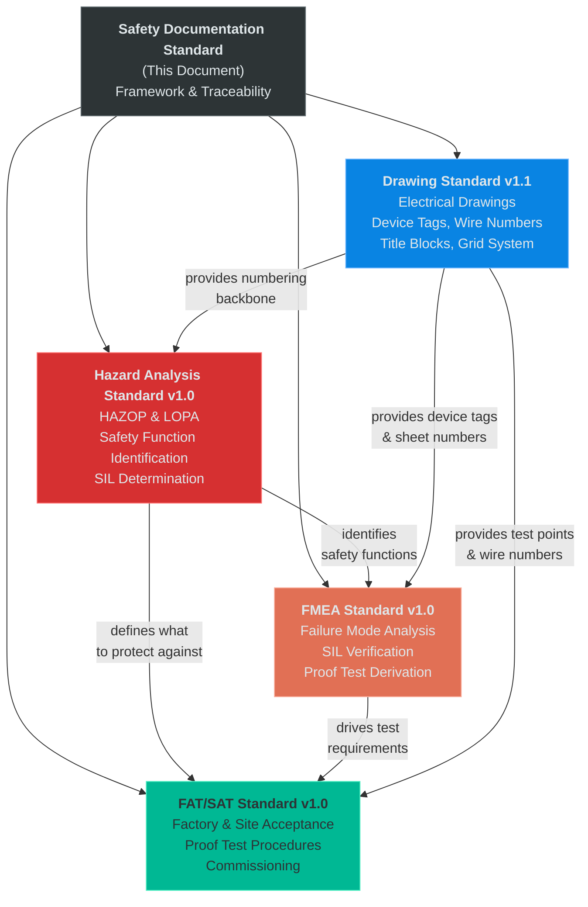
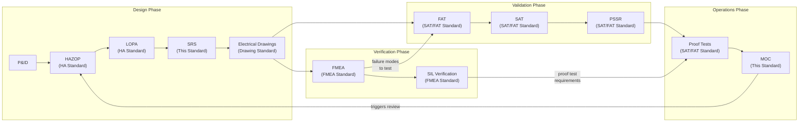
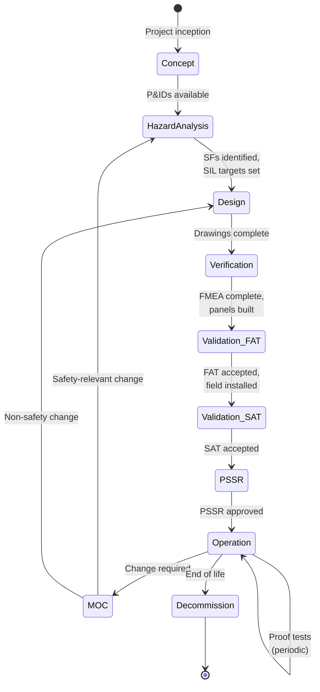
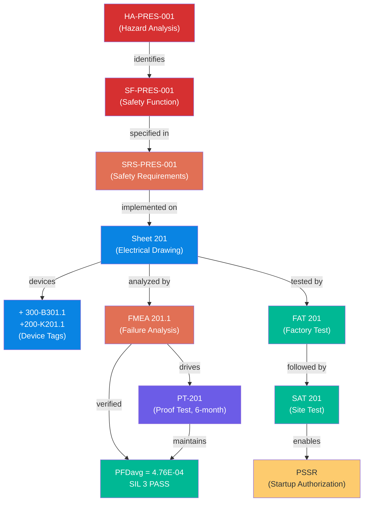
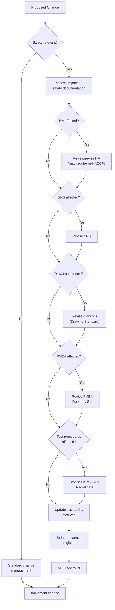

# Safety Documentation Standard
## Systems Design Documentation Framework for Industrial Control Systems

**Version:** 0.0
**Date:** 2025-02-15
**Author:** Reid Hall
**Status:** Draft
**Scope:** Defines the complete safety documentation framework for industrial control systems — document hierarchy, lifecycle, numbering conventions, traceability requirements, and the relationships between all standards in the systems design documentation suite.

---

## Table of Contents

1. [Purpose and Scope](#1-purpose-and-scope)
2. [Standards References](#2-standards-references)
3. [Document Suite Overview](#3-document-suite-overview)
4. [Document Hierarchy and Lifecycle](#4-document-hierarchy-and-lifecycle)
5. [Numbering Conventions — Consolidated Reference](#5-numbering-conventions--consolidated-reference)
6. [Traceability Requirements](#6-traceability-requirements)
7. [Traceability Matrix Definitions](#7-traceability-matrix-definitions)
8. [Document Register](#8-document-register)
9. [Management of Change Integration](#9-management-of-change-integration)
10. [Competency Requirements](#10-competency-requirements)
11. [Audit and Compliance](#11-audit-and-compliance)
12. [Implementation Checklist](#12-implementation-checklist)
13. [Document Information](#13-document-information)

---

## 1. Purpose and Scope

### 1.1 Purpose

This standard defines the overall framework for systems design documentation in industrial control system projects. It establishes how the individual standards in this documentation suite relate to each other, defines traceability requirements between documents, and provides consolidated reference material for numbering conventions, lifecycle management, and compliance auditing.

This is the **umbrella document**. It does not duplicate the detailed methodology in each subordinate standard — it defines how those standards work together as a system.

### 1.2 Scope

This standard governs the following documentation suite:

| Document | Version | Coverage |
|----------|---------|----------|
| Industrial Systems Drawing Standard | v1.1 | Electrical drawings, device tagging, wire numbering, title blocks |
| Hazard Analysis Standard | v1.0 | HAZOP methodology, LOPA, safety function identification, SIL determination |
| FMEA Standard for Safety Instrumented Systems | v1.0 | Failure mode analysis, SIL verification, proof test derivation |
| FAT/SAT Standard | v1.0 | Factory acceptance testing, site acceptance testing, proof test procedures |
| **This document** | v1.0 | Framework, traceability, lifecycle, document register |

### 1.3 Additional Documents Defined by This Framework

Beyond the four detailed standards above, this framework defines several project-level documents that are produced during execution. These documents do not have their own methodology standards — their format and content requirements are defined here:

| Document | ID Format | Purpose | Defined In |
|----------|-----------|---------|------------|
| Safety Requirements Specification (SRS) | `SRS-XXX-NNN` | Specifies safety function requirements derived from HA/LOPA | [Section 7.3](#73-safety-requirements-specification-srs) |
| Traceability Matrix — Requirements | `TM-REQ-[Project]` | Maps HA → SF → SRS → Drawing Sheets | [Section 7.4](#74-requirements-traceability-matrix) |
| Traceability Matrix — Verification | `TM-VER-[Project]` | Maps SRS requirements → FMEA → FAT → SAT → Proof Test | [Section 7.5](#75-verification-traceability-matrix) |
| Traceability Matrix — Device | `TM-DEV-[Project]` | Maps device tags → drawings → FMEA items → test steps | [Section 7.6](#76-device-traceability-matrix) |
| Safety Validation Summary | `SVS-[Project]` | Consolidated evidence that all safety functions are validated | [Section 7.7](#77-safety-validation-summary) |
| Document Register | `DR-[Project]` | Master index of all safety documentation | [Section 8](#8-document-register) |
| Bypass Register | `BR-[Project]` | Active bypass/override tracking | [Section 7.8](#78-bypass-register) |

### 1.4 Design Philosophy

**Every document references every other document through a common numbering system.** The Drawing Standard's sheet-based numbering is the backbone. Hazard Analysis IDs, FMEA numbers, SAT/FAT numbers, and proof test IDs all derive from or map to drawing sheet numbers. A single sheet number (e.g., 201) connects:

- The electrical drawing (Sheet 201)
- The hazard analysis that drives it (HA-PRES-001 → SF-PRES-001)
- The failure analysis that verifies it (FMEA 201.1)
- The factory test that validates it (FAT 201)
- The site test that commissions it (SAT 201)
- The proof test that maintains it (PT-201)

**No lookup tables required.** The numbering system is self-documenting across the entire documentation suite.

---

## 2. Standards References

| Standard | Title | Application |
|----------|-------|-------------|
| IEC 61508 | Functional safety of E/E/PE safety-related systems | Parent functional safety standard |
| IEC 61511 | Safety instrumented systems for the process industry | Process sector application of IEC 61508 |
| IEC 61882 | Hazard and operability studies (HAZOP) | HAZOP application guide |
| IEC 60812 | Failure modes and effects analysis (FMEA/FMECA) | FMEA methodology |
| IEC 61082 | Preparation of documents used in electrotechnology | Drawing format |
| IEC 81346 | Structuring principles and reference designations | Device designation |
| IEC 62382 | Electrical and instrumentation loop checking | Loop check methodology |
| IEC 62443 | Industrial communication networks — Security | Cybersecurity for IACS (where applicable) |

---

## 3. Document Suite Overview

### 3.1 Document Hierarchy



### 3.2 Information Flow Between Standards



### 3.3 Document Purpose Summary

| Phase | Document | Input | Output |
|-------|----------|-------|--------|
| Hazard Identification | HAZOP worksheets | P&IDs, process data | Hazard list, consequence/cause pairs |
| Risk Assessment | LOPA worksheets | HAZOP results, risk criteria | Safety functions with SIL targets |
| Requirements | SRS | LOPA results | Functional requirements for each SF |
| Design | Electrical drawings | SRS, P&IDs | Implementation: device tags, wiring, logic |
| Verification | FMEA | Drawings, device data | Hardware integrity proof, PFDavg |
| Validation — Factory | FAT procedures & records | Drawings, FMEA | Tested panel functionality |
| Validation — Site | SAT procedures & records | Drawings, FMEA, FAT records | Commissioned system, proven end-to-end |
| Pre-Startup | PSSR | FAT/SAT records, all docs | Authorization to introduce process |
| Operations | Proof test procedures | FMEA, SAT | Ongoing integrity assurance |

---

## 4. Document Hierarchy and Lifecycle

### 4.1 Creation Sequence

Documents are created in a specific order. Each document depends on its predecessors.

```mermaid
gantt
    title Document Creation Sequence
    dateFormat  X
    axisFormat %s

    section Hazard Analysis
    HAZOP Study           :ha1, 0, 2
    LOPA Study            :ha2, after ha1, 2
    Safety Function Register :ha3, after ha2, 1

    section Requirements
    SRS per Safety Function :srs, after ha3, 2

    section Design
    Electrical Drawings    :dwg, after srs, 4
    Drawing Review         :dwgr, after dwg, 1

    section Verification
    FMEA per Sheet         :fmea, after dwg, 3
    SIL Verification Calc  :sil, after fmea, 1

    section Validation
    FAT Procedures         :fatp, after dwg, 2
    FAT Execution          :fate, after fatp, 2
    SAT Procedures         :satp, after fate, 1
    SAT Execution          :sate, after satp, 2

    section Commissioning
    PSSR                   :pssr, after sate, 1
    Proof Test Procedures  :pt, after fmea, 2
```



### 4.2 Creation Sequence Rules

| Step | Document | Prerequisites | Key Output |
|------|----------|---------------|------------|
| 1 | HAZOP (HA Standard) | P&IDs (approved or IFD), process data | Hazard list, cause/consequence pairs |
| 2 | LOPA (HA Standard) | HAZOP results, corporate risk criteria | SF-XXX-NNN with SIL targets |
| 3 | SRS (this standard) | LOPA results | Functional requirements per SF |
| 4 | Electrical Drawings (Drawing Standard) | SRS, P&IDs | Implementation with device tags |
| 5 | FMEA (FMEA Standard) | Drawings, device failure data | PFDavg, SIL verification |
| 6 | FAT Procedures (SAT/FAT Standard) | Drawings, FMEA | Test steps per drawing sheet |
| 7 | FAT Execution | FAT procedures, built panels | Test records |
| 8 | SAT Procedures (SAT/FAT Standard) | FAT records, field installation complete | Field test steps |
| 9 | SAT Execution | SAT procedures, field-installed systems | Commissioning records |
| 10 | PSSR (SAT/FAT Standard) | All above complete | Authorization to operate |
| 11 | Proof Tests (SAT/FAT Standard) | FMEA, SAT records | Ongoing maintenance procedures |

### 4.3 Lifecycle Phases



### 4.4 Review Triggers

All documents in the suite share common review triggers. The table below defines which documents must be reviewed for each trigger:

| Trigger | HA | SRS | Drawings | FMEA | FAT/SAT | Proof Test | Traceability |
|---------|:--:|:---:|:--------:|:----:|:-------:|:----------:|:------------:|
| Management of Change (MOC) | Review | Review | Revise | Review | Revise | Review | Update |
| Incident or near-miss | Review | — | — | Review | — | Review | — |
| Periodic (5 years max, IEC 61511) | Review | Review | Review | Review | — | Review | Audit |
| Device replacement (like-for-like) | — | — | — | — | — | Execute | — |
| Device replacement (different type) | — | Review | Revise | Revise | Revise | Revise | Update |
| Architecture change | Review | Revise | Revise | Revise | Revise | Revise | Update |
| New failure rate data | — | — | — | Review | — | Review | — |
| Regulatory/standards update | Review | Review | Review | Review | Review | Review | Audit |
| Pre-Startup Safety Review (PSSR) | Verify | Verify | Verify | Verify | Verify | Verify | Verify |

---

## 5. Numbering Conventions — Consolidated Reference

### 5.1 Master Numbering Table

All numbering conventions across the documentation suite, in one place:

| Item | Format | Example | Defined In |
|------|--------|---------|------------|
| **Drawing sheet** | `[NNN]` | Sheet 201 | Drawing Standard §4.1 |
| **Cabinet/location** | `+[NNN]` | +200 | Drawing Standard §4.1 |
| **Device tag** | `+[Loc]-[Dev][Sheet].[Seq]` | +300-B301.1 | Drawing Standard §5.1 |
| **Terminal** | `+[Loc]-[Dev][Sheet].[Seq]:[Term]` | +300-B301.1:2 | Drawing Standard §5.4 |
| **Wire number** | `[Sheet]-[Col].[Seq]` | 201-4.1 | Drawing Standard §6.2 |
| **Grid reference** | `[Col][Row]` | 4E | Drawing Standard §7.1 |
| **Cable ID** | `CBL-[Sheet]-[Seq]` | CBL-201-01 | Drawing Standard §10.6 |
| **Hazard Analysis** | `HA-[SYS]-[NNN]` | HA-PRES-001 | HA Standard §4 |
| **Safety Function** | `SF-[SYS]-[NNN]` | SF-PRES-001 | HA Standard §4 |
| **FMEA** | `FMEA [Sheet].[Seq]` | FMEA 201.1 | FMEA Standard §4 |
| **FAT** | `FAT [Sheet]` | FAT 201 | SAT/FAT Standard §4 |
| **SAT** | `SAT [Sheet]` | SAT 201 | SAT/FAT Standard §4 |
| **Proof Test** | `PT-[Sheet]` | PT-201 | SAT/FAT Standard §4 |
| **Functional Test** | `FT [Sheet]` | FT 150 | SAT/FAT Standard §4 |
| **SRS** | `SRS-[SYS]-[NNN]` | SRS-PRES-001 | This Standard §7.3 |
| **Traceability Matrix (Req)** | `TM-REQ-[Project]` | TM-REQ-RefineryXYZ | This Standard §7.4 |
| **Traceability Matrix (Ver)** | `TM-VER-[Project]` | TM-VER-RefineryXYZ | This Standard §7.5 |
| **Traceability Matrix (Dev)** | `TM-DEV-[Project]` | TM-DEV-RefineryXYZ | This Standard §7.6 |
| **Validation Summary** | `SVS-[Project]` | SVS-RefineryXYZ | This Standard §7.7 |
| **Document Register** | `DR-[Project]` | DR-RefineryXYZ | This Standard §8 |
| **Bypass Register** | `BR-[Project]` | BR-RefineryXYZ | This Standard §7.8 |

### 5.2 System Abbreviation Codes

Used in HA-XXX-NNN, SF-XXX-NNN, and SRS-XXX-NNN identifiers:

| Code | System | Examples |
|------|--------|----------|
| PRES | Pressure protection | Overpressure, underpressure, relief |
| TEMP | Temperature protection | High temperature, thermal runaway |
| FLOW | Flow protection | Low flow, reverse flow, overflow |
| LEV | Level protection | High level, low level, overflow |
| FIRE | Fire and gas detection | Fire detection, gas detection |
| TOX | Toxic release protection | H2S, CO, toxic gas |
| COMB | Combustible gas protection | LEL monitoring, explosion prevention |
| COMP | Composition protection | pH, O2, concentration |
| REAC | Reaction protection | Runaway reaction, exotherm |
| MECH | Mechanical protection | Vibration, overspeed, displacement |
| ELEC | Electrical protection | Arc flash, ground fault, overload |
| ENV | Environmental protection | Spill containment, emissions |

### 5.3 Numbering Derivation Chain

The sheet number is the common key across all documents:

```
Sheet 201 (Drawing Standard)
    │
    ├── +200-K201.1  (device tag on Sheet 201)
    ├── +200-K201.2  (device tag on Sheet 201)
    ├── 201-4.1      (wire number originating on Sheet 201)
    │
    ├── FMEA 201.1   (FMEA analyzing Sheet 201, first SF)
    ├── FMEA 201.2   (FMEA analyzing Sheet 201, second SF, if any)
    │
    ├── FAT 201      (factory test for Sheet 201 systems)
    ├── SAT 201      (site test for Sheet 201 systems)
    ├── PT-201       (proof test for Sheet 201 systems)
    │
    └── Traced back to:
        ├── SF-PRES-001  (safety function implemented on Sheet 201)
        ├── HA-PRES-001  (hazard analysis that identified SF-PRES-001)
        └── SRS-PRES-001 (requirements specification for SF-PRES-001)
```

---

## 6. Traceability Requirements

### 6.1 Traceability Principle

**Every safety requirement must be traceable from hazard identification through to operational proof testing.** No link in the chain may be missing. If a safety function cannot be traced from HA through to proof test, the documentation is incomplete.

### 6.2 Required Traceability Chains



### 6.3 Bidirectional Traceability

Every link in the chain must be navigable in both directions:

| From → To | Forward Reference | Reverse Reference |
|-----------|-------------------|-------------------|
| HA → SF | HA worksheet → Safety Function Register | SF Register lists source HA-XXX-NNN |
| SF → SRS | Safety Function Register → SRS document | SRS header references SF-XXX-NNN |
| SRS → Drawing | SRS requirement → implementing sheet number | Drawing title block lists SF reference |
| Drawing → FMEA | Drawing title block → FMEA reference | FMEA scope lists analyzed sheets |
| Drawing → FAT/SAT | Drawing title block → SAT reference | FAT/SAT cover page lists sheets |
| FMEA → Proof Test | FMEA failure mode → PT procedure step | PT step references FMEA item number |
| Drawing → Device | Sheet contains device | Device tag encodes sheet number |

### 6.4 Completeness Criteria

A project's safety documentation is complete when:

- [ ] Every hazard in the HA has a disposition (accepted, mitigated by SF, or mitigated by non-SIS IPL)
- [ ] Every SF identified in the HA has an SRS
- [ ] Every SRS requirement maps to at least one drawing sheet
- [ ] Every safety-critical drawing sheet has an FMEA
- [ ] Every FMEA demonstrates SIL target achievement (PFDavg and architectural constraints)
- [ ] Every safety-critical sheet has FAT and SAT records marked PASS
- [ ] Every FMEA has a corresponding proof test procedure with defined interval
- [ ] All traceability matrices are populated with no gaps
- [ ] Document register is current and all documents are at approved revision

---

## 7. Traceability Matrix Definitions

### 7.1 Overview

Three traceability matrices are required for each project. They serve different audiences and verification purposes:

| Matrix | Audience | Question It Answers |
|--------|----------|---------------------|
| Requirements (TM-REQ) | Safety engineers, auditors | "Is every hazard addressed by a requirement and implemented in a design?" |
| Verification (TM-VER) | Functional safety assessors | "Is every requirement verified by analysis and validated by testing?" |
| Device (TM-DEV) | Commissioning engineers, maintenance | "For a given device, where is every relevant document?" |

### 7.2 Matrix Maintenance

Traceability matrices are **living documents** maintained throughout the project lifecycle. They are updated whenever any referenced document is revised. The document register (Section 8) tracks matrix revision status.

### 7.3 Safety Requirements Specification (SRS)

The SRS is a project-level document (not a methodology standard). One SRS is produced per safety function.

**SRS Document ID:** `SRS-XXX-NNN` (matches the SF-XXX-NNN it specifies)

**Required SRS Content:**

| Section | Content |
|---------|---------|
| Header | SRS-XXX-NNN, SF name, SIL target, HA reference |
| Process Description | What the safety function protects against |
| Functional Requirements | Trip setpoints, voting logic, response time, reset requirements |
| Integrity Requirements | SIL target, PFDavg target, proof test interval, diagnostic requirements |
| Interface Requirements | Inputs (sensors), outputs (final elements), communication |
| Bypass Requirements | Permitted bypass conditions, maximum duration, authorization |
| Failure Mode Requirements | Required safe state, action on detected failure, action on diagnostic alarm |
| Implementation Constraints | Architecture (e.g., 2oo3), HFT, separation requirements |
| Implementing Sheets | Drawing sheet numbers |

**Example — SRS-PRES-001:**

```
SRS-PRES-001: Overpressure Protection Safety Function
Safety Function: SF-PRES-001
SIL Target: SIL 3
Source HA: HA-PRES-001

Functional Requirements:
  - Monitor vessel pressure via three independent transmitters (+300-B301.1, B301.2, B301.3)
  - Trip on 2-of-3 voting at 95% of design pressure (setpoint: 285 psig)
  - De-energize shutdown relay (+200-K201.1) to close isolation valve
  - Response time: < 1 second from setpoint to valve closure initiation
  - Manual reset required after trip (no auto-reset)

Integrity Requirements:
  - SIL 3 (PFDavg < 1.0E-03)
  - Proof test interval: 6 months
  - Diagnostic coverage: per FMEA 201.1

Architecture:
  - Sensor: 2oo3 voting (HFT = 1)
  - Logic solver: 1oo1 safety-rated
  - Final element: 1oo1 (de-energize-to-trip)

Implementing Sheets: 201, 301, 302
```

### 7.4 Requirements Traceability Matrix

**Document ID:** `TM-REQ-[Project]`

This matrix traces from hazards through safety functions to design implementation.

**Format:**

| HA ID | Hazard Description | SF ID | SIL | SRS ID | Implementing Sheets | Key Devices | Status |
|-------|-------------------|-------|-----|--------|--------------------:|-------------|--------|
| HA-PRES-001 | Vessel overpressure due to blocked outlet | SF-PRES-001 | SIL 3 | SRS-PRES-001 | 201, 301, 302 | +300-B301.1/2/3, +200-K201.1 | Verified |
| HA-TEMP-001 | Reactor high temperature due to cooling failure | SF-TEMP-001 | SIL 2 | SRS-TEMP-001 | 130, 320 | +300-B320.1/2, +100-K130.1 | In Design |
| HA-LEV-001 | Tank overflow due to level control failure | SF-LEV-001 | SIL 1 | SRS-LEV-001 | 140, 325 | +300-B325.1, +100-K140.1 | In Design |

**Rules:**
- One row per safety function
- Every SF identified in the HA Safety Function Register must appear
- "Status" tracks progress: Identified → Specified → Designed → Verified → Validated
- Blank cells indicate gaps that must be resolved

### 7.5 Verification Traceability Matrix

**Document ID:** `TM-VER-[Project]`

This matrix traces from requirements through verification (FMEA) and validation (FAT/SAT/PT).

**Format:**

| SF ID | SRS Requirement | FMEA ID | PFDavg | SIL Met? | FAT ID | FAT Result | SAT ID | SAT Result | PT ID | PT Interval |
|-------|----------------|---------|--------|----------|--------|------------|--------|------------|-------|-------------|
| SF-PRES-001 | 2oo3 voting at 285 psig | FMEA 201.1 | 4.76E-04 | SIL 3 YES | FAT 201 | PASS | SAT 201 | PASS | PT-201 | 6 months |
| SF-PRES-001 | Response time < 1s | FMEA 201.1 | — | — | FAT 201 | 0.45s PASS | SAT 201 | 0.52s PASS | PT-201 | Per PT |
| SF-PRES-001 | De-energize to trip | FMEA 201.1 | — | — | FAT 201 | PASS | SAT 201 | PASS | PT-201 | Per PT |
| SF-TEMP-001 | 1oo2 voting at 350°F | FMEA 130.1 | 2.1E-03 | SIL 2 YES | FAT 130 | PASS | SAT 130 | — | PT-130 | 12 months |

**Rules:**
- One row per SRS requirement (a single SF may have multiple rows)
- FMEA results and FAT/SAT results must both be populated before PSSR
- Any "FAIL" or blank in a required column blocks startup authorization

### 7.6 Device Traceability Matrix

**Document ID:** `TM-DEV-[Project]`

This matrix provides a device-centric view — for any device tag, find every document that references it.

**Format:**

| Device Tag | Description | Cabinet | Drawing Sheet | Grid | SF ID | FMEA ID | FMEA Item # | FAT Step | SAT Step | PT Step | P&ID Tag |
|------------|-------------|---------|:------------:|------|-------|---------|-------------|----------|----------|---------|----------|
| +300-B301.1 | Pressure Transmitter #1 | +300 | 301 | 2B | SF-PRES-001 | FMEA 201.1 | 1.1–1.7 | FAT 201-005 | SAT 201-010 | PT-201-003 | PT-201 |
| +300-B301.2 | Pressure Transmitter #2 | +300 | 301 | 3B | SF-PRES-001 | FMEA 201.1 | 2.1–2.7 | FAT 201-006 | SAT 201-011 | PT-201-004 | PT-202 |
| +300-B301.3 | Pressure Transmitter #3 | +300 | 302 | 2B | SF-PRES-001 | FMEA 201.1 | 3.1–3.7 | FAT 201-007 | SAT 201-012 | PT-201-005 | PT-203 |
| +200-K201.1 | Safety Relay | +200 | 201 | 4E | SF-PRES-001 | FMEA 201.1 | 8.1–8.6 | FAT 201-015 | SAT 201-020 | PT-201-008 | — |

**Rules:**
- One row per device tag
- Every safety-critical device must appear
- Non-safety devices may optionally be included
- This matrix is the primary maintenance reference — a technician replacing a device can find every relevant procedure

### 7.7 Safety Validation Summary

**Document ID:** `SVS-[Project]`

The Safety Validation Summary is produced before PSSR. It is a consolidated evidence package proving that all safety functions are validated.

**Required Content:**

| Section | Content |
|---------|---------|
| Executive Summary | List of all SFs, their SIL targets, and overall validation status |
| Per Safety Function | For each SF: SRS reference, FMEA result (PFDavg, SIL pass/fail), FAT result, SAT result, proof test procedure reference |
| Outstanding Items | Punch list items from FAT/SAT, their disposition, impact on safety |
| Conclusion | Statement of readiness for PSSR |
| Approvals | Functional safety engineer, project manager, operations representative |

**Example Summary Table:**

| SF ID | SIL | SRS | FMEA | PFDavg | Arch. | FAT | SAT | PT Procedure | PT Interval | Status |
|-------|-----|-----|------|--------|-------|-----|-----|-------------|-------------|--------|
| SF-PRES-001 | 3 | SRS-PRES-001 Rev A | FMEA 201.1 Rev B | 4.76E-04 | PASS | PASS | PASS | PT-201 Rev A | 6 months | VALIDATED |
| SF-TEMP-001 | 2 | SRS-TEMP-001 Rev A | FMEA 130.1 Rev A | 2.1E-03 | PASS | PASS | PASS | PT-130 Rev A | 12 months | VALIDATED |
| SF-LEV-001 | 1 | SRS-LEV-001 Rev A | FMEA 140.1 Rev A | 8.5E-03 | PASS | PASS | — | PT-140 Rev A | 12 months | SAT PENDING |

### 7.8 Bypass Register

**Document ID:** `BR-[Project]`

Active during commissioning and operation. Tracks all safety system bypasses and overrides.

**Format:**

| Bypass # | SF Affected | Device(s) Bypassed | Reason | Authorized By | Date Applied | Max Duration | Compensating Measures | Date Removed | Removed By |
|----------|-------------|-------------------|--------|---------------|-------------|-------------|----------------------|-------------|------------|
| BR-001 | SF-PRES-001 | +300-B301.2 | Calibration | J. Smith (Ops Mgr) | 2025-03-15 08:00 | 8 hours | Manual monitoring, B301.1 & B301.3 active (1oo2 degraded) | 2025-03-15 10:30 | R. Jones |

**Rules:**
- No safety function shall be fully bypassed without formal risk assessment
- Partial bypass (e.g., one channel of a voted group) requires documented compensating measures
- Maximum bypass duration shall be defined per SIL level:
  - SIL 3: 8 hours maximum
  - SIL 2: 24 hours maximum
  - SIL 1: 72 hours maximum
- Bypass register is auditable — records are retained for the life of the installation

---

## 8. Document Register

### 8.1 Purpose

The Document Register is the master index of all safety-related documentation for a project. It tracks document status, revision, and approval.

**Document ID:** `DR-[Project]`

### 8.2 Format

| Doc ID | Title | Type | Rev | Date | Status | Author | Approved By | Related SFs | File Location |
|--------|-------|------|-----|------|--------|--------|-------------|-------------|---------------|
| HA-PRES-001 | Vessel Overpressure Hazard Analysis | HA | B | 2025-01-10 | Approved | Reid Hall | T. Brown | SF-PRES-001 | /safety/HA/HA-PRES-001_RevB.pdf |
| SRS-PRES-001 | Overpressure Protection SRS | SRS | A | 2025-01-20 | Approved | Reid Hall | T. Brown | SF-PRES-001 | /safety/SRS/SRS-PRES-001_RevA.pdf |
| — | Sheet 201: Overpressure Logic | Drawing | 5 | 2025-01-22 | Approved | J. Smith | T. Brown | SF-PRES-001 | /drawings/Sheet_201_Rev5.dwg |
| FMEA 201.1 | Overpressure Protection FMEA | FMEA | B | 2025-02-01 | Approved | Reid Hall | T. Brown | SF-PRES-001 | /safety/FMEA/FMEA_201.1_RevB.pdf |
| FAT 201 | Overpressure Protection FAT | FAT | A | 2025-02-10 | Complete | J. Smith | R. Jones | SF-PRES-001 | /testing/FAT/FAT_201_RevA.pdf |
| SAT 201 | Overpressure Protection SAT | SAT | A | 2025-03-01 | Complete | J. Smith | R. Jones | SF-PRES-001 | /testing/SAT/SAT_201_RevA.pdf |
| PT-201 | Overpressure Proof Test | PT | A | 2025-02-05 | Approved | Reid Hall | T. Brown | SF-PRES-001 | /testing/PT/PT-201_RevA.pdf |
| TM-REQ-RefineryXYZ | Requirements Traceability | TM | C | 2025-03-01 | Current | Reid Hall | T. Brown | All | /safety/TM-REQ_RevC.xlsx |
| TM-VER-RefineryXYZ | Verification Traceability | TM | B | 2025-03-01 | Current | Reid Hall | T. Brown | All | /safety/TM-VER_RevB.xlsx |
| TM-DEV-RefineryXYZ | Device Traceability | TM | B | 2025-03-01 | Current | Reid Hall | T. Brown | All | /safety/TM-DEV_RevB.xlsx |
| SVS-RefineryXYZ | Safety Validation Summary | SVS | A | 2025-03-05 | Draft | Reid Hall | — | All | /safety/SVS_RevA.pdf |
| BR-RefineryXYZ | Bypass Register | BR | — | Active | Active | Ops | — | All | /operations/BR_active.xlsx |

### 8.3 Document Status Definitions

| Status | Meaning |
|--------|---------|
| Draft | In preparation, not reviewed |
| In Review | Under formal review |
| Approved | Reviewed and approved for use |
| Complete | Test/activity executed and documented |
| Current | Living document, continuously maintained |
| Active | Operational register, updated in real time |
| Superseded | Replaced by newer revision |
| Archived | Retained for historical record, no longer active |

---

## 9. Management of Change Integration

### 9.1 MOC Triggers Relevant to Safety Documentation

Any of the following changes require evaluation against the safety documentation suite:

- Process condition changes (new setpoints, new operating modes)
- Equipment changes (instrument replacement, valve substitution)
- Logic changes (PLC program modification, voting logic change)
- Drawing changes (new sheets, revised circuits)
- Organizational changes (maintenance intervals, staffing)
- Regulatory or standards updates

### 9.2 MOC Evaluation Workflow



### 9.3 MOC Documentation Requirements

Every safety-relevant MOC shall document:

1. **Change description** — What is changing and why
2. **Impact assessment** — Which documents in the suite are affected (use review trigger table from Section 4.4)
3. **Document revisions required** — List each document that needs updating, with responsible person and due date
4. **Verification** — How will the change be verified (re-analysis, re-test, or both)
5. **Approval** — Signatures from functional safety engineer, operations, and management

---

## 10. Competency Requirements

### 10.1 Role Definitions

| Role | Responsibilities | Minimum Competency |
|------|-----------------|-------------------|
| HAZOP Leader | Facilitates HAZOP studies, ensures completeness | IEC 61511 training, 3+ HAZOP studies led, process safety experience |
| LOPA Analyst | Performs LOPA calculations, assigns SIL targets | IEC 61511 training, statistical risk analysis competency |
| Functional Safety Engineer | Owns FMEA, SIL verification, proof test design | TUV or equivalent FS certification, IEC 61508/61511 |
| Electrical Designer | Produces drawings per Drawing Standard | IEC 61082 familiarity, CAD proficiency, supervised by FSE for SIL-rated circuits |
| Commissioning Engineer | Executes FAT/SAT procedures | Loop checking experience, safety system commissioning training |
| Maintenance Technician | Executes proof tests | Proof test training, instrument calibration competency |
| Independent Assessor | FSA per IEC 61511 clause 5 | TUV or equivalent, independence from project team |

### 10.2 Training Records

Training and competency records shall be maintained in the document register for all personnel performing safety-critical work.

---

## 11. Audit and Compliance

### 11.1 Internal Audit Checklist

For periodic or pre-startup audits, verify:

**Hazard Analysis:**
- [ ] HAZOP covers all P&ID nodes
- [ ] LOPA completed for all identified SIFs
- [ ] SIL targets assigned for all safety functions
- [ ] Safety Function Register complete and current

**Requirements:**
- [ ] SRS exists for every safety function
- [ ] SRS requirements are testable and traceable

**Design:**
- [ ] All safety-critical sheets have title block safety fields populated
- [ ] Device descriptions carry HA references per Drawing Standard §5.3
- [ ] All safety-critical devices have correct device tags per Drawing Standard §5.1

**Verification:**
- [ ] FMEA exists for every safety-critical drawing sheet
- [ ] PFDavg meets SIL target for every safety function
- [ ] Architectural constraints met (HFT, SFF)
- [ ] Common cause analysis completed

**Validation:**
- [ ] FAT completed and accepted for all safety-critical sheets
- [ ] SAT completed and accepted for all safety-critical sheets
- [ ] All SAT deviations dispositioned

**Operations:**
- [ ] Proof test procedures exist for all safety functions
- [ ] Proof test intervals defined and scheduled
- [ ] Bypass register established and active
- [ ] MOC procedure references safety documentation suite

**Traceability:**
- [ ] TM-REQ populated with no gaps
- [ ] TM-VER populated with no gaps
- [ ] TM-DEV populated for all safety-critical devices
- [ ] Document register current

### 11.2 Functional Safety Assessment (FSA)

Per IEC 61511 clause 5, an independent Functional Safety Assessment is required at key lifecycle stages:

| FSA Stage | Timing | Scope |
|-----------|--------|-------|
| FSA 1 | After SRS approval | HA, LOPA, SRS completeness |
| FSA 2 | After detailed design | Drawings, FMEA, SIL verification |
| FSA 3 | After commissioning | FAT/SAT records, validation summary |
| FSA 4 | Periodic (during operation) | Proof test records, MOC compliance, ongoing integrity |

---

## 12. Implementation Checklist

### Project Setup
- [ ] Establish project document register (DR-[Project])
- [ ] Define system abbreviation codes for the project
- [ ] Create file/folder structure per document types
- [ ] Assign roles and verify competency (Section 10)

### Hazard Analysis Phase
- [ ] Conduct HAZOP per HA Standard
- [ ] Conduct LOPA per HA Standard
- [ ] Produce Safety Function Register
- [ ] Create SRS for each safety function (Section 7.3)
- [ ] Populate requirements traceability matrix TM-REQ (Section 7.4)
- [ ] FSA Stage 1

### Design Phase
- [ ] Produce electrical drawings per Drawing Standard
- [ ] Verify title block safety fields on all safety-critical sheets
- [ ] Verify device description fields carry HA references

### Verification Phase
- [ ] Produce FMEA per FMEA Standard for each safety-critical sheet
- [ ] Complete SIL verification calculations
- [ ] Produce proof test procedures per SAT/FAT Standard
- [ ] Populate verification traceability matrix TM-VER (Section 7.5)
- [ ] Populate device traceability matrix TM-DEV (Section 7.6)
- [ ] FSA Stage 2

### Validation Phase
- [ ] Produce and execute FAT procedures per SAT/FAT Standard
- [ ] Produce and execute SAT procedures per SAT/FAT Standard
- [ ] Disposition all FAT/SAT deviations
- [ ] Produce Safety Validation Summary SVS (Section 7.7)
- [ ] Establish bypass register BR (Section 7.8)
- [ ] FSA Stage 3

### Pre-Startup
- [ ] PSSR — verify all documentation complete per Section 6.4
- [ ] All traceability matrices populated with no gaps
- [ ] Document register current
- [ ] Authorization to introduce process

### Operations
- [ ] Proof tests scheduled per defined intervals
- [ ] MOC procedure references this documentation framework
- [ ] Periodic FSA scheduled (FSA Stage 4)

---

## 13. Document Information

| Field | Value      |
|-------|------------|
| Version | 0.0        |
| Date | 2025-02-15 |
| Author | Reid Hall  |
| Status | Draft      |

**Revision History:**

| Version | Date | Changes | Author |
|---------|------|---------|--------|
| 0.0     | 2025-02-15 | Initial release. Establishes the safety documentation framework covering HA, FMEA, SAT/FAT, and Drawing Standards. Defines traceability matrices, SRS format, document register, bypass register, MOC integration, and audit checklists. | Reid Hall |

**Related Documents:**

| Document | Relationship |
|----------|-------------|
| Industrial Systems Drawing Standard | Provides numbering backbone (sheets, devices, wires) |
| Hazard Analysis Standard | Defines HAZOP/LOPA methodology |
| FMEA Standard for Safety Instrumented Systems | Defines failure analysis and SIL verification |
| FAT/SAT Standard | Defines testing and proof test methodology |
